# Storage & File Format

This document describes how BanyanDB physically stores data on disk, organized **from the API perspective**: for each resource a user creates (`Measure`, `Stream`, `Trace`, `Property`, `TopNAggregation`), it explains the API surface first, then the storage engine(s) that actually back it.

The central idea to keep in mind:

> **The API unifies what the storage separates.** A single API resource can be backed by completely different storage engines. The clearest example is `Measure`: one schema, one write RPC, one query RPC — but a single boolean flag (`index_mode`) silently swaps the entire on-disk engine. This document makes those hidden forks explicit.

Everything here is derived from the source code. Where a diagram or older document disagrees with the code, the code wins.

> **Convention used below:** `<016x>` means a 16-digit zero-padded lowercase hex string (e.g. `000000000000001f`); `<012x>` means 12-digit. These are how part/segment epoch IDs appear as directory and file names.

---

## 1. Two storage families

Despite five API resources, there are only **two** physical storage engines underneath.

| Family | Backs | On disk | Mutability |
| --- | --- | --- | --- |
| **Columnar TSDB** (BanyanDB-native) | `Measure` (normal mode), `Stream`, `Trace` (span store) | per-part column files (`*.bin`, `*.tf`, `*.t`, …) inside epoch-named part directories | append-only — immutable parts, mem → flush → merge |
| **Inverted index** (third-party [Bluge](https://github.com/blugelabs/bluge) + ICE segments) | `Property`, `Measure` (index-mode), and the **series index** used by every TSDB engine | Lucene-style `*.seg` / `*.snp` segment files | mutable — new document + tombstone bitmap, GC at merge |

So the five resources really decompose into **3 columnar + 2 inverted-index** uses, plus the **sidx** ordered secondary-index store that `Trace` embeds.

The columnar engines store values **by column** for compression and projection efficiency. The inverted-index engines store whole **documents** and are searched by term — they are used either as a pure index (series resolution, stream indexed tags) or, surprisingly, as a primary store (`Property`, index-mode `Measure`).

---

## 2. The shared directory skeleton (TSDB)

`Measure`, `Stream`, and `Trace` all share the same directory skeleton, managed by `banyand/internal/storage`. The substrate owns the directory tree and lifecycle; each engine injects its own per-part column format.

```
<data-path>/<group>/
├── lock                              # advisory flock for the whole group's TSDB
└── seg-<YYYYMMDD|YYYYMMDDHH>/        # SEGMENT = a time bucket (the rotation/retention unit)
    ├── metadata                      #   {"version":"1.5.0","endTime":"<RFC3339Nano>"} (JSON)
    ├── sidx/                         #   per-SEGMENT series inverted index (Bluge) — shared by all shards
    └── shard-<N>/                    #   SHARD lives *inside* the segment
        ├── <016x>/                   #     PART (one immutable flush/merge output)
        │   └── … columnar files …
        ├── <016x>.snp               #     snapshot manifest = JSON array of live part dir names
        ├── idx/                      #     STREAM only: per-shard element inverted index (Bluge)
        └── sidx/<ruleName>/<016x>/   #     TRACE only: ordered secondary-index parts (one tree per index rule)
```

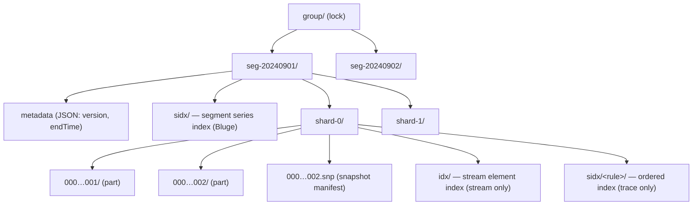

Key facts (verified against `banyand/internal/storage/segment.go`, `shard.go`, `storage.go`):

- **Hierarchy order is `group → segment → shard → part`.** A `shard-<N>` directory is created **inside** a `seg-<…>` directory (`segment.openShard` joins `segment.location` with `shard-<N>`). Older diagrams/prose that draw `group → shard → segment` are **wrong**.
- **Segment** directories are named `seg-` + the segment-start time formatted as `2006010215` (hour granularity) or `20060102` (day granularity), chosen by the group's `segment_interval` unit.
- **Part** directories are named `<016x>` of a monotonically increasing epoch. A part is immutable once written.
- **Snapshot (MVCC):** `<016x>.snp` is a JSON array listing which part directories are *live* at that epoch. Readers only see parts in the current snapshot; a part dropped from the snapshot is GC'd at the next flush/merge. The newest `.snp` (highest epoch) is the current one.
- The **segment-level `sidx/`** is the *series index* (a Bluge inverted index). Note the **name collision**: `Trace` also has a `sidx/` directory, but at the **shard** level and with a completely different meaning (ordered secondary index, see §6). Same name, different depth, different engine.

`Property` does **not** use this skeleton — see §7.

### 2.1 Part lifecycle

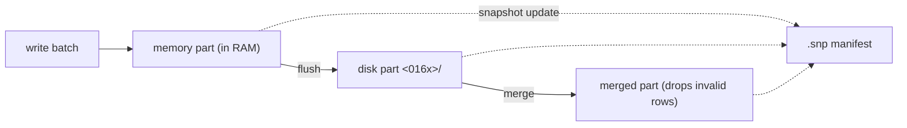

Every batch write becomes a memory part. A background worker flushes it to a disk part; flushing triggers a merge that combines parts and removes data no longer referenced by the snapshot. Each of these events writes a new `.snp` and deletes stale ones.

---

## 3. Measure

`Measure` is the headline example of "one API, two engines."

### 3.1 The Measure resource (API)

A user registers a `Measure` schema (`api/proto/banyandb/database/v1/schema.proto`, message `Measure`):

| Field | Meaning |
| --- | --- |
| `tag_families` | named groups of tags (the dimensions); each tag has a type (STRING/INT/STRING_ARRAY/INT_ARRAY/DATA_BINARY) |
| `fields` | the numeric measure values; each has `field_type`, `encoding_method`, `compression_method` |
| `entity` | the subset of tags forming the **series key** (and default shard key) |
| `sharding_key` | optional explicit shard key (defaults to `entity`) |
| `interval` | nominal data-point cadence (e.g. `1m`) |
| **`index_mode`** | **the boolean that selects the storage engine** (field 7) |

Data is written and read with the same two RPCs regardless of mode:

- **Write** — `MeasureService.Write` (bidi stream of `DataPointValue{timestamp, tag_families, fields, version}`).
- **Query** — `MeasureService.Query` (`time_range`, `criteria`, `tag_projection`, `field_projection`, `group_by`, `agg`, `top`, `order_by`, …).

Crucially, **the liaison (coordinator) write path never inspects `index_mode`** — it just hashes the entity to a shard and forwards. The engine fork happens only on the data node.

### 3.2 One API, two storage engines

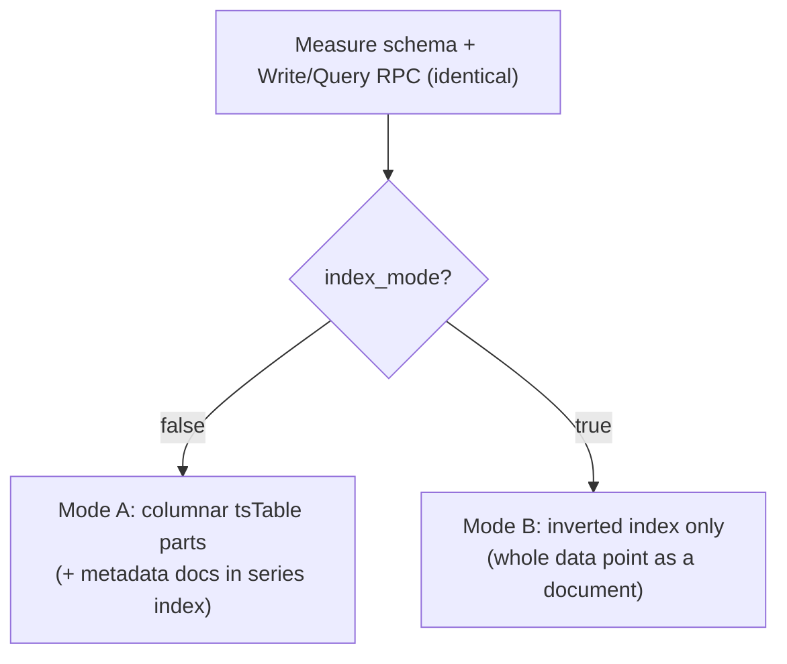

`index_mode` is set once at schema creation and is effectively **immutable for the data's lifetime**: flipping it would orphan everything previously written in the other engine (this is an operational caveat, not a code-enforced check). Field-encoding options, part compaction, and TopN derivation apply only to **Mode A**.

### 3.3 Mode A — normal columnar (`index_mode = false`)

Field/tag values are stored **by column** in immutable parts. The series index holds only a lightweight metadata document per series (for series-ID resolution); the *values* live in the part.

**Part files** (`banyand/measure/part.go`):

| File | Holds | Format |
| --- | --- | --- |
| `metadata.json` | per-part stats | JSON: `{compressedSizeBytes, uncompressedSizeBytes, totalCount, blocksCount, minTimestamp, maxTimestamp}`. The part ID is the directory name, not stored in the JSON. |
| `meta.bin` | index of primary blocks | zstd stream of fixed **40-byte** `primaryBlockMetadata` records: `seriesID(8 BE) + minTimestamp(8) + maxTimestamp(8) + offset(8) + size(8)`, sorted ascending by seriesID |
| `primary.bin` | per-block index (`blockMetadata`) | sequence of independently zstd-compressed "primary blocks" (~128 KiB uncompressed each), each a run of `blockMetadata` records pointing into the data files |
| `timestamps.bin` | timestamps **+ versions** | per block: `[encoded timestamps][encoded versions]`; delta/zigzag, no zstd at this layer |
| `fv.bin` | **all field-value columns** | per (block, field) a self-describing encoded run (see §8). *Note: the file is `fv.bin`, not `fields.bin`.* |
| `<tagFamily>.tf` | tag value columns for one family | one file per tag family; per (block, tag) encoded run |
| `<tagFamily>.tfm` | tag column directory for one family | per block: names, value types, offsets/sizes into the `.tf` |
| `smeta.bin` | optional series metadata | opaque blob (series docs) for sync/recovery; absent on older parts |

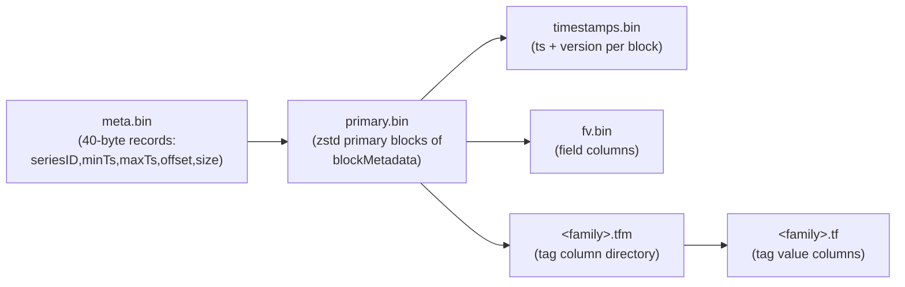

**Block structure.** A block holds the rows (data points) of **one series ID**, sorted by timestamp. Within a block, every column is stored contiguously and addressed by one `blockMetadata` record. Blocks are globally ordered by `(seriesID asc, minTimestamp asc)`. A `version` is stored alongside each timestamp; when two rows share a timestamp, only the highest version is returned (dedup).

**Size caps** (`banyand/measure/measure.go`) — note two distinct enforcement strategies:

| Cap | Value | Enforced by |
| --- | --- | --- |
| `maxUncompressedBlockSize` | 2 MiB | **split** — start a new block |
| `maxBlockLength` | 8192 rows | **split** |
| `maxUncompressedPrimaryBlockSize` | 128 KiB | **split** — flush the primary block |
| `maxValuesBlockSize` | 8 MiB | **panic** — hard invariant |
| `maxTagFamiliesMetadataSize` | 8 MiB | **panic** — hard invariant |

A block boundary is also forced whenever the series ID changes.

**Encoding/compression** is shared with the other columnar engines — see §8. Numeric field/tag columns use delta / delta-of-delta / const + zigzag varint; non-numeric columns use dictionary encoding (≤256 distinct values) or a plain bytes block; long byte payloads and the primary/meta indexes are zstd level-1.

**Series index.** On write, a *metadata* document (`seriesID ↔ entity values`) is inserted into the segment series index (`segment.IndexDB().Insert`). This is only for series resolution — it does **not** hold field values.

**Write path:** `processDataPoint` → buffer as memory part → on flush, `tsTable.mustAddDataPoints` (columns) **and** `IndexDB().Insert` (metadata docs).
**Query path:** resolve candidate series from the series index → load matching parts from snapshots → scan blocks for the requested columns/time range → order/aggregate/top-N.

### 3.4 Mode B — index-mode (`index_mode = true`)

No part is ever written. The **entire** data point — entity tags, tags, and field values, all as *stored* fields — becomes one document in the segment series index (Bluge), keyed by series ID with **upsert** (Update) semantics.

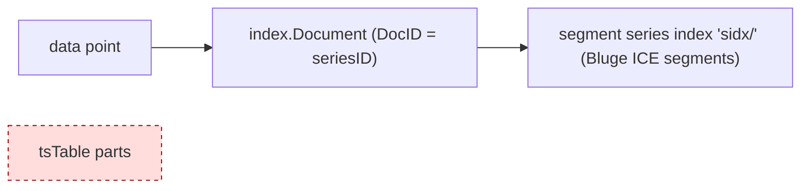

- **Storage:** Bluge `*.seg` / `*.snp` ICE segments under the segment-level `sidx/`. No columnar part files.
- **Synthetic fields** added only in this mode: `_im_name` (the measure subject) and `_im_entity_tag_<tag>` (so entity components are independently queryable), plus internal `_series_id`, `_timestamp`, `_version`, `_id`.
- **Write path:** `handleIndexMode` builds the document → `segment.IndexDB().Update(docs)`. `mustAddDataPoints` is never called.
- **Query path:** short-circuits to `buildIndexQueryResult` → `IndexDB().SearchWithoutSeries` — it reads projected stored fields straight out of the index over a time range and de-dupes by series ID with a roaring bitmap. There is no series-list pre-resolution and no block scan.
- **What does NOT apply:** field `encoding_method`/`compression_method`, columnar block layout, part compaction, and TopN — all of those are Mode-A concepts. Index-mode segments use Bluge's own S2 compression for stored fields.

Index-mode is intended for low-cardinality, non-time-series-shaped data (e.g. service traffic / metadata) where every tag should be searchable.

### 3.5 TopNAggregation (derived from a normal-mode measure)

`TopNAggregation` has **no write RPC**. It is materialized from the source measure's writes:

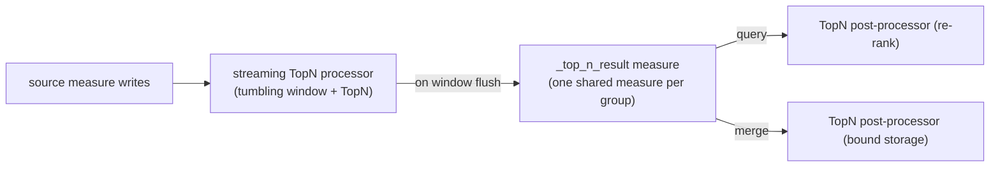

- Pre-aggregated **at ingest**: each source write is fed through a streaming flow (tumbling time window + TopN operator). On window flush, the rankings are published as a normal data point into a single shared result measure named **`_top_n_result`** (auto-created once per group). Multiple `TopNAggregation` definitions in a group share this measure, distinguished by a `name` entity tag.
- Re-ranked **at query** (TopN post-processor merges per-timestamp heaps across blocks/segments) **and at merge** (to keep stored top-N blocks bounded). So the stored data is a *candidate set*; the final top-N is computed at read time.
- If `field_value_sort` is unspecified, two processors run (ASC and DESC), distinguished by a `direction` entity tag.
- The persisted value is a single opaque binary blob (`TopNValue`) holding the top entities and their int64 values — one blob per (group, window), not one row per ranked entity.

---

## 4. Stream

### 4.1 The Stream resource (API)

A `Stream` schema (`schema.proto` message `Stream`) has `tag_families` + `entity` only — **no fields, no interval, no index_mode, no sharding_key**. A stream stores immutable **elements** (e.g. log entries). Indexing is declared **out of band** via `IndexRule` + `IndexRuleBinding`, not in the Stream message.

- **Write** — `StreamService.Write` (stream of `ElementValue{element_id, timestamp, tag_families}`). If `element_id` is set, the storage DocID is `HashStr("group|name|element_id")`; elements are immutable (never updated).
- **Query** — `StreamService.Query` (`time_range`, `criteria`, `projection` (required), `order_by`).

### 4.2 Three physical stores under one resource

A single `Stream` is backed by **three** separate structures, selected implicitly:

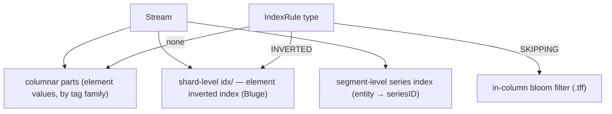

1. **Columnar parts** — the element data, structured like Measure's but with no `fv.bin`:

| File | Difference vs Measure |
| --- | --- |
| `metadata.json`, `meta.bin`, `primary.bin` | same roles |
| `timestamps.bin` | holds timestamps **+ elementIDs** (not versions); elementIDs are a plain varuint list |
| `<tagFamily>.tf` / `.tfm` | same roles |
| `<tagFamily>.tff` | **tag filter file** — per-tag bloom filters for SKIPPING-indexed tags (new vs Measure) |
| `smeta.bin` | optional series metadata |

(No `fv.bin` — streams have no fields.) Unlike Measure, rows with the same timestamp but different `element_id` are **both** stored (no dedup). Stream defines `maxUncompressedBlockSize`/`maxValuesBlockSize`/`maxTagFamiliesMetadataSize`/`maxUncompressedPrimaryBlockSize` but **no `maxBlockLength`** — blocks are cut by size or series change only.

2. **Shard-level element index `idx/`** — a Bluge inverted index mapping indexed-tag terms → element IDs (with a parallel timestamp posting list). This resolves `TYPE_INVERTED` predicates and sort-by-tag. (This is the element-level analogue of the series index, and is **undocumented** in the older `tsdb.md`.)

3. **Segment-level series index** — holds the entity (`seriesID ↔ entity values`), shared with the other engines.

### 4.3 Index rules map to two different mechanisms

This is the key thing a reader must understand: an `IndexRule`'s `type` decides *which physical mechanism* a tag gets, and the Stream schema never mentions it:

- **`TYPE_INVERTED`** → postings in the shard-level `idx/` inverted index (full inverted index).
- **`TYPE_SKIPPING`** → **no** inverted index; instead an in-column **bloom filter** written to `<tagFamily>.tff` (block-level skip).
- unindexed → plain columnar values only.

### 4.4 Query fork

The same Query RPC dispatches to two executors based on whether `order_by.index` is set:

- **no `order_by.index`** → time-series scan: read columnar parts filtered by series ID + time range, using in-column bloom filters for SKIPPING tags.
- **`order_by.index` set** → indexed query: drive the `idx/` inverted index to seek/sort element IDs, then fetch projected tag columns from the parts.

---

## 5. Trace

### 5.1 The Trace resource (API)

A `Trace` schema (`schema.proto` message `Trace`) is a **flat list of tags** (no tag families) plus three special tag-name pointers:

| Field | Role |
| --- | --- |
| `trace_id_tag_name` | the tag holding the trace ID — **both the shard key** (`Hash(traceID) % shards`) **and the span store's primary key** |
| `timestamp_tag_name` | the tag holding span start time — drives segment/time selection |
| `span_id_tag_name` | the tag holding the span ID |

- **Write** — `TraceService.Write` (stream of `{tags[], span (raw bytes), version}`). Every span always goes to the span store; bound index rules additionally feed the sidx.
- **Query** — `TraceService.Query` (`time_range`, `criteria`, `order_by`, `tag_projection`). Responses are always grouped **by trace ID**.

Unlike Measure, **Trace has no mode flag**. The storage fork is driven entirely by index rules and the query's `order_by`.

### 5.2 Two engines side by side

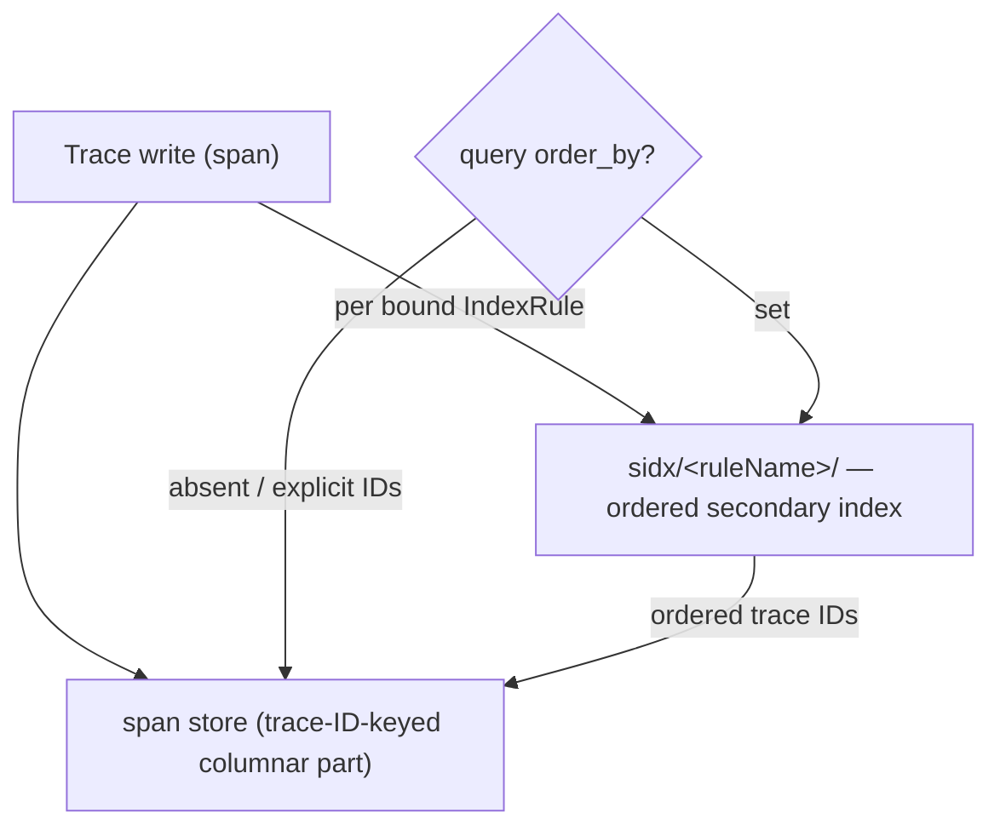

**Span store part files** (`banyand/trace/part.go`) — notably different from Measure/Stream:

| File | Holds | Notes |
| --- | --- | --- |
| `metadata.json` | part stats **including** `minTimestamp`/`maxTimestamp` | timestamps live **only** here (there is **no `timestamps.bin`**) |
| `meta.bin` | index of primary blocks, keyed by **traceID** | record = `EncodeBytes(traceID) + offset(8 BE) + size(8 BE)` |
| `primary.bin` | `blockMetadata` per block | keyed by traceID; points at the span chunk + per-tag columns |
| `spans.bin` | the raw span payloads + span IDs | **opaque** application bytes (one `[][]byte` block per traceID range), compressed via the shared bytes-block (zstd) |
| `<tag>.t` / `<tag>.tm` | per-tag value column + metadata | **flat** per-tag files (not tag families); extensions `.t`/`.tm`, **not** `.tf`/`.tfm` |
| `tag.type` | tag name → value type | one map per part (because `blockMetadata` omits the value type, it is merged back at read time) |
| `traceID.filter` | part-level **bloom filter over all traceIDs** | used to prune parts on traceID lookup |
| `smeta.bin` | optional series metadata | |

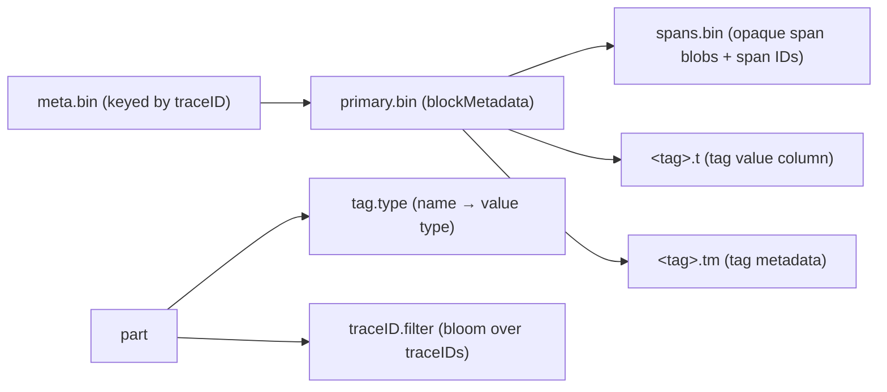

**Block structure.** A block holds all spans of **one trace ID** (bounded by `maxUncompressedSpanSize` = 2 MiB of opaque span bytes). All three index levels (`meta.bin` → `primary.bin` → in-block) are sorted by traceID for binary search.

**Block pruning is limited.** Trace's only block/part-pruning structures are the part-level `traceID.filter` bloom and the embedded sidx. The per-tag `.tm` records *do* have `min`/`max`/`filterBlock` fields, but the trace engine writes them **empty** — there is **no tag-level block-skip filter** (unlike Stream's `.tff` and sidx's `.tf`).

**Conflict-tag rename on merge.** If the same tag name appears with different value types across merged parts, the columns are kept separate by suffixing the name with its type (`name#int`, `name#str`, …); read-time projection resolves the suffixed columns.

### 5.3 sidx — the ordered secondary index

The "TREE" index rule (proto enum `TYPE_TREE`) is implemented by the **sidx** store (`banyand/internal/sidx`), one instance per index rule, materialized lazily under `shard-<N>/sidx/<ruleName>/`. sidx stores `(seriesID, int64 ordering-key, tags, data)` records ordered by the key — it holds the int64 sort key (e.g. `duration`, start time) and the trace ID, but **not** the spans.

**sidx part files:**

| File | Holds |
| --- | --- |
| `manifest.json` | part metadata (authoritative): ID, key range, counts, sizes |
| `meta.bin` | index of primary blocks (40-byte records, zstd) |
| `primary.bin` | `blockMetadata` per block (zstd primary blocks, capped at **64 KiB** uncompressed — vs 128 KiB elsewhere) |
| `keys.bin` | the int64 ordering keys, encoded but **not** block-compressed |
| `data.bin` | user payload blobs (for trace: a control byte + trace ID), zstd bytes-block |
| `<tag>.td` / `.tm` / `.tf` | per-tag value column / metadata / **bloom filter** (the `.tf` is written only for non-dictionary tags) |

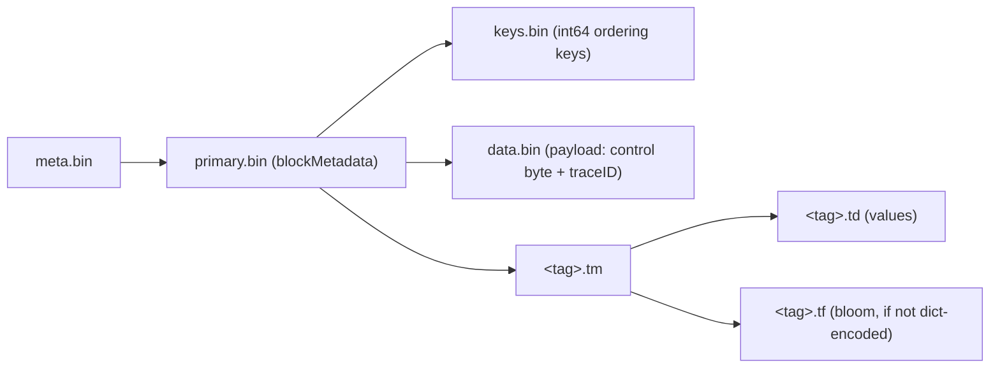

A block holds one series ID's records over a contiguous key range, sorted by key (caps: 8192 elements / 2 MiB).

### 5.4 Query fork

- **`order_by` absent (or explicit trace IDs given)** → hit the span store directly (binary-search by traceID, gated by `traceID.filter`).
- **`order_by` set** → stream **ordered** trace IDs from the named sidx, then fetch the spans from the span store for those IDs.

So an index rule on a `Trace` does not merely "add an index" — it instantiates an entirely separate ordered storage engine, and `order_by` is the user-facing switch between the two read paths.

---

## 6. Property

### 6.1 The Property resource (API)

`Property` presents a **mutable key/value** API, keyed by `group/name/id`, with etcd-style `ModRevision`/`CreateRevision`. There are two proto messages named `Property`: the **schema** (`database.v1.Property`, the tag-type contract registered once) and the **data** (`property.v1.Property`, the actual values).

- **Apply** (`PropertyService.Apply`) — upsert with `strategy` `MERGE` (default, union of previous + current tags) or `REPLACE` (full overwrite).
- **Delete** — soft delete (tombstone). `id` is optional (omit to delete all ids under a name).
- **Query** — `groups`, `name`, `ids`, `criteria`, `tag_projection`, `limit`, `order_by`. **There is no time-range parameter** — Property is not a time series.

Storage options are on the **group**: only `shard_num` matters; `segment_interval` and `ttl` on the group are **silently ignored** for properties.

### 6.2 Storage: a Bluge document store (not KV, not TSDB)

Despite the KV-style API, there is no KV engine and no time-series engine. Each `(group, shard)` is **one Bluge inverted index**; every property revision is **one document**.

```
<property-root>/property/data/<group>/shard-<N>/
├── <012x>.seg     # ICE-v3 segment: documents (stored _source JSON + indexed terms)
├── <012x>.snp     # snapshot manifest: live segments + per-segment DELETED roaring drop-set
└── bluge.pid      # writer lock
```

There is **no segment (time) directory** — a single Bluge directory per shard holds all revisions of all properties in that shard.

**Document fields** (`banyand/property/db/shard.go`, the doc keyed by `entity/ModRevision`):

| Field | Stored? | Indexed? | Meaning |
| --- | --- | --- | --- |
| `_source` | ✅ | — | the whole property serialized as JSON (the value) |
| `_sha_value` | ✅ | — | SHA-512 of source + delete-time (for repair) |
| `_deleted` | ✅ (only when deleted) | — | delete-time nanos (tombstone) |
| `_id` | ✅ | ✅ | the entity (`group/name/id`) |
| `_timestamp` | ✅ | ✅ | = `ModRevision` |
| `_entity_id`, `_group`, `_name` | — | ✅ | indexed identity terms |
| per tag (`hash(tagKey)`) | — | ✅ | one indexed term per tag (all tags are always indexed) |

> The read-back projection is `{_id, _timestamp, _source, _deleted}`. Note `_version` and `_series_id` are **not** written on the property path (unlike the generic series-index path).

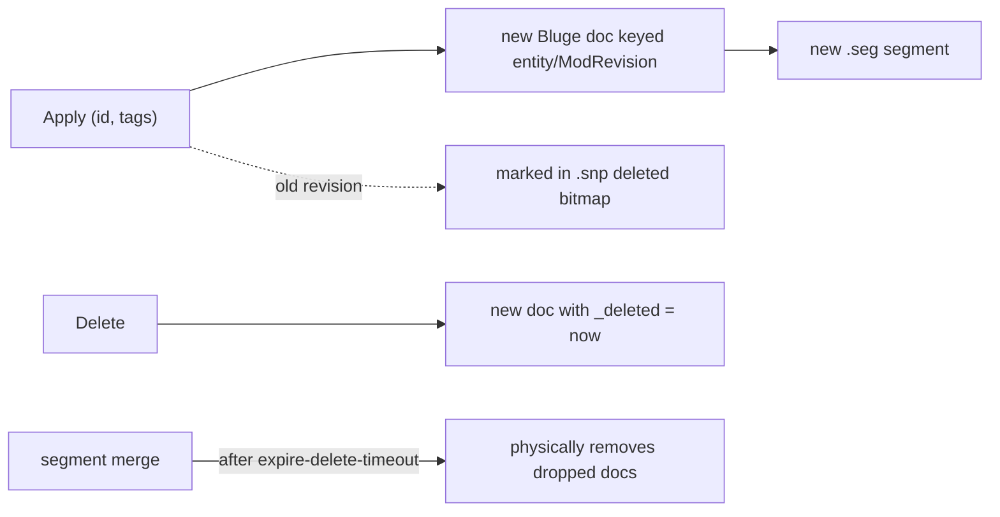

**Mutation = append + tombstone, not in-place edit:**

- An update writes a brand-new document (new revision); the prior same-`_id` document is added to a **per-segment DELETED roaring bitmap** recorded in `.snp`. Reads `AndNot` the deleted set, so the old revision is masked, not rewritten.
- A delete writes a new document carrying `_deleted = deleteTime` (soft delete).
- **Physical removal happens only at Bluge segment merge**, and only `property-expire-delete-timeout` (default 7 days) after the tombstone — so "deleted" data lingers on disk until then. There is no per-property TTL.
- Conflict resolution is last-writer-wins by `ModRevision` (the physical doc ID is `entity/ModRevision`).

**Compression:** stored fields (`_source`) are chunked (128 docs/chunk) and compressed with **S2** by default (not zstd); postings are roaring bitmaps; term dictionaries are FSTs.

### 6.3 Anti-entropy repair

Property has a gossip-based repair mechanism backed by a **custom Merkle tree** (SHA-512; leaf per entity, xxhash slot buckets, root) persisted as `state-tree.data` under a **separate** repair directory (`state.json`, transient `state-append-<slot>.tmp`, `state-tree.data`). Peers reconcile root → slot → leaf SHAs over a bidi gRPC stream and exchange full property protos for mismatches. See [Property Background Repair](property-repair.md).

---

## 7. Encoding & compression primitives (shared)

All columnar engines (Measure Mode A, Stream, Trace span store, sidx) share the same low-level primitives in `pkg/encoding`. Understanding these once explains every `*.bin`/`*.tf`/`*.t`/`*.td` column.

### 7.1 The byte-block / length-list framing

- **`compressBlock`** is the single compression chokepoint. A payload **< 128 bytes** is stored plain (`[type=0][1-byte len][raw]`); a payload **≥ 128 bytes** is zstd level-1 (`[type=1][varuint complen][zstd bytes]`).
- **`EncodeUint64Block`** packs a uint64 list at an **adaptive bit width** — it scans for the max and emits a 1-byte selector (8/16/32/64-bit) then fixed-width **big-endian** values, then runs the result through `compressBlock`.
- **`EncodeBytesBlock`** serializes a `[][]byte` as `[uint64-block of lengths][compressBlock of concatenated bytes]`. Lengths use **nil-encoding offset-by-one**: a `nil` entry encodes as `0`, a present entry as `len+1` (so an empty-but-present `[]byte` encodes as `1`).

### 7.2 Numeric column encoding

- **int64 columns** (and timestamps, sidx keys): `Int64ListToBytes` chooses per run from `Const` / `DeltaConst` / `Delta` / `DeltaOfDelta`, with deltas as **zigzag varint**; a `firstValue` is stored alongside. There is **no zstd** at this layer.
- **float64 columns**: converted to an int64 mantissa + an int16 exponent (`Float64ListToDecimalIntList`), then int64-delta encoded.
- **versions** (Measure) use a parallel `WithVersion` encode-type variant.

### 7.3 Non-numeric (string/binary/array) column encoding

- **Dictionary** when ≤ 256 distinct values: values stored as a bytes-block, indices RLE-then-bit-packed. The dictionary itself doubles as an exact membership filter.
- otherwise **plain** `EncodeBytesBlock`.
- Array tags are `|`-delimited (with `\` escaping); int64 arrays are raw 8-byte concatenations.

### 7.4 Where zstd is applied

zstd level-1 is applied to: the whole `meta.bin`, each ~128 KiB primary block in `primary.bin`, and any byte payload ≥ 128 bytes inside a column. Timestamps, element IDs, and sidx keys are **not** zstd'd (delta/zigzag only).

### 7.5 Two encoding footguns (do not be misled)

- **`ENCODING_METHOD_GORILLA` is a schema hint, not Gorilla XOR.** The `FieldSpec.encoding_method = GORILLA` enum is set in schemas, but the columnar engine encodes fields with the delta/dictionary scheme above. The actual Gorilla XOR encoder (`pkg/encoding/xor.go`) and the `SeriesEncoder`/`SeriesDecoder` interfaces are **dead code** — no engine wires them in. Do not document them as live primitives.
- **Per-field `compression_method = ZSTD` is not a per-field setting.** zstd is applied generically (§7.4), driven by size thresholds, not by the schema enum.

---

## 8. Distributed: how parts move between nodes

In cluster mode, parts are shipped to replica/data nodes by a **chunked-sync** protocol (`banyand/queue/pub|sub/chunked_sync.go`). The on-the-wire form is **not** a byte-for-byte copy of the directory:

- **Logical file model.** Each part is sent as a list of `FileInfo{name, offset, size}` where `name` is a *logical* identifier decoupled from the on-disk filename: `meta`, `primary`, `timestamps`, `fv`, `t:<tag>`, `tm:<tag>`, `tf:<tag>`, `tff:<tag>`. The receiver maps each logical name back to the concrete file (`meta` → `meta.bin`, `t:foo` → `foo.t`, …). So the streamed file list differs from the literal directory listing.
- **Chunk framing.** Data is split into ~1 MiB chunks with a monotonic `chunk_index`, a per-chunk **CRC32 (IEEE)** checksum, and a `VersionInfo` (API + file-format version) validated on every chunk. A single logical file can span multiple chunks; the receiver appends per-chunk slices in order. (Note: `FileInfo.offset` is **chunk-relative** in practice; the proto comment saying "within the part" is stale.)
- **`meta` is regenerated, not copied.** The live syncer rebuilds the `meta` bytes from the in-memory `primaryBlockMetadata` (marshal + zstd), producing bytes equivalent to `meta.bin` rather than reading the file. (A separate verbatim path, `CreatePartFileReaderFromPath`, exists for migration/copy flows.)
- **`metadata.json` is not shipped.** It is reconstructed on the receiver from the per-part `PartInfo` numeric fields. By contrast `traceID.filter` and `tag.type` *are* streamed (as logical files) but flushed at `FinishSync`.

### 8.1 Failed-parts handling

If a part still fails to sync after retries (3 attempts, exponential backoff), it is preserved under `failed-parts/` as **hard links** (no byte copy) at `<root>/failed-parts/<016x>_<partType>/` (partType `core` or a sidx name). The directory is size-capped (`--failed-parts-max-size-percent`, default 10%) with oldest-first eviction, and is explicitly **skipped** when loading parts (so it is never mistaken for a live part or deleted as an unparseable epoch).

---

## 9. Quick reference — files by engine

| Engine | Per-unit directory | Key files |
| --- | --- | --- |
| Measure (columnar) | `seg-…/shard-N/<016x>/` | `metadata.json` · `meta.bin` · `primary.bin` · `timestamps.bin` (ts+version) · `fv.bin` · `<fam>.tf` · `<fam>.tfm` · `smeta.bin?` |
| Stream | `seg-…/shard-N/<016x>/` + `shard-N/idx/` | `metadata.json` · `meta.bin` · `primary.bin` · `timestamps.bin` (ts+elementID) · `<fam>.tf` · `<fam>.tfm` · `<fam>.tff` · `smeta.bin?` |
| Trace (span store) | `seg-…/shard-N/<016x>/` | `metadata.json` · `meta.bin` · `primary.bin` · `spans.bin` · `<tag>.t` · `<tag>.tm` · `tag.type` · `traceID.filter` · `smeta.bin?` |
| sidx (trace 2°) | `seg-…/shard-N/sidx/<rule>/<016x>/` | `manifest.json` · `meta.bin` · `primary.bin` · `keys.bin` · `data.bin` · `<tag>.td` · `<tag>.tm` · `<tag>.tf` |
| Measure (index-mode) | `seg-…/sidx/` (segment series index) | Bluge `<012x>.seg` · `<012x>.snp` |
| Series index (all TSDB) | `seg-…/sidx/` | Bluge `<012x>.seg` · `<012x>.snp` |
| Property | `…/property/data/<group>/shard-N/` | Bluge `<012x>.seg` · `<012x>.snp` · `bluge.pid` |

---

## See also

- [TSDB](tsdb.md) — the columnar TSDB engine concepts (segment/shard/part/block, snapshot MVCC, write/read paths).
- [Data Model](data-model.md) — the logical/API model (groups, resources, index rules).
- [Data Rotation](rotation.md) — segment rotation and retention.
- [Property Background Repair](property-repair.md) — the gossip + Merkle anti-entropy detail.
