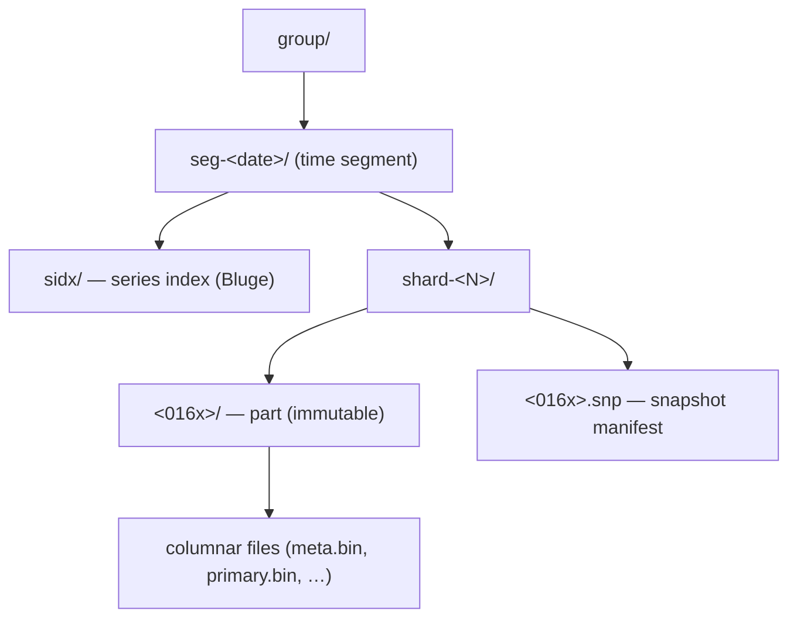
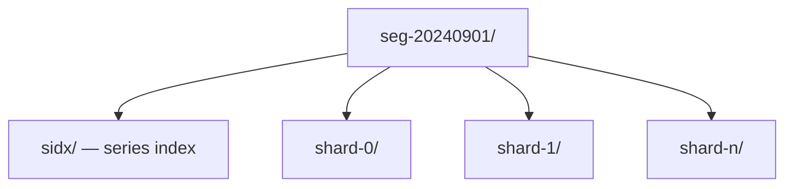
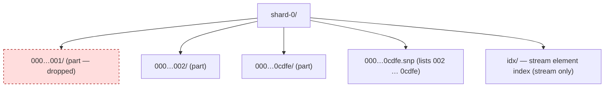
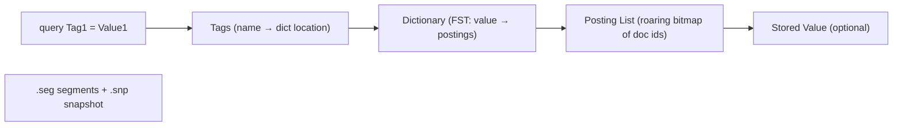
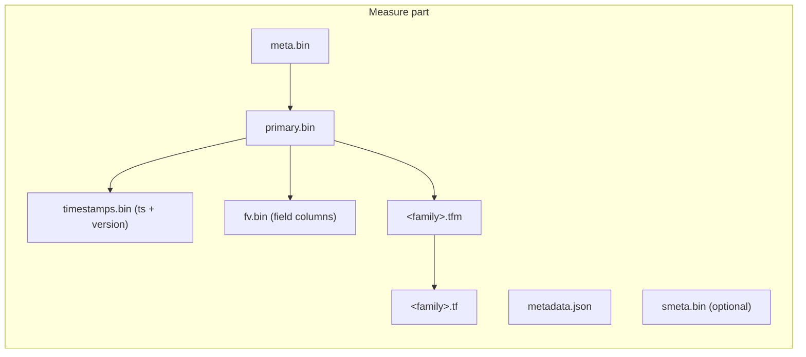
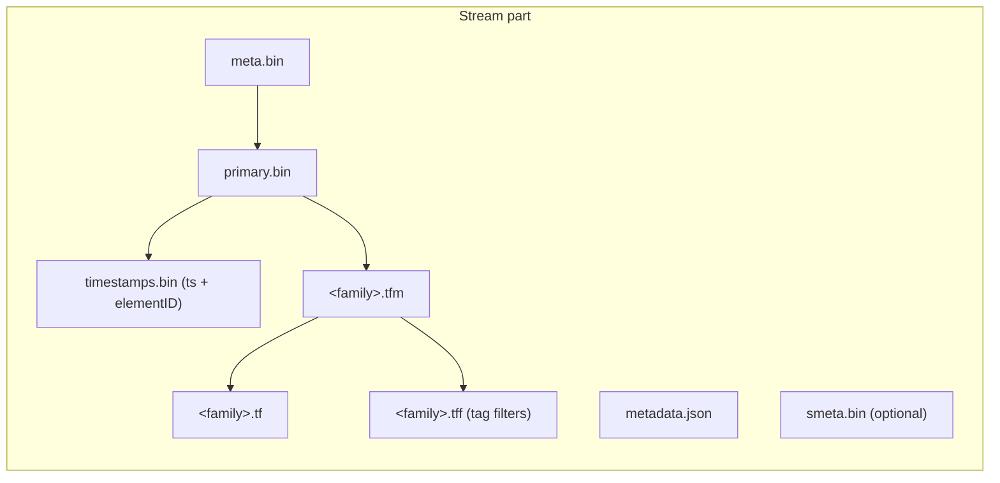
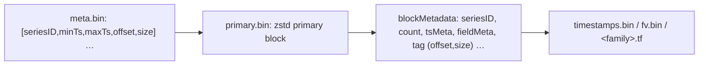

# TimeSeries Database(TSDB) v1.3.0

TSDB is a time-series storage engine designed to store and query large volumes of time-series data. One of the key features of TSDB is its ability to automatically manage data storage over time, optimize performance and ensure that the system can scale to handle large workloads. TSDB empowers `Measure`, `Stream` and `Trace` relevant data.

In TSDB, the data in a group is partitioned based on the time range of the data. The segment size is determined by the `segment_interval` of a group. The number of segments in a group is determined by the `ttl` of a group. A new segment is created when the written data exceeds the time range of the current segment. The expired segment will be deleted after the `ttl` of the group.

More than the time series data model, TSDB also provides a schema-less and non-time-series data type, `Property`. The `Property` data type is used to store the document which contains several tags. The `Property` data is an independent group that contains only `shard`s, without `segment_interval`, `ttl`, or other time-series-related features.

> This page describes the TSDB engine concepts. For the on-disk file format of every resource organized **from the API perspective** (including `Property`, measure index-mode, the shared encoding primitives, and the distributed sync wire format), see [Storage & File Format](storage-and-format.md).

The on-disk hierarchy is `group → segment → shard → part`:

For `Property`, there is no time segment: a group contains shards directly, each shard being a single inverted index (see [Storage & File Format](storage-and-format.md#6-property)).

## Segment

In each segment, the data is spread into shards based on `entity`. The series index (the per-segment `sidx/` directory, a Bluge inverted index) is stored in the segment and is used to locate the data in the shard.

A segment directory is named `seg-<suffix>`, where the suffix is the segment-start time formatted as `YYYYMMDDHH` (hour granularity) or `YYYYMMDD` (day granularity), selected by the group's `segment_interval` unit.

## Shard

Each shard is assigned to a specific set of storage nodes, and those nodes store and process the data within that shard. This allows BanyanDB to scale horizontally by adding more storage nodes to the cluster as needed.

In `Stream`, `Measure` or `Trace`, each shard is composed of multiple [parts](#Part). Whenever SkyWalking sends a batch of data, BanyanDB writes this batch of data into a new part.

- For data of the `Stream` type, an element-level inverted index built from `TYPE_INVERTED` index rules is stored in the shard's `idx/` directory.
- For data of the `Trace` type, BanyanDB maintains an ordered secondary index (`sidx`) for `TREE` type index rules under the shard's `sidx/` directory. The secondary index stores data with user-controlled int64 ordering keys, enabling efficient sorted result retrieval. (Note: this shard-level `sidx/` is distinct from the segment-level `sidx/` series index above — same name, different depth and purpose.)

Since BanyanDB adopts a snapshot approach for data read and write operations, the shard maintains snapshot information to record the validity of the parts. The shard contains `<016x>.snp` (JSON array of live part directory names) to record which parts are valid. In the chart, `000…001` is absent from the snapshot file, which means the part is invalid; it will be cleaned up in the next flush or merge operation.

In `Property`, the shard is implemented directly by an [inverted index](#Inverted-Index). Users can filter data by tag.

## Inverted Index

The inverted index locates data within a segment/shard. It is used in several places:

- the per-segment **series index** (`seg-…/sidx/`) — for `Measure`, `Stream`, and `Trace`, it maps entity/tag terms to the **series id**;
- the per-shard **element index** (`Stream`'s `idx/`) — it maps indexed-tag terms to **element ids** (with a parallel timestamp posting list);
- the **index-mode `Measure`** store and the entire **`Property`** store (see [Storage & File Format](storage-and-format.md)).

The inverted index uses the Bluge/ICE segment format. It stores a `snapshot` file `<012x>.snp` to record the validity of segments; a segment id absent from the snapshot is invalid and will be cleaned up at the next flush or merge.

A segment file `<012x>.seg` contains the inverted index data, with these logical parts:

- **Tags**: the mapping from a tag name to its dictionary location.
- **Dictionary**: an FST (Finite State Transducer) dictionary mapping a tag value to its posting list.
- **Posting List**: the mapping from a tag value to the series id / element id (and, when stored, a location for the stored value). Posting lists are roaring bitmaps.
- **Stored Value**: optionally stored field values. (For `Property`, individual tags are *not* stored here — only the whole-document `_source` JSON is stored; tags are indexed-only.)

## Tree Index

The "tree index" (proto enum `TYPE_TREE`) is the high-performance ordered index used by `Trace`. It is implemented by the **sidx** (secondary index) store, not a literal tree structure; it stores records ordered by a user-controlled int64 key, enabling efficient sorted retrieval.

Each `TREE` index rule bound to a trace creates a separate sidx instance, identified by the index rule name, under `shard-<N>/sidx/<ruleName>/`. During writes, the engine extracts the int64 value from the indexed tag (e.g. `duration`, start time) and stores it as the ordering key alongside the trace id. During queries, sidx supports streaming retrieval sorted by the key, cross-shard ordered merging, and key-range filtering.

sidx follows the same part-based storage model as the main data store (memory parts flushed to disk parts, with periodic merges). Its on-disk files (`keys.bin`, `data.bin`, per-tag `.td`/`.tm`/`.tf`, etc.) are detailed in [Storage & File Format](storage-and-format.md#53-sidx--the-ordered-secondary-index).

## Part

Within a part, data is split into multiple files in a **columnar** manner. The exact set of files depends on the engine:

- **Measure**: timestamps (with versions) in `timestamps.bin`; field-value columns in `fv.bin`; tags grouped into tag families, with values in `<tagFamily>.tf` and the column directory in `<tagFamily>.tfm`.
- **Stream**: same as Measure but with **no `fv.bin`** (streams have no fields); `timestamps.bin` holds timestamps **+ element ids**; each tag family adds a `<tagFamily>.tff` filter file (bloom filters for `SKIPPING`-indexed tags).
- **Trace**: a different layout — opaque span payloads in `spans.bin`, **no `timestamps.bin`** (timestamps live in `metadata.json`), flat per-tag files `<tag>.t` / `<tag>.tm` (not tag families), plus `tag.type` and a part-level `traceID.filter` bloom. See [Storage & File Format](storage-and-format.md#5-trace).

Each part also maintains metadata files:

- `metadata.json` — descriptive information for the part (compressed/uncompressed sizes, total count, block count, min/max timestamp). The part id is the directory name, not stored inside the JSON.
- `meta.bin` — a skipping index file that is the entry point for the part; it indexes the `primary.bin` file. It is a zstd-compressed stream of fixed-size `primaryBlockMetadata` records.
- `primary.bin` — the index of each [block](#Block). Through it, the data files (and the tag-family metadata files ending with `.tfm`) are located. It is a sequence of independently zstd-compressed "primary blocks".
- `smeta.bin` (optional) — compact series metadata (e.g. SeriesID → EntityValues), used for sync/recovery and offline inspection tools. It may be absent on older parts.

The diagrams below show the Measure and Stream part fan-out (`meta.bin → primary.bin → data columns`):

## Block

Each block holds data with the same series ID (for `Trace`, the grouping key is the **trace id** instead). A block is the minimal unit of TSDB and contains several rows of data; because of the column-based design, a single block is spread across several files. Blocks are globally ordered by `(seriesID, minTimestamp)`.

Block size is bounded by configurable caps (enforced by splitting): for Measure, by both data volume (2 MiB uncompressed) and row count (8192 rows); for Stream, by data volume only; for Trace, by opaque span volume (2 MiB). Separate 8 MiB caps on per-block value/metadata regions are hard invariants (enforced by panic). See [Storage & File Format](storage-and-format.md#33-mode-a--normal-columnar-index_mode--false) for the full table.

In Measure's `timestamps.bin`, a `version` is stored next to each timestamp. The version deduplicates rows that share an identical timestamp — only the latest (highest-version) row is returned to the user.

The two-level index and per-block record layout:

| `meta.bin` record (`primaryBlockMetadata`, 40 bytes, zstd stream) | bytes |
| --- | --- |
| seriesID | 8 (big-endian) |
| minTimestamp / maxTimestamp | 8 + 8 |
| offset / size (into `primary.bin`) | 8 + 8 |

A `primary.bin` "primary block" (zstd-compressed, ~128 KiB uncompressed) is a run of `blockMetadata` records, each carrying the seriesID, row count, the timestamps location, and per-column / per-tag-family `(offset, size)` pointers into `timestamps.bin`, `fv.bin`, and the `.tfm`/`.tf` files.

Unlike Measure, Stream's `timestamps.bin` stores **element ids** (not versions); rows with the same timestamp but different element id are both stored (no dedup). Stream's `.tfm` records additionally carry per-tag `min`/`max` (for Int64 tags) and a pointer to the `.tff` filter block; as of 0.10.0, dictionary-encoded tags use the dictionary itself as an exact filter rather than a bloom filter.

## Write Path

The write path of TSDB begins when time-series data is ingested into the system. TSDB consults the schema repository to check that the group exists, then hashes the SeriesID (or the configured sharding key) to determine which shard the data belongs to.

Each shard is responsible for storing a subset of the data and holds an in-memory index for fast lookups.

When a shard receives a write request, the data is written to a buffer as a memory part; the series index (and, for indexed tags, the inverted index) is updated as well. A background worker periodically flushes the memory part to disk. After a flush completes, it triggers a merge operation to combine parts and remove invalid data.

Whenever a new memory part is generated, or a flush or merge completes, the snapshot is updated and outdated snapshots are deleted. Only the parts referenced by a persistent snapshot are visible to readers.

## Read Path

The read path retrieves data from disk or memory and returns it to the query engine, working across the buffer (memory parts) and on-disk parts.

The first step is an index lookup to determine which parts cover the requested time range; each part's `metadata.json` records its start and end time. The buffer (memory parts) is checked first; if the data is not present there, the read path proceeds to the on-disk parts. Because of the columnar layout, satisfying a query may require reading several data files per part.

### Snapshot Coordination

BanyanDB uses a shared snapshot coordination mechanism to ensure atomic snapshot transitions across the trace engine and the sidx (secondary index) engine. When a snapshot transition occurs, both engines coordinate to produce a consistent view of the data, preventing situations where the trace engine and the sidx engine have different views of the same data. This coordination is automatic and requires no operator configuration.

### Series Metadata Persistence

In cluster mode, liaison nodes persist series metadata to disk. This improves recovery after restarts by allowing the liaison to rebuild its series mapping without waiting for data from other nodes. The persisted metadata includes the mapping between series IDs and entity values.

The dump tool can analyze series metadata files (`smeta.bin`) stored in each part directory for debugging purposes. See [Disk Management](../operation/disk-management.md#dump-tool-series-metadata) for details.
