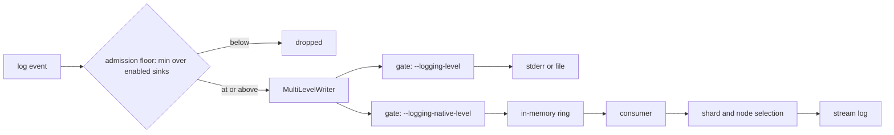

# Self-Stored Logs

Status: **design** — not implemented.

BanyanDB self-stores its metrics into the `_monitoring` group but has no equivalent for its own
logs: `pkg/logger` writes to a single `io.Writer` fixed at `logger.Init` time, so logs leave the
process on stderr and are gone when a pod recycles. This document specifies a second, optional
destination for logs — native self-storage into a `_monitoring_log` stream group — alongside
normal logging, which is never disabled.

It follows the native metrics path where that path fits, and departs from it where logs are events
rather than sampled state: a missed metric flush costs nothing because the next one carries the
current value, while a dropped log line is data loss. That single difference is the source of most
departures here.

---

## 1. Feature introduction and scope

BanyanDB already self-stores its own telemetry, but only half of it. Metrics have a native path into the database; logs do not.

| | Metrics today | Logs today |
|---|---|---|
| Destination | `_monitoring` group, one Measure per metric | one `io.Writer`, fixed at `logger.Init` time |
| Turned on by | `--observability-modes=native` | always on, no choice of destination |
| Queryable, retained | yes, with a TTL | no, stderr is the log driver's problem |

> During an incident the metrics are in the database and the logs are not. When a pod recycles, they are gone.

This feature adds a second, optional destination for logs: native self-storage into a new `_monitoring_log` stream group, behind `--logging-native-enabled` (bool, default `false`). Normal logging keeps its current behaviour — one zerolog writer, stderr today, though zerolog also supports file writers — and is never disabled.

| | Roles | Rationale |
|---|---|---|
| In scope | standalone, data, liaison | reach stream storage directly |
| In scope | lifecycle, backup | colocated producers, using the receiver on their host's data node |
| In scope | FODC — the on-demand diagnostics collector, agents plus a proxy | a generic receiver/forwarder serves it, so BanyanDB imports nothing from FODC |
| Out of scope | restore, migration | they run when the data tier is unavailable |

The sections that follow go roles, approach, configuration, failure modes.

## 2. Role → function → log destination

One binary, several roles. One property decides the destination: whether the process owns a storage engine or must reach one.

| Role | Function | Log destination |
|---|---|---|
| `standalone` | full server | own storage, in-process (`queue.Local()`) — as native metrics already do |
| `data` | shards, writes, queries | own storage, in-process (`TopicStreamWrite`) |
| `liaison` | front door: validate, route, batch | one hop to a data node over its tier-2 client, the pool spelled `tire2Client` in the code |
| `backup`, `lifecycle`, FODC agent beside data | snapshot, migration, diagnostics | colocated data node's cluster server, `127.0.0.1:17912` |
| FODC proxy, FODC agent beside a liaison | diagnostics, no colocated data node | liaison gRPC port (`--grpc-port`, default 17912) |
| `restore`, `migration` | offline tools | normal logging only |

> A liaison has local disk: it runs a two-tier write queue whose normal `StreamService/Write` route ends in part files. What it lacks is the storage engine, so it can hold a batch in flight but can never be where logs are read back from.

Three shapes: in-process; the liaison selecting a data node by shard; and every other producer publishing into the generic receiver, subscribed on data nodes' cluster server and on the liaison.

> Restore and migration use normal logging only by construction, not as a gap to close later: a tool that runs while the database is down cannot log into it. The native flags are registered only by the server, backup, lifecycle and FODC binaries.

## 3. Proposed approach

### 3.1 The writer seam

One event, two level-gated writers under zerolog's `MultiLevelWriter`. The zerolog level becomes an admission floor — the more verbose of the enabled sinks — and each sink then applies its own threshold, letting native run at `info` while normal logging stays at `error`.



Worked example, normal logging at `error` and native at `info`, so the floor is `info`.

| event | admitted | normal sink | native sink |
|---|---|---|---|
| debug | no | – | – |
| info / warn | yes | dropped by its own gate | stored |
| error | yes | printed | stored |

Per-module thresholds resolve once when a logger is built, with normal level, native level and exclusion cached on it, never by parsing JSON per line. Matching is by **prefix**, since an override truncates the module name it stamps: `--logging-modules=liaison-grpc` stamps `LIAISON-GRPC.STREAM-T1` as `LIAISON-GRPC`.

### 3.2 Buffer and transport

| property | value |
|---|---|
| unit | one stream `WriteRequest` per event, drawn from and returned to a **pool**. Requests and their nested allocations are reused; a request returns to the pool only after its publish completes or it is dropped, with retained references cleared and oversized buffers discarded rather than kept |
| payload | values carried in tags. The `data:fields` tag holds **only** keys with no tag of their own — no duplicated body |
| bounds | `--logging-native-max-bytes` `32mb`, `--logging-native-max-event-bytes` `64kb` (proposed defaults, section 4) |
| triggers | `--logging-native-flush-interval` `1s` and `--logging-native-flush-size` `100` |
| durability | none — no queue files, no WAL, no disk fallback |

The consumer is a dedicated goroutine selecting over the closer, the flush ticker and the ring, so both triggers fire.

> When native is enabled the ring is live from logger initialisation; service start only begins draining it, so no startup line is stranded in a buffer nobody drains.

### 3.3 Routing and shard selection

Shard IDs are deterministic and real, computed as the normal write path computes them — entity locator from the fetched schema, then hash modulo shard count — not the hardcoded shard `0` of native metrics. The default is `--logging-native-shard-num=2`; at `1` every event keys to one shard and the whole cluster funnels onto a single data node. The count can be raised later through the group schema, though lowering it silently hides shards already written.

> **Decided: keep the selection, replace the transport.** Reusing the liaison's existing shard-based routing and never touching disk cannot both hold, because that route terminates in the disk-backed write queue and writes part files. The liaison therefore keeps the shard and node **selection** and publishes directly to the selected data node over its tier-2 client, bypassing the write queue entirely. The new native log topic serves the receiver's foreign producers, not the liaison's own route. Two facts make this modest rather than novel: nothing enforces shard ownership on ingest, and `lifecycle` already publishes straight into a colocated data node in production today.

The receiver is deliberately thin.

| Rule | Behaviour |
|---|---|
| Validation | `InvalidArgument` on a nil or non-millisecond timestamp, empty `element_id` or `node_id`, oversized body, out-of-enum level, oversized batch |
| Back-pressure | `ResourceExhausted` when its own ring is over budget; never blocks |
| Filtering | no local level, no module override — what arrives is what is stored |
| Echo | received events never enter its own logging path |
| Identity | `element_id` and identity tags pass through unchanged; identity must live in the element |

`--logging-native-enabled` governs only a process's own collection: a node with it `false` still accepts, routes and persists forwarded writes.

### 3.4 Schema

| object | value |
|---|---|
| group | `_monitoring_log`, catalog `STREAM`, TTL `--logging-native-ttl-days` (7), `Replicas` `0` — matching `_monitoring` |
| stream | `log`, one shared by every role |
| entity | `node_id`, `level` |
| searchable tags | `node_id`, `node_type`, `module`, `level`, `grpc_address`, `http_address`, `message`, `log_id` |
| data tag | `fields`, binary — the leftover keys only, omitted when there are none |
| index rules | none in v1 |

`level` is an entity tag; entity tags accept only equality and set membership, so selecting several levels uses `IN` rather than a negation. `module` stays an ordinary tag — module strings splice in group, measure and task names, so entity membership would give unbounded series cardinality. Nothing stores the original line verbatim: known keys become tags, and only the remainder lands in `fields`.

Having no index rules costs more than scan speed. An analyzer is configured on an index rule, so with none defined `MATCH` has no analyzer to tokenize with and falls back to comparing the value whole — `MATCH "timeout"` does not find `write timeout exceeded`, and it reports no match rather than an error. Full-text search over `message` is therefore an index rule away, not available now; `=` and the time range are what narrow a query in v1.

## 4. Parameters and configuration

Two independent namespaces; neither inherits from the other.

| namespace | flags | environment | notes |
|---|---|---|---|
| normal logging | `--logging-*` | `BYDB_LOGGING_*` | unchanged; typically `error` in production |
| native stream | `--logging-native-*` | `BYDB_LOGGING_NATIVE_*` | default level `info`, always JSON |

Every dashed flag binds to `BYDB_<UPPER_SNAKE>`, and the env value applies only when the flag was not set on the command line, so an explicit flag wins.

Nine of these are flags today. The rest are values the design calls for that are currently fixed constants in the code, or belong to a later phase; the `status` column says which, so that nothing here reads as configurable before it is.

| flag | default | meaning | status |
|---|---|---|---|
| `--logging-native-enabled` | `false` | collect this process's own logs natively | flag |
| `--logging-native-level` | `info` | root level of the native sink | flag |
| `--logging-native-exclude-modules` | built-in prefix set | modules never sent natively, breaking the write-path feedback loop; replaces, not appends | flag |
| `--logging-native-flush-interval` | `1s` | longest a buffered event waits | flag |
| `--logging-native-flush-size` | `100` | events that trigger a batch | flag |
| `--logging-native-max-bytes` | `32mb` | configured ring cap | flag |
| `--logging-native-max-event-bytes` | `64kb` | oversize events dropped whole | flag |
| `--logging-native-shard-num` | `2` | shards of `_monitoring_log`; raisable later through the group schema | flag |
| `--logging-native-ttl-days` | `7` | retention | flag |
| `--logging-native-modules` / `--logging-native-levels` | `nil` | per-module overrides, prefix-matched, length-checked | not implemented — the root level and the exclude set are the only controls today |
| `--logging-native-write-timeout` | `5s` | per-batch publish timeout | constant `writeTimeout` |
| `--logging-native-drain-timeout` | `5s` | bound on the final drain at shutdown | constant `drainTimeout` |
| `--logging-native-memory-fraction` | `0.02` | fraction of available memory in the adaptive budget | constant in `bindBudget` |
| `--logging-native-memory-reserve` | `64mb` | reserve subtracted before the fraction | constant in `bindBudget` |
| `--logging-native-receiver-enabled` | `false` | accept forwarded writes, wherever hosted; independent of collection | phase 2 — nothing forwards yet |

The constants are held back deliberately: each would be a supported name the moment it is a flag, and none has a use case yet beyond the value already chosen. Level semantics are in section 3.1; the four existing `--logging-*` flags keep their names and defaults.

> With `--logging-native-enabled=false` — the default — no schema and no counters are created, nothing is admitted, and the cost is one atomic pointer load per event. The ring itself is allocated either way: the sink is built while the command tree is, before the flags are parsed, so the buffer exists for the lines emitted during startup. It is one channel of `8192` entry headers and holds nothing.

## 5. Failure modes

```
event -> producer -> buffer(ring) -> consumer -> schema -> selection -> publish -> destination
                                                                                       |
                      GracefulStop: stop admission, then bounded drain ----------------+
```

Every stage that can fail has a row, carrying one behaviour and one reason from the closed `reason` set on `native_dropped_total`. Eight of the reasons exist today; the two marked *phase 2* are stages a single node does not have, and they arrive with remote routing.

| Stage | Situation | Behaviour | Counter reason |
|---|---|---|---|
| producer | event over `--logging-native-max-event-bytes` | dropped whole, never truncated — a truncated JSON body is unparseable | `oversize_event` |
| producer | the encoded line is not the JSON the sink expects | dropped and counted; the caller is never made to care | `encode_failed` |
| buffer | ring over budget | drop the newest event, the writer still returning `(len(p), nil)`; admission never waits for capacity and queued events are never evicted, so a burst keeps its head | `buffer_full` / `memory_pressure` |
| consumer | stalled in a slow publish | the ring absorbs it; batches capped at 25% of budget, one in flight, so a stall cannot pin admission | – gauge `native_buffer_bytes{state=in_flight}` |
| schema | create fails for anything but `AlreadyExists`, or the group is dropped at runtime | retry every 10s, batch in hand dropped | `schema_unavailable` |
| schema | a `log` stream exists whose families, tag order or entity differ from this version's | refuse and count; the retry stays in place so an operator can drop and recreate the group without restarting, but waiting alone never clears it | `schema_incompatible` |
| selection | `Locate` errors or returns an empty node ID | count and return; never publish to an empty node | `locate_failed` — *phase 2* |
| local publish | listener unhealthy | the bus skips it and drops the payload while returning an error, so any error means full batch loss | `publish_failed` |
| remote publish | error, breaker open, admission timeout, auth rejection | batch dropped, never re-queued; classified from the per-node error map from `Close` | `publish_failed` — *phase 2* |
| destination | local topic not yet subscribed | retain, N retries, then drop | `destination_unready` — *phase 2* |
| read path | a data node has not yet caught up on the schema | its query processor returns stream-not-exist and the distributed planner discards the whole response, blanking the query. **Pre-existing** for any group created while the cluster is running, user groups included — not introduced here. Mitigation is a one-site change in the planner, out of scope for this feature | – |
| shutdown | buffer still full at the deadline | remainder dropped once `--logging-native-drain-timeout` expires; teardown never blocked | `shutdown_deadline` |

> No row blocks, retries forever, or falls back to disk. Loss is bounded and always counted.

### 5.1 Memory budget

```
budget = min(max-bytes, memory-fraction * max(0, availableBytes - memory-reserve))
availableBytes < 0  ->  budget = max-bytes          # unknown is not unlimited
```

All three terms are native flags whose defaults are proposals. The budget is recomputed every 5s, counting queued and in-flight bytes alike. The sink reads `AvailableBytes()` only — never the blocking `AcquireResource` on the logging path, never waiting, never reclaiming bytes in flight; over budget it drops and counts. Where no protector is registered the cap alone applies; the adaptive term binds only where one is.

| Process | Adaptive term | Why |
|---|---|---|
| standalone, data | binds | protector registered as a run unit |
| everything else | cap only | availability reports `-1`, or no protector is registered. We leave the liaison as it is today rather than registering one, since that would arm load shedding that has never run |

That gap is pre-existing. The liaison's protector is deliberately left unregistered here, because registering it would also arm liaison load shedding that has never run in production, which does not belong in a logging change. The sink needs no change if it is registered later — the same formula simply begins to adapt — so the cap is sized to be safe on its own.

> Normal logging is never degraded by the sink. Native is the more verbose sink, so at normal `error` and native `info` a dropped native `info` event has no normal copy anywhere — the drop counters are the only record it existed.

> With `--observability-modes=native` alone those counters travel the same transport as the logs, so the same outage loses both. The sink therefore also emits a periodic drop summary straight to stderr, and we recommend keeping `prometheus` enabled alongside.
