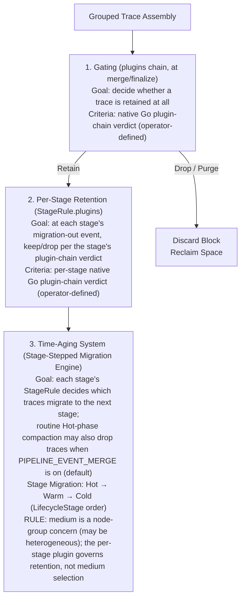
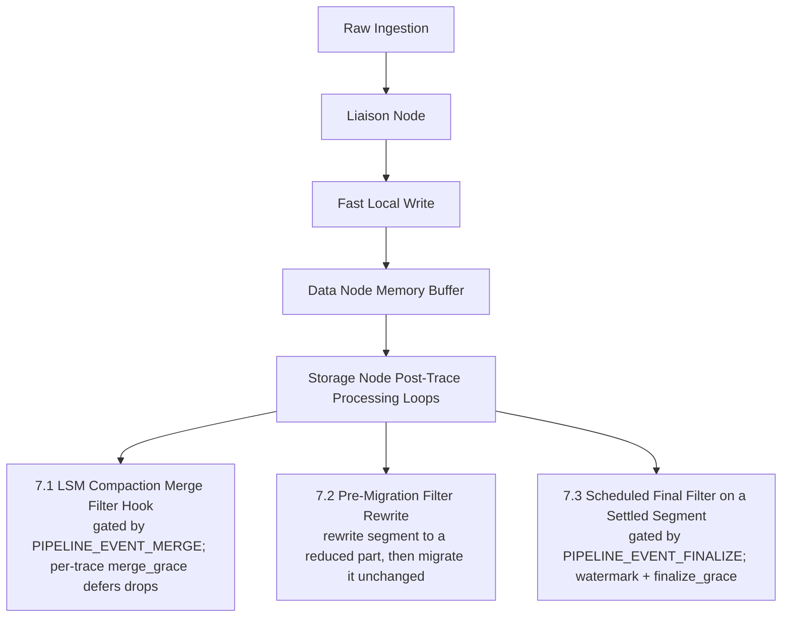
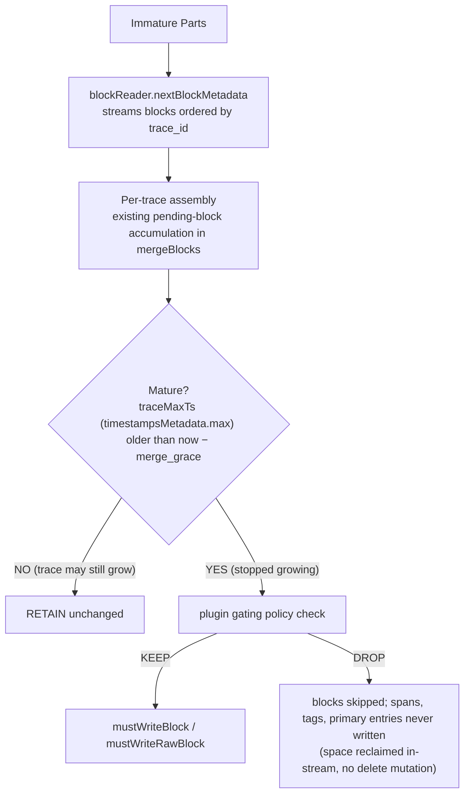
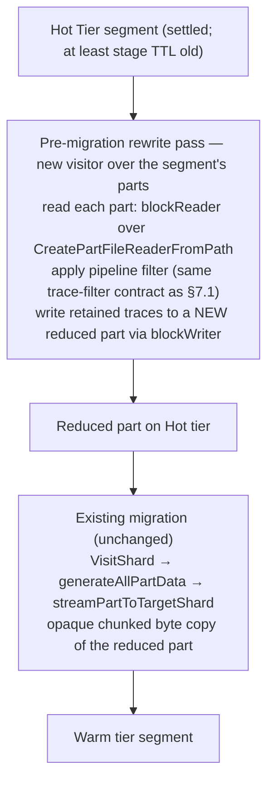
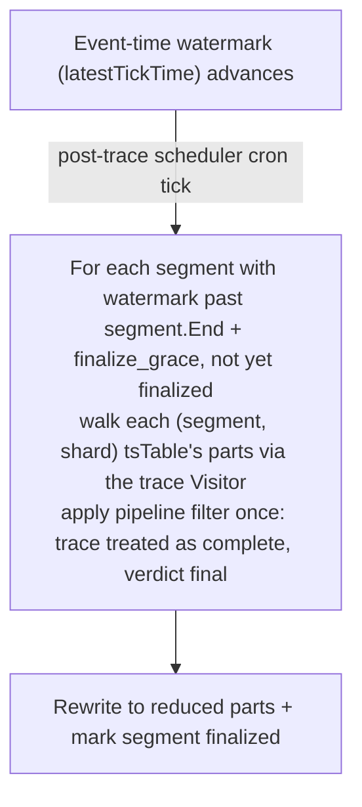
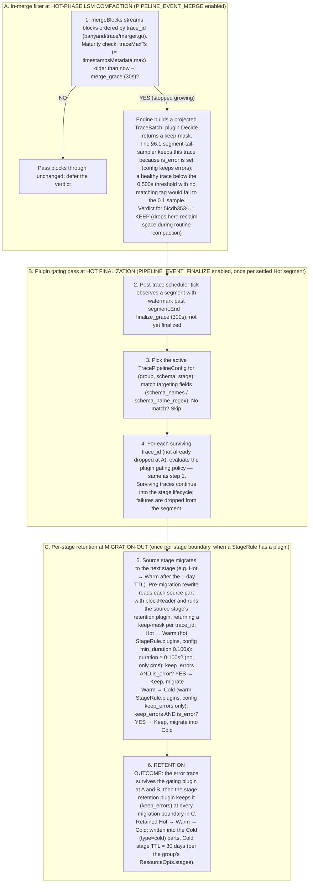

# BanyanDB Storage-Node Post-Trace Pipeline & Storage Tier Mapping Specification

This document presents the complete technical design for the **BanyanDB Storage-Node Post-Trace Pipeline** and its integration with physical hardware storage tiers and time-aging schedulers.

Unlike traditional streaming-based telemetry engines that perform span assembly inside active, memory-heavy windowing pipelines, BanyanDB relies on a **native trace model**. Spans are stored, sorted, and indexed by `trace_id` directly within the storage engine layout on individual data nodes.

By decoupling trace assembly from the active ingestion path, the post-trace pipeline executes asynchronous tail-sampling, per-stage retention filtering, and data reduction natively during storage lifecycle events on the data nodes. This design is grounded in recent academic advancements in post-hoc retroactive tracing and storage-level file merge analysis.

## Architectural Concept: Decoupled Gating and Per-Stage Retention

To maximize storage efficiency and compute performance on the BanyanDB data nodes, trace evaluation is separated into two logical phases, which subsequently feed into an automated **time-aging system** for partition-level migration:



### 1.1 Gating (the `plugins` chain)

- **Operation Type**: An ordered chain of native Go plugins (`plugins`) delivers the keep/drop verdict. Each link is a `Plugin` (today the only kind is a sampler); the chain is a sequential pipe — links run in declared order, each evaluating the traces the previous link kept, so an all-sampler chain is the conjunction of the links' verdicts (§2.5). It is the sole gating mechanism, invoked at whichever of the toggleable events is enabled.

- **Responsibility**: Gating runs **only in the Hot phase**, at whichever of the toggleable events is enabled — `PIPELINE_EVENT_MERGE` (in-merge on Hot compactions, §7.1; default-on) and/or `PIPELINE_EVENT_FINALIZE` (on settled Hot segments, §7.3); Warm and Cold compactions are byte-for-byte lossless. It determines whether a freshly-assembled trace block **survives** at all — passing into the stage lifecycle — or is **purged** to reclaim storage space.

- **Compute Profile**: Operator-defined. The plugin receives a vectorized batch of traces and, via its `Project()` declaration, materializes only the columns it needs — the named tag columns and, only when requested, the heavy span bodies (§2.5). Verdicts are expected to be pure in their inputs (the `TraceBatch` plus the frozen `config`), so they are deterministic in `trace_id` and stable across re-evaluation once the trace is mature per `merge_grace` or settled per `finalize_grace`.

- **Contract**: An ordered chain of native Go plugins (`.so`s loaded in-process via the Go `plugin` package); each link owns a keep/drop verdict and the chain composes them as a sequential pipe, invoked by the same enabled events at the same maturity/settling gates. Each link's contract — a vectorized columnar batch in, a boolean keep-mask out, with up-front column projection — is specified in §2.5.

### 1.2 Per-Stage Retention (`StageRule.plugins`)

- **Operation Type**: Per-stage keep/drop verdict by a native Go plugin chain. Each `StageRule` carries its own `plugins` chain; a trace it drops is omitted from the part written for the next stage at the stage's migration-out boundary.

- **Responsibility**: Decides **which traces survive each stage** as data ages. Each `StageRule` fires once per segment lifetime, at the stage's **migration-out** boundary (when the segment migrates to the next stage). The "rising bar" effect — Hot keeps more, Cold keeps less — is expressed by tightening each stage plugin's config at successive stages. The pipeline does **not** choose the physical storage medium; that is a node-group / `LifecycleStage` placement concern (§4.1). Routine Hot-phase LSM compaction is governed independently by `PIPELINE_EVENT_MERGE` (on by default, applies the plugin gating policy with a per-trace `merge_grace` gate; see §5.1 / §7.1). With merge disabled — and at every Warm/Cold compaction — LSM compaction stays byte-for-byte lossless.

- **Compute Profile**: Operator-defined — the same vectorized contract as the gating plugin (§2.5): the stage plugin receives a batch of traces, projects only the columns it declares via `Project()`, and returns a boolean keep-mask. `MinTS`/`MaxTS` are free from block metadata; tag columns are decoded only when the plugin's projection requests them.

## Protobuf Message Design

The pipeline configuration is a single trace-typed message, `TracePipelineConfig`. Rather than a parallel abstract metadata layer, it reuses the existing catalog identifiers — Group (via `metadata`), lifecycle stage names, and schema names — and adds only the trace-specific gating (a native plugin chain) and per-stage retention rules. General stream parsing and metrics aggregation configurations are excluded to maintain a strict focus on trace-centric analytical operations.

### 2.1 Targeting Model: Reuse Existing Catalog Identifiers

This design deliberately does **not** introduce an abstract `Pipeline` resource or an `ExecutionTrigger` enum. Both would re-declare targeting that the storage model already owns and let the two drift. A trace pipeline is instead expressed entirely with identifiers that already exist:

- **Group** — named by the config's own `metadata.group` (`common.v1.Metadata`). A `TracePipelineConfig` lives in, and applies to, that Group, exactly as every other schema resource does. The Group already fixes the `catalog`, so catalog is never repeated.
- **Lifecycle stages** — a `StageRule` per targeted stage, each naming a stage from the Group's `ResourceOpts.stages` (e.g. `"hot"`, `"warm"`, `"cold"`) and carrying that stage's **retention `plugins` chain** (the same native-plugin mechanism as gating). Each rule fires at the stage's migration-out boundary. Stage names are the same vocabulary queries already accept (`trace/v1/query.proto`'s `stages`). All retention policy is configured here, per stage and per pipeline — there is no hardcoded retention logic in the engine.
- **Schema selector** — an explicit `schema_names` list (exact match on `common.v1.Metadata.name`) plus a `schema_name_regex` (RE2). A schema matches if it is listed OR matches the regex; both empty targets every schema in the Group.

The former `ExecutionTrigger` (COMPACTION / MIGRATION / SCHEDULED) is replaced by three anchored events: the **in-merge filter at LSM compaction** (§7.1, toggleable via `PIPELINE_EVENT_MERGE` — on by default), the **plugin gating pass at finalization** (§7.3, toggleable via `PIPELINE_EVENT_FINALIZE`), and the **per-stage retention pass at migration-out** (§7.2, always-on when any `StageRule` carries a `plugins` chain). The first two run the gating chain; the third runs the per-stage `StageRule` chains. This keeps the trace-specific rules out of the generic, catalog-agnostic `common.v1.LifecycleStage` (which stream and measure groups share) while still binding them to stages by name.

Multiple `TracePipelineConfig`s may coexist in a Group only when their effective coverage is disjoint; the schema registry enforces this with a per-tuple uniqueness rule (§2.3).

### 2.2 Trace Pipeline Specification (`trace_pipeline.proto`)

The full message definitions live in the proto source at `api/proto/banyandb/pipeline/v1/trace_pipeline.proto` (package `banyandb.pipeline.v1`); they are not duplicated here. `TracePipelineConfig` is the single root resource: it carries its own identity (`metadata`), the targeting fields from §2.1, and the trace-specific gating (a native plugin chain) and per-stage retention rules. There is no embedded abstract `Pipeline` and no `ExecutionTrigger`; the anchored filter points are the plugin-chain gating at merge/finalization and per-stage retention at migration-out.

The message set is:

- **`TracePipelineConfig`** — root resource: `metadata`, `enabled`, the per-stage `stages` rules, the `schema_names` / `schema_name_regex` selector, the gating policy as a native-plugin `plugins` chain, the `enabled_events` list (defaults to `[PIPELINE_EVENT_MERGE]`), and the two grace windows `merge_grace` (§5.1 / §7.1) and `finalize_grace` (§7.3) — each consulted only when its corresponding event is enabled.
- **`PipelineEvent`** — enum of pipeline-wide events: `PIPELINE_EVENT_MERGE` (in-merge filter at LSM compaction, §7.1) and `PIPELINE_EVENT_FINALIZE` (plugin gating pass at segment finalization, §7.3). Per-stage retention (`StageRule`) fires implicitly at migration-out and is not in this enum.
- **`StageRule`** — binds the pipeline to one lifecycle stage and carries that stage's retention `plugins` chain: a `stage` name plus a `repeated Plugin`. The rule fires at the stage's migration-out boundary, where the chain's keep-mask decides which traces migrate; a `StageRule` with an empty `plugins` chain has no filtering effect (see §4.2).
- **`Plugin`** — one link in a chain: a `name` plus a `oneof kind` whose set arm selects the kind. The set arm is the discriminator; today the only arm is `sampler` (a `SamplerPlugin`). Adding a kind is purely additive — a new payload message and a new `oneof` arm — so existing configs and field numbers are untouched (§2.6).
- **`SamplerPlugin`** — the sampler kind of `Plugin`: `path` (the `.so` within the trusted plugin dir), `symbol` (constructor, default `NewSampler`), `abi_version` (checked against the host at load), and a structured `config` (`google.protobuf.Struct`) set directly in the pipeline config — the engine serializes it to JSON and hands it to the plugin, which unmarshals it into its own typed config. The vectorized-batch / projection / verdict contract is the Go SDK, not the proto (§2.5).
- **`TracePipelineRegistryService`** — the CRUD registry surface (`Create` / `Update` / `Delete` / `Get` / `List` / `Exist`, with HTTP mappings under `/v1/trace-pipeline/schema`), mirroring every other schema resource's `*RegistryService`. `Create`/`Update` are where the admission and conflict checks of §2.3 / §2.4 run. Without this service a `TracePipelineConfig` would be an orphaned, un-writable resource.

### 2.3 Uniqueness and Conflict Policy

Multiple `TracePipelineConfig` resources can coexist in a Group, but their **effective coverage must be disjoint on two independent keys**, so the behavior at every point is deterministic — there is no implicit ordering, priority, or composition of overlapping pipelines:

- **Gating key `(Group, Schema, Event)`** — at most one active pipeline may gate a given schema at a given `PipelineEvent` (`PIPELINE_EVENT_MERGE` / `PIPELINE_EVENT_FINALIZE`). Gating runs only in the Hot phase (§1.1), independent of `stages`.
- **Retention key `(Group, Schema, Source-Stage)`** — at most one active pipeline may carry a `StageRule` for a given schema at a given source stage's migration-out boundary.

**Effective coverage of a pipeline.** A `TracePipelineConfig` P with `enabled=true` covers:

- **Gating tuples** `(P.metadata.group, schema, event)` for each `schema` selected by `P.schema_names`/`P.schema_name_regex` (both empty selectors target every schema in the Group) and each `event` in `P.enabled_events` (default `[PIPELINE_EVENT_MERGE]`).
- **Retention tuples** `(P.metadata.group, schema, stage)` for each selected `schema` and each `stage` named by a `StageRule` in `P.stages`. An empty `P.stages` covers **no** retention tuples — it declares no per-stage retention, consistent with the proto semantics that empty `stages` means no per-stage drop.

**Conflict detection on write.** When a `TracePipelineConfig` is created or updated, the registry expands its gating and retention tuples against the current schemas and stages of its Group and rejects the write if **any** tuple on either key is already covered by another `enabled` pipeline in the same Group. The error names the conflicting pipeline and the overlapping tuple(s).

**Schema additions.** When a new `Trace` schema is created in a Group, the registry re-validates every `enabled` `TracePipelineConfig` in that Group against the new schema. If the new schema would cause two pipelines to overlap on any gating or retention tuple, the schema creation is rejected; the operator must narrow the pipelines (e.g. add explicit `schema_names`) before adding the schema.

**Disabling and replacement.** Setting `enabled=false` removes a pipeline from active coverage immediately, freeing its tuples for another pipeline to claim. This is the safe path for atomically swapping in a new pipeline: disable the old, enable or create the new, then delete the old. There is no implicit precedence between two `enabled` pipelines — the registry will not pick a winner.

**Runtime defense-in-depth.** At each enabled Hot-phase event (§7.1/§7.3) the engine selects the active pipeline by gating key `(group, schema, event)`; at a migration-out boundary (§7.2) it selects by retention key `(group, schema, source_stage)`. If a registry inconsistency ever exposes more than one active match for a key, the engine logs an error and applies **none** of them — failing safe to retain rather than risk a nondeterministic destructive drop.

**Recommended pattern.** For most workloads, a single pipeline per Group with a broad `schema_name_regex` is the simplest configuration. Multiple pipelines in a Group are useful only when their schema selectors are mutually exclusive (for example `schema_names: ["segment"]` and `schema_names: ["zipkin_span"]` in a hypothetical mixed group) so no tuple is doubly covered.

### 2.4 Admission Validation

The proto pins bounds with PGV so a malformed config is rejected at parse time rather than producing undefined behavior. The schema registry's admission control adds one cross-field rule that PGV cannot express.

**PGV-enforced bounds** (rejected at proto parse / `Write` time):

- `TracePipelineConfig.merge_grace`, `TracePipelineConfig.finalize_grace` — strictly positive when set; unset means engine default (30s and 5m respectively). Each is consulted only when its corresponding `PipelineEvent` is in `enabled_events`.
- `TracePipelineConfig.enabled_events` — each element must be a defined, non-`UNSPECIFIED` enum value (`repeated.items.enum = {defined_only: true, not_in: [0]}`).
- `TracePipelineConfig.schema_names` — each element non-empty (`repeated.items.string.min_len = 1`).
- `StageRule.stage` — non-empty (`min_len: 1`); `Plugin.name` — non-empty (`min_len: 1`); `SamplerPlugin.path` — non-empty (`min_len: 1`); `SamplerPlugin.abi_version` — `gte: 1`.

**Admission rules (server-side; not expressible in PGV):**

- **Required rule blocks when enabled.** When `TracePipelineConfig.enabled = true`, the config must declare at least one of: (a) a non-empty gating `plugins` chain paired with a non-empty **effective event set** — that is, after applying the `[PIPELINE_EVENT_MERGE]` default for an unset/empty `enabled_events`, at least one of `PIPELINE_EVENT_MERGE` or `PIPELINE_EVENT_FINALIZE` actually fires (this check must be evaluated against the defaulted set, not a raw `len(enabled_events) > 0`, so a gating chain set without an explicit `enabled_events` passes); or (b) at least one `StageRule` with a non-empty `plugins` chain. An enabled pipeline with no gating chain *and* no per-stage chain has no effect and is rejected. To temporarily disable a pipeline, set `enabled = false` — do not strip its rule blocks.
- **Well-formedness checks** (PGV cannot express these cross-element rules): `enabled_events` is normalized to a duplicate-free set (duplicates are de-duped, not an error); every `StageRule.stage` and every `schema_names` entry is unique within the config (duplicates rejected); every `StageRule.stage` names a real stage in the Group's `ResourceOpts.stages` and is **non-terminal** — a `StageRule` on the last (Cold) stage is rejected, since the terminal stage has no migration-out boundary to fire at (§4.2); and `schema_name_regex`, if set, must compile as RE2.
- **Plugin admission (for every link in every chain — gating and per-stage).** Validation is split by topology, because plugins live on the **data nodes** while the registry write path runs on the **liaison/metadata** layer — the liaison cannot itself `dlopen` a data-node `.so`. (1) At write time the liaison validates only the **static** fields it can check without the binary: every `Plugin` has a set `kind` arm and a non-empty `name` (unique within its chain), and for the sampler kind native-plugin loading is enabled cluster-wide (a server flag), `path` resolves inside the configured trusted plugin directory (no path escape), `abi_version ≥ 1`, and `config` is a well-formed `google.protobuf.Struct`. (2) The actual realization — `.so` load via the Go `plugin` package, `symbol` lookup, ABI-version match against the data node's compiled `sdk.ABIVersion`, and the kind's constructor (`NewSampler(config-as-JSON)` for the sampler kind) construction/validation — necessarily happens on **each data node** when it applies the config. A realization failure there does not corrupt data: the runtime **fails open** for the affected tuple (retains everything; logs + metric — see §2.5).

Both the liaison write path and the per-node runtime apply their respective checks. If a registry inconsistency ever lets a malformed config reach a data node, the node logs an error and falls back to **retain** for every tuple the malformed config would have governed — never a destructive drop (consistent with the §2.3 runtime fail-safe).

### 2.5 Native Plugin Contract & Chain Composition

A pipeline's gating policy and each stage's retention are an **ordered chain of native Go plugins** (`plugins`). A `Plugin` is one link — a generic, kind-tagged envelope whose set `oneof` arm selects the kind; today the only kind is a **sampler**, a **user-supplied `.so` loaded in-process via the standard Go `plugin` package** that owns a keep/drop verdict. The chain is invoked by the enabled events (§7.1 / §7.3) at the same maturity (`merge_grace`) and settling (`finalize_grace`) gates. Operators express their retention policy as vectorized Go code — anything from the familiar duration / error / tag / probabilistic keep-rules to verdicts the declarative schema never could (cross-span correlation, e.g. "keep if >30% of child spans errored"; custom value functions; policy derived from data outside the trace).

This is an **operator-only, trusted** extension point: loading a `.so` runs arbitrary code inside the data node, so it is gated behind a server flag and a fixed trusted plugin directory; the proto config only *references* a plugin already vetted on disk (§2.4). It is not tenant-facing.

The contract is designed around three hard requirements.

**(2) Vectorized parameter — the engine's native trace columns.** The batch is **not** a parallel columnar form invented for the plugin; it is the engine's own native trace block (`banyand/trace/block.go`). The merger already streams and assembles one columnar `block` per `trace_id` — `spans [][]byte` (the span column), `tags []tag` (tag columns, each a row-aligned `values [][]byte` + a `valueType`), `spanIDs []string`, and `minTS`/`maxTS` — so the plugin receives exactly the projected column slices, shared (not copied). `Decide` is called **once per batch** of assembled per-trace blocks, so per-call overhead is amortized; within each trace, spans are laid out as columns (struct-of-arrays), the same cache-friendly shape Apache Arrow and vectorized engines like [DataFusion](https://datafusion.apache.org/library-user-guide/functions/adding-udfs.html) standardize. Reusing the native block (rather than introducing `apache/arrow-go`) avoids a new heavy dependency *and* is zero-copy.

**(1) Strong compatibility of the parameter and return types.** Go's `plugin` package is strict by design: the [official docs](https://pkg.go.dev/plugin) state host and plugin must be built with "exactly the same version of the toolchain, the same build tags, and the same values of certain flags and environment variables," and that "all common dependencies … [must be] built from exactly the same source code" — in practice "built together by a single … component." This lock is *irreducible*. The contract therefore controls — rather than hides — what crosses the boundary:

- The boundary types live in a single pinned SDK module, `pkg/pipeline/sdk`, that mirrors the native column layout with stdlib slices (`[][]byte`, `[]string`, `int64`) plus the engine's already-public, byte-sized value-type enum `pbv1.ValueType` (`pkg/pb/v1`). Tag values cross as the raw marshaled `[][]byte` exactly as the block holds them; the SDK re-exports the `pbv1` decode helper so a plugin decodes a value by its `ValueType` without importing engine internals directly.
- Because the batch *is* the native trace layout, the plugin is by design **version-locked to the BanyanDB release** — which is consistent with Go plugin's irreducible toolchain lock, not an additional cost. The SDK module is the single version-tagged surface operators build against; `pkg/pb/v1` is a stable `byte` enum, and no `banyand/trace`-internal struct is exported across the boundary.
- The plugin re-exports an `ABIVersion` constant; the engine refuses to load on mismatch with its own compiled `sdk.ABIVersion`, turning a silent miscompile into a clear, fail-fast error. Configuration is a structured `google.protobuf.Struct` (`SamplerPlugin.config`) set directly in the pipeline config; the engine serializes it to canonical JSON and the plugin unmarshals those `[]byte` into its own typed config — so the wire form is structured and inspectable while the `.so` boundary stays a plain `[]byte`, with no shared config struct.
- **Distribution:** operators build plugins against the released, version-tagged `pkg/pipeline/sdk` using the **same CI image / Go version / `-trimpath` / CGO flags** as the data node. (Background constraints, well-documented but outside this design's verified scope: Go plugins are **Linux/macOS only**, **cannot be unloaded** — so changing a plugin requires a node restart, there is no hot-reload — and a plugin **panic crashes the host** unless contained; see fail-open below.)

**(3) Projection / column selection — spans optional, more than tags.** The plugin declares the columns it needs up front via `Project()`, which returns a `Projection{ Tags []string; SpanIDs bool; Spans bool }`. The engine turns `Tags` into the **same `model.TagProjection`** the block reader already honors (`blockMetadata.tagProjection`), so only those tag columns are decoded into `block.tags` — literally the query engine's tag-projection path (`trace/v1/query.proto`), not a new mechanism. Two things are **opt-in and default off**: the span-id column (`Projection.SpanIDs`) and the heavy span-body column (`Projection.Spans`). A subtlety in the native layout makes this matter: `spanIDs` and `spans` are encoded **together** in one data block (`mustWriteSpansTo`/`mustReadSpansFrom`, `banyand/trace/block.go`), so reading span ids is **not** free — requesting either one forces a read of the spans stream. Only `trace_id` and `MinTS`/`MaxTS` are genuinely intrinsic (they come from `blockMetadata` with no decode). So the tiers are: intrinsic-always (`trace_id`, `minTS`/`maxTS`), opt-in-by-name (tags), and opt-in-and-default-off (the spans stream — span ids and/or span bodies) — which is what makes spans *more* optional than tags. The declare-up-front handshake matches the projection-pushdown contracts in [DuckDB's C table API](https://duckdb.org/docs/stable/clients/c/table_functions) (`duckdb_init_get_column_index`) and [DataFusion's `TableProvider::scan`](https://datafusion.apache.org/library-user-guide/custom-table-providers.html) (`projection: Option<&Vec<usize>>`). `min_duration`-style checks are free from `minTS`/`maxTS`, and an error predicate is just a projected tag (e.g. `is_error`), so a plugin that requests neither tags, span ids, nor span bodies stays on the merge raw fast path (`mustReadRaw` → `mustWriteRawBlock`, §7.1) and pays no decode at all.

**Go SDK (`pkg/pipeline/sdk`).** The batch types mirror the native trace `block`/`tag` (`banyand/trace/block.go`); the engine fills them with the block's own slices, shared **read-only** (not copied) — see the read-only contract below:

```go
package sdk

// ABIVersion is compiled into the host and re-exported by every plugin; the
// engine refuses to load a plugin whose ABIVersion differs.
const ABIVersion = 1

// Exported symbols the .so MUST provide (the constructor name is the kind's
// convention — NewSampler for the sampler kind):
//   var  ABIVersion int                          // == sdk.ABIVersion
//   func NewSampler(config []byte) (Sampler, error)

// Kind identifies a Plugin's role in a chain; it mirrors the set arm of the
// proto Plugin.kind oneof. New kinds are added here in lockstep with new arms.
type Kind uint8

const (
    KindUnspecified Kind = iota // zero value; a real plugin never reports it
    KindSampler                 // keep/drop verdict (see Sampler)
)

// Plugin is the common interface every kind satisfies — the generic link type
// the engine handles uniformly. The engine constructs a Plugin, checks Kind
// against the proto oneof arm that named it, then type-asserts to that kind's
// interface (e.g. Sampler). Project and Close are shared by every kind.
type Plugin interface {
    // Kind reports the plugin kind, for bookkeeping and as a cross-check
    // against the proto oneof arm. Constant for the plugin's lifetime.
    Kind() Kind

    // Project is the column-selection handshake, called ONCE at load. The
    // engine honors it for the plugin's lifetime: Tags drives the native
    // model.TagProjection (only those tag columns are decoded); SpanIDs and
    // Spans gate the spans stream. Intrinsic columns are always present.
    Project() Projection

    // Close releases any resources the plugin holds (called once at unload).
    Close() error
}

// Sampler is the keep/drop kind of Plugin (Kind reports KindSampler). In a
// chain it is a conjunction link: each Sampler narrows the traces the next
// link sees.
type Sampler interface {
    Plugin

    // Decide receives a vectorized batch of assembled per-trace blocks and
    // returns a keep-mask aligned to batch.Traces. The batch is READ-ONLY:
    // Decide must not mutate any slice it receives (see the read-only contract).
    Decide(batch *TraceBatch) (Verdict, error)
}

// Projection is the plugin's up-front column request — one handshake covering
// every optional column. Intrinsic columns (TraceID, MinTS/MaxTS) are always
// materialized and are NOT listed here.
type Projection struct {
    // Tags names the tag columns to decode; the engine builds a
    // model.TagProjection from them. Empty => no tag columns decoded.
    Tags []string
    // SpanIDs opts IN to the span-id column. Default false. span ids and span
    // bodies share one encoded data block in the native layout, so requesting
    // span ids forces a read of the spans stream (it is NOT free metadata).
    SpanIDs bool
    // Spans opts IN to the heavy span-body column. Default false: the engine
    // leaves TraceBlock.Spans nil and, on the merge fast path (mustReadRaw),
    // never decodes span bodies. Set true only when the verdict reads them.
    Spans bool
}

// TraceBatch is a vectorized batch of assembled per-trace blocks — the engine's
// native columnar trace layout, not a parallel form invented for the plugin.
type TraceBatch struct {
    Traces []TraceBlock
}

// TraceBlock mirrors the native trace `block`: all columns are indexed in
// lockstep by span row i in [0,Len). The engine shares the block's slices
// READ-ONLY. Intrinsic columns are always populated; SpanIDs, Tags, and Spans
// appear only as requested by Project().
type TraceBlock struct {
    // Intrinsic — always present (from blockMetadata, no spans-stream decode):
    TraceID string
    MinTS   int64       // earliest span start (unix nanos)
    MaxTS   int64       // latest span end; Duration = MaxTS - MinTS
    // Projected — per Project():
    Tags    []TagColumn // projected tag columns (per Projection.Tags)
    SpanIDs []string    // span-id column, row-aligned; nil unless Projection.SpanIDs
    Spans   [][]byte    // span bodies (heaviest column); nil unless Projection.Spans
}

// TagColumn mirrors the native `tag`: a row-aligned column of marshaled values
// plus the value type needed to decode them via the SDK's pbv1 helper.
type TagColumn struct {
    Name      string
    ValueType pbv1.ValueType // pkg/pb/v1 — the engine's stable byte-sized enum
    Values    [][]byte       // one marshaled value per span row; nil == absent
}

// Verdict is the per-trace decision, aligned to batch.Traces.
type Verdict struct {
    Keep []bool // len(Keep) MUST == len(batch.Traces); Keep[i] retains Traces[i]
}
```

These types are real and live in [`pkg/pipeline/sdk`](../../pkg/pipeline/sdk); the block above is the conceptual layout, and the canonical definitions plus the value-decode helpers (`TagColumn.At`, `DecodeTagValue`) are in that package. A complete reference plugin implementing the Scenario 6.1 sampler — config parsing, `Project()`, and tag/span extraction — lives at [`pkg/pipeline/sdk/_example/segment-tail-sampler`](../../pkg/pipeline/sdk/_example/segment-tail-sampler).

**Verdict shape — boolean keep-mask.** `Decide` returns a `[]bool` aligned to `batch.Traces`: `Keep[i]` retains trace `i`. This is the simplest fully-vectorized contract and makes the alignment invariant trivial to check (the engine rejects a verdict whose length ≠ `len(batch.Traces)`). The keep/drop is per `trace_id`, matching the merger's per-`trace_id` write granularity (§7.1).

**Chain composition — sequential pipe.** `TracePipelineConfig.plugins` (gating) and each `StageRule.plugins` (per-stage retention) are *ordered chains*. The engine materializes the **union** of every link's `Project()` once, then runs the links in declared order, handing each link the traces the previous link kept — a read-only sub-batch view, not a copy. The chain's survivors are what the event retains. For an all-sampler chain this is exactly the conjunction (AND) of the links' keep-masks; declaring it as a pipe rather than a commutative AND is deliberate forward-room for non-filter kinds (§2.6), where a link could rewrite the batch the next link sees. **Fail-open is per link:** a link that panics, errors, or returns a length-mismatched verdict is bypassed (its input passes through unchanged) and logged, so one broken link degrades to "keep what reached it," never a chain-wide drop. A single sampler is just a one-element chain.

**Read-only batch contract.** The plugin receives the native block's slices **shared, not copied** — so `Decide` MUST treat `TraceBatch` (and every `[]byte`/`[]string`/`TagColumn` inside it) as **read-only**. The keep-mask is the plugin's **only** output channel. Crucially, persistence is structurally immune to a misbehaving plugin: the engine applies the returned mask to its **own** untouched block data when writing the reduced part — it never serializes the plugin-visible slices back to disk. So even if a buggy plugin mutates its view in place, retained traces are written from the engine's original bytes, not the mutated ones; mutation is undefined behavior for the plugin's own logic but **cannot corrupt stored data**. Because plugins are operator-supplied trusted code (§2.4), the SDK does not defensively deep-copy the batch — the read-only contract plus mask-only output is the guarantee, not a copy.

**Failure handling — fail-open.** The engine wraps every `NewSampler`/`Decide` call in `recover()`. On panic, returned error, or a length-mismatched verdict, the engine **retains every trace in the batch** and emits a log + metric. A retention filter must never *drop* data because of a plugin bug; a misbehaving plugin degrades to "keep everything," not "drop everything." (A consecutive-failure counter may later disable the sampler entirely and alert, but the per-batch default is always keep-all.) Note this fail-open guarantee covers control-flow failures (panic/error/bad verdict); data integrity against in-place mutation is handled separately by the read-only contract above, since `recover()` cannot detect silent mutation.

**Determinism.** `Decide` is expected to be **pure** in its inputs (`TraceBatch` + the frozen `config`). A plugin that consults wall-clock or mutable external state breaks the "re-evaluation is stable across merge/finalize" property the timing model (§3.1) relies on; the SDK documents this expectation.

**Where it runs.** The plugin runs at each enabled event: at `PIPELINE_EVENT_MERGE` the batch collects the mature (`merge_grace`-passed) traces the merger has assembled (§7.1); at `PIPELINE_EVENT_FINALIZE` it collects the settled segment's traces (§7.3). In both cases the engine wraps the native assembled `block` it already holds as a `TraceBlock` (sharing the column slices read-only) and buffers several before calling `Decide` once, applying the same metadata-vs-decode cost split as §7.1: `MinTS`/`MaxTS` come free from `blockMetadata.timestamps`, only the tag columns named by `Project().Tags` are decoded (via the native `model.TagProjection`), and the spans stream (span ids and/or span bodies) is read only when `Project().SpanIDs` or `Project().Spans` is set — otherwise a stream-free verdict stays on the merge raw fast path.

### 2.6 Extending with a New Plugin Kind

The sampler is the only kind this design ships, but `Plugin` is a generic envelope so new kinds are additive — no change to `TracePipelineConfig`, `StageRule`, the chain semantics, or existing `.so`s. Adding a hypothetical **transformer** kind (one that *rewrites* batch data — drop or redact tags, enrich, collapse spans — rather than only filtering) would touch three places, in lockstep:

1. **Proto** — add a payload message and a new arm to the `oneof`: `oneof kind { SamplerPlugin sampler = 2; TransformerPlugin transformer = 3; }`. Existing arms and field numbers are untouched, so old configs still parse.
2. **SDK** — add a `Transformer` sub-interface that embeds `Plugin` and adds its own processing method (e.g. `Transform(*TraceBatch) (*TraceBatch, error)`), plus a `KindTransformer` value and a `NewTransformer` constructor convention. A transform that emits a *new* batch needs a mutable output channel, which is exactly why this design keeps the batch strictly read-only and defers the transform kind: the read-only contract (above) holds precisely because the only shipped kind is a filter.
3. **Engine** — when the chain executor meets a `transformer` link it type-asserts to `Transformer` and feeds its output to the next link instead of applying a keep-mask. The sequential-pipe model (§2.5) already hands each link the previous link's output, so a transform link slots in without changing how the chain is wired — it simply rewrites the sub-batch the next link sees.

The same three-step pattern (proto arm → SDK sub-interface + constructor → engine dispatch) covers any future kind (exporter, router, …); the discriminator is always the set `oneof` arm, cross-checked by `Plugin.Kind()`.

## Retention-Decision Timing & Trace Completeness

Both the plugin gating policy (§1.1) and the per-stage retention plugin (§1.2) operate on the **whole** trace, not on individual spans as they arrive: `D_total` needs the earliest start and latest end, `has_error` scans all spans, and tag matchers scan all spans. Spans of one trace, however, arrive at the storage node anywhere from milliseconds to hours apart, and BanyanDB writes each span into the segment selected by its **event time** (the `start_time` tag), not its arrival time (`banyand/trace/write_standalone.go`). There is no live partial-trace buffer; a trace exists only as spans co-located by `trace_id` inside a segment's parts.

### 3.1 When Retention Decisions Are Safe

Retention decisions are therefore **not** made at write time. They are made by the post-trace passes that re-assemble a trace by `trace_id`:

- **In-merge filter, during Hot-phase compaction** — when `PIPELINE_EVENT_MERGE` is enabled (the default), the plugin gating policy is evaluated in-line during Hot-phase LSM compaction (Warm/Cold compactions stay lossless). Compaction is part-count-driven, so it can fire while a trace is still growing; per-trace drops are deferred until `traceMaxTs < now − merge_grace` (§7.1).
- **Plugin gating, at finalization** — when `PIPELINE_EVENT_FINALIZE` is enabled, the plugin gating policy is evaluated once per **Hot** segment after it has **settled**: its event-time window has closed *and* the event-time watermark has advanced past it by the `finalize_grace` period (§7.3). BanyanDB has no hard "segment sealed" event — `create()` pre-creates the next segment up to an hour *before* the current window ends, and late data keeps routing to an old segment by event time — so "settled" is a watermark heuristic, not a guarantee.
- **Per-stage retention, at migration-out** — by the time a segment is migrated to the next stage (≥ its stage's TTL, orders of magnitude longer than `finalize_grace`), every trace it holds has settled, so per-stage plugin evaluation is final.

Two completeness caveats follow from event-time segmentation:

1. **Spans arriving after finalization.** A span whose `start_time` falls in an already-finalized segment is still accepted (while the segment is within retention) but is missed by the finalization-time evaluation. The `finalize_grace` period bounds how often this happens; a late span that arrives after the gate has run does not retroactively change the verdict for already-dropped traces.

2. **Traces spanning multiple segments.** A trace longer than `segment_interval`, or one that straddles a boundary, is physically split across two segments, and each segment's pass evaluates only its own fragment (`D_total` and the indicators are fragment-local). BanyanDB performs no cross-segment trace assembly at the storage layer. Where trace duration is far below `segment_interval` (e.g. the showcase's ≈2.8 s max trace against 1-day segments) the fragment equals the whole trace and this is a non-issue; for long-running traces it is a known limitation.

## Integration of the Retention System & Time-Aging System

Distributed telemetry's diagnostic utility naturally decays as time passes. The pipeline must therefore decide, per stage, what to keep — but it must **not** try to pick the physical storage medium, because in BanyanDB the medium is already determined by where a `LifecycleStage` is placed.

### 4.1 Stage Placement vs. Rule-Governed Retention

The physical medium is **not** fixed per tier by this design. Each `LifecycleStage` (`common.v1.LifecycleStage`) is routed to a node group through its `node_selector`; the medium is whatever hardware that node group runs, and operators may deploy heterogeneous backings (for example two warm node groups on different SSD classes). A common placement is Hot → local NVMe, Warm → SATA SSD/HDD, Cold → object storage, but that mapping is an operator deployment choice, not a rule this pipeline enforces.

Because medium selection already belongs to stage placement, per-stage `StageRule` retention **does not route traces to a medium**. Within whatever stage currently holds a trace, the stage plugin only acts as a **retention gate** — dictating whether a trace is retained when a partition is rewritten or migrated, or discarded/pruned to reduce storage footprint.

### 4.2 Stage-Stepped Retention via Rising Plugin Config

"Aging" is expressed structurally: each `StageRule` carries its own retention `plugins` chain, and the bar rises as data moves to colder stages by tightening each chain's plugin **config**. **Semantics at a stage's migration-out boundary:** the stage chain returns a keep/drop verdict per `trace_id` over the vectorized batch (§2.5); a trace it drops is omitted from the part written for the next stage. A `StageRule` with an empty `plugins` chain has no filtering effect (every trace at that stage migrates unchanged); to drop traces at a stage's boundary, give the `StageRule` a non-empty `plugins` chain.

A typical profile rises across **three points** — Hot-phase gating, then each migration-out boundary — tightening the config at each step; for example, with one shared retention plugin the operator configures per stage:

- **Gating (Hot phase):** keep if duration ≥ threshold, OR error, OR a key tag matches; probabilistically sample the healthy rest.
- **Hot → Warm:** keep if duration ≥ 100 ms, OR error, OR a key tag matches (PostgreSQL, ActiveMQ, etc.).
- **Warm → Cold:** keep errors only — slow-but-healthy traces are dropped at this boundary, so only errors enter Cold and persist for the full 30-day retention. Cold itself does no sampling (Cold compactions are lossless).

The plugin's verdict is deterministic in its inputs, so retention stays self-explanatory: a trace is retained at Warm because the stage plugin's config matched `db.type=PostgreSQL`, even though it was only 3 ms. Time enters only through *when* a partition reaches each stage, which is governed by `LifecycleStage.ttl` / `segment_interval`.

## Downstream Lifecycle Actions Governed by Per-Stage Retention

The time-aging engine has up to three retention points: LSM-merge filtering during routine compaction (§5.1, gated by `PIPELINE_EVENT_MERGE` — on by default), per-stage retention at the migration-out boundary (§5.2, always-on when any `StageRule` carries a `plugins` chain), and segment-granularity eviction (§5.3, unchanged).

### 5.1 Compaction Rewrites (when `PIPELINE_EVENT_MERGE` is enabled)

When `PIPELINE_EVENT_MERGE` is in `enabled_events` (the default), the data node hooks the **Hot-phase** LSM merge stream so that traces failing the plugin gating policy are omitted from the consolidated output (Warm and Cold compactions are never filtered — they stay byte-for-byte lossless). Hot compaction is then both a space-reclamation pass and an early retention pass — drops happen incrementally as Hot parts age, rather than once-per-segment at finalization. Per-trace drops are gated on a per-trace `merge_grace` so partial traces (whose remaining spans may still arrive) are not destroyed prematurely; see §7.1 for the full integration with `mergeBlocks`.

When the event is disabled (`enabled_events` omits `PIPELINE_EVENT_MERGE`), routine LSM compaction stays byte-for-byte lossless; retention falls entirely to the finalization gate (§7.3, when `PIPELINE_EVENT_FINALIZE` is enabled) and the per-stage retention plugin (§5.2).

### 5.2 Partition-Level Tier Migration

Both showcase trace groups (`sw_trace`, `sw_zipkinTrace`) declare a Hot → Warm → Cold lifecycle in `ResourceOpts.stages`: Hot holds the active window (1-day ttl), Warm runs on `node_selector type=warm` (7-day ttl), and Cold runs on `node_selector type=cold` with `close=true` (30-day ttl). When a Hot segment matures past its 1-day ttl, the migration worker copies it to the Warm node group; the medium behind each node group (e.g. NVMe → SATA SSD → object storage) is the operator's deployment choice (§4.1), not something this pipeline picks.

- The migration engine runs the source stage's retention `plugins` chain against every trace in the partition.

- **No dynamic splitting is performed:** all retained data is written to the next stage's node group. Traces the source stage's plugin drops are omitted from the target write stream, reducing the physical size of the migrated partition. With Scenario 6.1's hot retention plugin (config `min_duration: 100ms`) a healthy `/homepage` trace (2802 ms) is kept and migrates to Warm; a PostgreSQL-touching trace is kept by the config's tag rule and migrates too; a healthy fast trace (6 ms) matches nothing and is dropped.

- When the partition matures past the Warm 7-day ttl, the Warm stage's retention plugin runs at this Warm→Cold boundary — the gate that decides what enters Cold (typically the strictest config; in Scenario 6.1 it keeps errors only). Only the traces it keeps are written into the Cold parts and then retained for the full Cold TTL; everything else is dropped here. Cold itself does no further sampling — Cold compactions are lossless.

### 5.3 Eviction: Per-Trace Drop During Rewrites, Segment-Granularity GC

BanyanDB does not tombstone individual traces, and this design does not add per-trace tombstones. The trace part layout is column-oriented (separate `primary`, `spans`, and `tags` streams), so there is no per-trace delete primitive. Eviction therefore happens at two distinct granularities:

- **Per-trace removal is a side effect of the pre-migration rewrite (§7.2), not GC.** A trace the current stage's retention plugin drops is simply omitted from the reduced part produced for the next stage. No tombstone is written; the trace's columns are not copied into the new part, and the space is reclaimed when the old part is retired with the source segment.

- **Whole-segment eviction stays the existing mechanism.** Reclaiming an entire time segment remains governed by the current retention path — TTL expiry plus the disk high/low watermarks (`banyand/trace/svc_standalone.go`, `TopicDeleteExpiredTraceSegments`). Per-stage plugins do not place tombstones and do not trigger segment deletion; they only change how much of a segment migrates to the next stage.

## Operational Scenario Configurations

Below are two operational scenarios represented as complete `TracePipelineConfig` instances, one per trace group found in the skywalking-showcase cluster (`sw_trace` and `sw_zipkinTrace`). Group names, schema names, tags, latencies, and lifecycle stages are taken from real data in that cluster; the retention outcomes quoted are derived by evaluating the per-stage plugins against real sampled traces.

### 6.1 Scenario 1: SkyWalking-Native Segment Retention (`sw_trace`)

- **Objective**: On the showcase `sw_trace` group (schema `segment`), keep every error trace all the way through migrations for incident forensics, keep genuinely slow requests through Warm, always keep traces that touch PostgreSQL or the ActiveMQ `queue-songs-ping` queue at the Hot→Warm boundary, and probabilistically sample the healthy remainder at gating. The group's real Hot → Warm → Cold stages (ttl 1d / 7d / 30d) carry rising retention strictness at each migration-out boundary. The gating verdict is owned by a native Go plugin chain (a single sampler link here, §2.5); per-stage retention is owned by each stage's `plugins` chain (the same native-plugin mechanism), with the former predicate vocabulary carried as that plugin's config below.

- **Configuration JSON**:

```Plain Text
{
  "metadata": { "group": "sw_trace", "name": "segment-tail-sampler" },
  "enabled": true,
  "stages": [
    {
      "stage": "hot",
      "plugins": [
        {
          "name": "hot-retention",
          "sampler": {
            "path": "segment-stage-retention.so",
            "abi_version": 1,
            "config": {
              "min_duration": "0.100s",
              "keep_errors": true,
              "keep_tag_rules": [
                { "tag_key": "db.type",  "equals": "PostgreSQL" },
                { "tag_key": "mq.queue", "equals": "queue-songs-ping" }
              ]
            }
          }
        }
      ]
    },
    {
      "stage": "warm",
      "plugins": [
        {
          "name": "warm-retention",
          "sampler": {
            "path": "segment-stage-retention.so",
            "abi_version": 1,
            "config": {
              "keep_errors": true
            }
          }
        }
      ]
    }
  ],
  "schema_names": ["segment"],
  "plugins": [
    {
      "name": "segment-tail-sampler",
      "sampler": {
        "path": "segment-tail-sampler.so",
        "abi_version": 1,
        "config": {
          "duration_threshold": "0.500s",
          "keep_errors": true,
          "healthy_sample_rate": 0.1,
          "keep_tag_rules": [
            { "tag_key": "db.type",  "equals": "PostgreSQL" },
            { "tag_key": "mq.queue", "equals": "queue-songs-ping" }
          ]
        }
      }
    }
  ],
  "enabled_events": ["PIPELINE_EVENT_MERGE", "PIPELINE_EVENT_FINALIZE"],
  "merge_grace": "30s",
  "finalize_grace": "300s"
}
```

> Each plugin link's `config` is a structured `google.protobuf.Struct` set directly in the pipeline config (not an opaque blob); the engine does not interpret its keys — it serializes the object to JSON and hands the bytes to the plugin's constructor, which unmarshals them into its own typed config. The gating chain here is a single `sampler` link whose `Project()` returns `Projection{ Tags: ["is_error", "db.type", "mq.queue"], SpanIDs: false, Spans: false }`, so only those three tag columns (plus the intrinsic `trace_id` / `MinTS` / `MaxTS`) are decoded and the spans stream is never read — the merge fast path (`mustReadRaw`) decodes no span ids or bodies for the gating verdict. Duration comes free from `MinTS`/`MaxTS`, and "keep errors" is satisfied by the projected `is_error` tag rather than by reading spans. The `segment-tail-sampler.so` link is implemented as a real reference plugin at [`pkg/pipeline/sdk/_example/segment-tail-sampler`](../../pkg/pipeline/sdk/_example/segment-tail-sampler) (§2.5). Each `StageRule.plugins` chain is the same shape — here a single shared `segment-stage-retention.so` sampler whose config tightens from Hot (`min_duration` 100 ms / `keep_errors` / the `db.type` + `mq.queue` keep-tag-rules) to Warm (`keep_errors` only), each projecting just the tags its config references, `Spans: false`.

- **Retention Dynamics** (real `sw_trace` traces; gating runs in Hot, owned by the gating chain; per-stage retention owned by each stage's `plugins` chain):

    - The error trace `5fcdb353-…` (`POST /test`, `agent::app`, `is_error=1`, 4 ms) is a sure-keep at gating: the gating plugin keeps it because its config sets `keep_errors`. At Hot→Warm, the hot retention plugin keeps it (config `keep_errors`) → migrated. At Warm→Cold, the warm retention plugin (errors-only) keeps it → migrated into Cold, where it is retained for the full 30-day Cold TTL (Cold does no further sampling).

    - The slow healthy trace `b03bb932-…` (`/homepage`, `agent::ui` → `agent::frontend`, 2802 ms) is a sure-keep at gating: the gating plugin keeps it because 2802 ms > 500 ms `duration_threshold` in its config (from `MaxTS - MinTS`, no span decode). At Hot→Warm: the hot plugin keeps it (2802 ms ≥ its 100 ms `min_duration`) → kept through Warm. At Warm→Cold: the warm plugin (errors-only) drops it (no error) → **dropped at Warm→Cold; never enters Cold**.

    - A PostgreSQL-touching trace (e.g. `b31e4be8-…`, `agent::songs` `UndertowDispatch`, 3 ms, `db.type=PostgreSQL`) is sure-kept at gating via the gating plugin's `db.type` keep-tag-rule. At Hot→Warm: the hot plugin keeps it (its config's `db.type` rule) → kept through Warm. At Warm→Cold: the warm plugin (errors-only) drops it (no error) → **dropped at Warm→Cold; never enters Cold**.

    - A healthy fast trace such as `GET:/songs` at 6 ms (`agent::songs`, `http.status_code=200`) is only kept at gating if the gating plugin's `healthy_sample_rate` (`0.1`) hash retains it (deterministic `hash(trace_id) < 0.1`, since it matches no sure-keep rule). If kept, at Hot→Warm the hot plugin drops it (6 ms < 100 ms, no error, no tag match) → **dropped at Hot→Warm migration**.

### 6.2 Scenario 2: Istio / Zipkin Mesh Edge Sampling (`sw_zipkinTrace`)

- **Objective**: On the showcase `sw_zipkinTrace` group (schema `zipkin_span`), apply a lower-cost edge sampler to the Istio service-mesh spans. The Zipkin schema has no first-class `is_error` column, so server errors are caught with a tag rule on the flattened `query` attributes rather than `keep_errors`; mesh gateway spans are kept by tag. Targets the group's Warm and Cold stages. As in §6.1 the gating verdict is owned by a native Go plugin chain (a single sampler link, §2.5); per-stage retention is the `StageRule.plugins` chain below.

- **Configuration JSON**:

```Plain Text
{
  "metadata": { "group": "sw_zipkinTrace", "name": "zipkin-edge-sampler" },
  "enabled": true,
  "stages": [
    {
      "stage": "warm",
      "plugins": [
        {
          "name": "warm-retention",
          "sampler": {
            "path": "zipkin-stage-retention.so",
            "abi_version": 1,
            "config": {
              "min_duration": "1s",
              "keep_tag_rules": [
                { "tag_key": "query", "regex": "http\\.status_code=5\\d\\d" },
                { "tag_key": "local_endpoint_service_name", "equals": "gateway.sample-services" }
              ]
            }
          }
        }
      ]
    }
  ],
  "schema_names": ["zipkin_span"],
  "plugins": [
    {
      "name": "zipkin-edge-sampler",
      "sampler": {
        "path": "zipkin-edge-sampler.so",
        "abi_version": 1,
        "config": {
          "duration_threshold": "1.000s",
          "keep_errors": false,
          "healthy_sample_rate": 0.05,
          "keep_tag_rules": [
            { "tag_key": "query", "regex": "http\\.status_code=5\\d\\d" }
          ]
        }
      }
    }
  ],
  "merge_grace": "30s"
}
```

> Each link's `config` is a structured `google.protobuf.Struct` set directly in the pipeline config (not an opaque blob); the engine does not interpret its keys — it serializes the object to JSON and hands the bytes to the plugin's constructor, which unmarshals them into its own typed config. The gating chain's single `sampler` link `Project()` returns `Projection{ Tags: ["query"], SpanIDs: false, Spans: false }`, so only the `query` tag column (plus the intrinsic `trace_id` / `MinTS` / `MaxTS`) is decoded and the spans stream is never read; the merge fast path (`mustReadRaw`) skips the spans-stream decode entirely. There is no `keep_errors` here because the Zipkin schema has no `is_error` column — the 5xx check is a `query` tag-regex rule the projection already covers. The Warm `StageRule.plugins` chain (`zipkin-stage-retention.so`) has the same shape: its config carries `min_duration: 1s` plus the `query` 5xx and gateway keep-tag-rules, and its `Project()` requests `Tags: ["query", "local_endpoint_service_name"], SpanIDs: false, Spans: false`.

- **Retention Dynamics** (real `sw_zipkinTrace` spans; gating runs in Hot, owned by the gating chain; per-stage retention owned by the Warm `plugins` chain):

    - The slowest mesh call observed — `trace_id 0961e077…`, a 30.7 s `istio.skywalking-showcase` client span to Grafana's live-WS endpoint (`http.status_code=101`) — is a sure-keep at gating: the gating plugin keeps it because 30.7 s > 1 s `duration_threshold` in its config (from `MaxTS - MinTS`, no span decode). At Warm→Cold: the warm retention plugin keeps it (30.7 s ≥ its 1 s `min_duration`) → migrated into Cold, where it is retained for the full Cold TTL (Cold does no further sampling).

    - A gateway span on `gateway.sample-services` at the mesh p90 (~19 ms): the gating plugin passes it only via the `0.05` `healthy_sample_rate` hash (19 ms < 1 s, no 5xx, so it matches no sure-keep rule). If kept, at Warm→Cold the warm plugin keeps it (19 ms < 1 s, but its `local_endpoint_service_name = gateway.sample-services` rule matches) → migrated into Cold, where it is retained for the full Cold TTL.

    - A typical p50 mesh span (~2 ms) is kept at gating only via the gating plugin's `0.05` sample. At Warm→Cold the warm plugin drops it (2 ms < 1 s, not a gateway span, no 5xx) → **dropped at Warm→Cold**.

    - Any span carrying a `5xx` in its `query` attributes is sure-kept at gating (Hot) by the gating plugin's `query` keep-tag-rule, and kept at Warm→Cold by the warm plugin's `query` rule → migrated into Cold and preserved for the full Cold TTL (Cold does no further sampling). Whole Warm/Cold segments are still reclaimed on their own schedule by `LifecycleStage.ttl`.

## Post-Trace Data Flow Architecture

The execution of the post-trace pipeline occurs natively on BanyanDB Data Nodes via three distinct pathways, matching storage lifecycle transitions.



### 7.1 LSM Compaction Merge Phase Loop (when `PIPELINE_EVENT_MERGE` is enabled)

During **Hot-phase** LSM file compaction, immature part files containing segmented trace blocks are merged into unified, consolidated parts. The merge loop already streams blocks grouped by `trace_id`, so it is the ideal place to evaluate traces without a separate read pass — *provided* drops are deferred until each trace is mature. (Warm and Cold compactions run the same merger with the gating hook disabled, so they stay lossless.)

> **Design decision (accepted):** The trace LSM merger is refactored to expose a **trace-filter hook**. When `PIPELINE_EVENT_MERGE` is in `enabled_events` and a `TracePipelineConfig` targets the schema being compacted, blocks belonging to traces failing the plugin gating policy are omitted from the consolidated output: mature traces are accumulated into a projected `TraceBatch` (§2.5) and the plugin's boolean keep-mask drives the per-`trace_id` drop. With `PIPELINE_EVENT_MERGE` disabled (or no targeting pipeline), the hook is a no-op and the merge stays byte-for-byte lossless, preserving the current LSM correctness guarantee.

#### Integration point in the real merger

The hook is injected into `mergeBlocks` (`banyand/trace/merger.go`), which is the single point where every emitted block flows to the block writer. Both write paths are wrapped by the filter:

- `blockWriter.mustWriteRawBlock` — the fast path that copies a single-block trace as raw bytes without decoding.
- `blockWriter.mustWriteBlock` — the slow path that emits a decoded, accumulated block for a `trace_id`.



#### Filter contract and what the merge already gives us for free

1. **Duration is free; projected columns cost a decode.** Block metadata carries `timestampsMetadata{min,max}` (`block_metadata.go`), so `D_total` is derivable on the raw fast path without unmarshaling — duration checks are free. A plugin that projects tag columns (`Project().Tags`) — or opts into span bodies (`Project().Spans`) — forces the decoded slow path (`loadBlockData`) for those columns; a plugin that needs neither stays on the raw fast path.

2. **Decisions are per `trace_id`, not per block.** A single trace may be emitted as multiple blocks when its accumulated span size crosses `maxUncompressedSpanSize`. The filter computes one keep/drop verdict per `trace_id` and applies it to every block carrying that id, so a trace is never partially written.

3. **A trace is dropped only after it stops growing (per-trace `merge_grace`).** Compaction is part-count-driven (`getPartsToMerge`), not time-driven — so a merge routinely runs on the active write window while a trace's remaining spans are still seconds away. Dropping such a trace on its partial spans would orphan the late ones. The filter therefore evaluates a trace only once its latest span timestamp is older than `now − merge_grace` (the trace's max timestamp is read for free from `timestampsMetadata.max`, point 1); traces newer than that frontier are passed through the merge unchanged. The engine default for `merge_grace` is 30s if unset on the config.

4. **Derived part state reflects only retained traces.** When a trace is dropped, its entries are excluded from `partMetadata` counts, the `traceIDFilter` bloom filter (`mustWriteTraceIDFilter`), and the `tagType` set written at `Flush`. The filter runs before these are finalized so the consolidated part stays self-consistent.

5. **Secondary indexes must be pruned in lockstep — this is net-new engine work.** Today `mergePartsThenSendIntroduction` merges sidx parts via `sidxInstance.Merge(closeCh, partIDMap, newPartID)` — a **part-ID-based** merge with no per-`trace_id` predicate, so a core trace drop would leave **dangling sidx entries** pointing at traces no longer in the reduced part. Closing this gap is a required, not-yet-existing contract: the trace filter must surface the set of dropped `trace_id`s, and the sidx merge/rewrite must be extended to accept that predicate and skip the dropped ids when emitting the new sidx part. Until that sidx-filtering contract exists, in-merge dropping cannot ship without index inconsistency; the implementation must land both halves together.

6. **Drops are final and the merge is crash-safe.** Because a trace is dropped only after `merge_grace` has elapsed since its last span (point 3), the verdict acts on a trace that has stopped growing, so the drop is final rather than premature. The merge writes the new part atomically and only retires source parts after the introduction is applied, so a crash mid-merge leaves the immature parts intact for retry; re-running compaction on an already-filtered part is a no-op.

### 7.2 Hot-to-Warm Tier Migration (Pre-Migration Filter Rewrite)

When the lifecycle agent migrates a segment to the next stage, the existing transfer is an opaque byte stream of part directories — it is not a per-trace filter. Today's path walks shards via `traceMigrationVisitor.VisitShard` (`banyand/backup/lifecycle/trace_migration_visitor.go`), reads source parts with `generateAllPartData` (which opens part files via `trace.CreatePartFileReaderFromPath`, `banyand/trace/part.go`), and ships them with `streamPartToTargetShard` over a chunked sync client to the destination replicas.

> **Design decision (accepted):** Do **not** filter inside the byte-copy transfer. Instead, run a **pre-migration filter pass** on the source segment that reads the existing parts through the pipeline and writes a **new, reduced part**; the unchanged migration then streams that new part to the next stage. This keeps "migration" a faithful byte copy and isolates all lossy behaviour in a dedicated rewrite step.



1. The pre-migration pass attaches between `generateAllPartData` and `streamPartToTargetShard` in `VisitShard`: each source part is read with `blockReader`/`blockWriter`, the source stage's retention `plugins` chain runs per `trace_id`, and a reduced part is produced in place of the source.

2. The filter contract is per-`trace_id` retain/drop verdicts, with dropped traces excluded from `partMetadata`, the `traceIDFilter` bloom filter, `tagType`, and the parallel sidx parts — the latter via the same trace-ID-aware sidx rewrite required for the merge path (§7.1, point 5), which is net-new engine work. Because a segment only migrates once it is at least its stage TTL old (e.g. a Hot segment after ~1 day), its event-time window closed long ago and any late arrivals have settled, so every trace is effectively complete and the verdict is final.

3. The reduced part — not the original — is what `streamPartToTargetShard` transfers. The migration protocol, replica fan-out, and destination registration are untouched, so the considerable savings come purely from shipping fewer bytes to the next tier.

### 7.3 Scheduled Final Filter on a Settled Segment

The plugin gating pass must run only once a Hot segment is unlikely to gain more spans — otherwise a trace whose remaining spans are still arriving could be judged prematurely. (Finalization, like the in-merge filter, runs only in the Hot phase.) The catch: **BanyanDB has no "segment sealed" signal** to trigger this, so the pass is driven by an event-time watermark and a grace period instead.

Why there is no seal event (grounding in `banyand/internal/storage/rotation.go`):

- **Writes route by event time, so old segments keep receiving data.** A span is written into the segment whose window contains its `start_time` (`banyand/trace/write_standalone.go` → `CreateSegmentIfNotExist(time.Unix(0, ts))`), not its arrival time. A span that arrives hours late still lands in its old event-time segment for as long as that segment exists.
- **Segment creation is look-ahead, not rollover.** The rotation loop pre-creates the *next* segment up to `creationGap` (1 hour) **before** the current window ends: it fires `segmentController.create` only while `0 < latest.End - eventTime <= newSegmentTimeGap`. At that moment the current segment is still the active write target, so `create()` cannot mean "the previous segment is sealed."
- **`closeIdleSegments` is not a seal.** It only releases idle in-memory handles after an idle timeout (`banyand/internal/storage/segment.go`) and reopens them on the next access; it says nothing about window completeness.
- **The only definitive boundary is TTL removal** (`retentionTask`, cron `5 0`), which deletes the whole segment — far too late to be a finalization trigger.

> **Design decision (accepted):** Drive the gating pass from an **event-time watermark plus a settling grace period**, not from a (non-existent) seal event. The rotation path already tracks the maximum observed event time (`latestTickTime`, fed by `Tick`, `rotation.go`). A segment is treated as **settled** once `watermark > segment.End + finalize_grace`, where `finalize_grace` is `TracePipelineConfig.finalize_grace` — a configured expected-late-arrival lag (engine default `5m` if unset). A new post-trace scheduler — registered on `pkg/timestamp.Scheduler` (cron-backed, like `retentionTask`) — periodically scans for settled-but-unfinalized **Hot** segments and runs the gating policy once per segment. The gating policy is the plugin verdict over a projected `TraceBatch` of the settled segment's traces (§2.5). It is **best-effort final**, not a hard guarantee: data arriving after `finalize_grace` is missed (§3.1, caveat 1). The gating policy is the **only** filter at this pass; per-stage `StageRule` plugins fire later, at the stage's migration-out boundary (§7.2).



1. The scheduler runs the pipeline's plugin gating policy across the settled segment's per-shard `tsTable` parts (a `tsTable` is scoped per `(segment, shard)`).

2. Because the watermark is past `segment.End + finalize_grace`, the segment is very unlikely to gain more spans, so the verdict is stable: this pass decides whether a trace survives at all. Surviving traces continue through the lifecycle and are filtered again at each migration-out boundary by the relevant `StageRule` (§7.2).

3. The `finalize_grace` period trades latency for completeness: a larger `finalize_grace` catches more late spans before finalizing but delays space reclamation. The cron tick doubles as a catch-up sweep — after a node restart it still finds settled-but-unfinalized segments and applies the filter, after which normal retention/GC proceeds.

## Step-by-Step Execution Sequence

To illustrate the relationship, here is the complete processing loop executed by the post-trace engine on a BanyanDB Data Node across a trace's lifetime (Example trace from Scenario 6.1: `5fcdb353-…`, `POST /test` on `agent::app`, `is_error=1`, with `enabled_events = [PIPELINE_EVENT_MERGE, PIPELINE_EVENT_FINALIZE]`):



## References

- OpenTelemetry Collector — Tail Sampling Processor (`tailsamplingprocessor`): the keep-all-errors / latency / probabilistic-policy model a typical sampler plugin implements.
- L. Zhang, Z. Xie, V. Anand, Y. Vigfusson, J. Mace. "The Benefit of Hindsight: Tracing Edge-Cases in Distributed Systems." NSDI '23 — motivation for post-hoc / retroactive trace retention.
- BanyanDB schema and query model: `api/proto/banyandb/common/v1/common.proto`, `api/proto/banyandb/trace/v1/query.proto`.
- Example data source: the `skywalking-showcase` BanyanDB cluster — groups `sw_trace` (schema `segment`) and `sw_zipkinTrace` (schema `zipkin_span`). All scenario group/schema/tag names, lifecycle stages, latencies, and retention outcomes are derived from real traces sampled from this cluster via the `/v1/trace/data` API.
- Native plugin sampler (§2.5): the vectorized batch reuses BanyanDB's own native trace columnar block (`banyand/trace/block.go` — `block`/`tag`) and the existing tag projection (`blockMetadata.tagProjection`, `pkg/query/model.TagProjection`), not a new columnar form. External grounding: Go [`plugin` package docs](https://pkg.go.dev/plugin) (toolchain/build version-lock); Apache Arrow [columnar format](https://arrow.apache.org/docs/format/Columnar.html) and Apache DataFusion [scalar UDFs](https://datafusion.apache.org/library-user-guide/functions/adding-udfs.html) (the struct-of-arrays vectorized-UDF shape); DataFusion [`TableProvider` projection pushdown](https://datafusion.apache.org/library-user-guide/custom-table-providers.html) and DuckDB [C table-function projection pushdown](https://duckdb.org/docs/stable/clients/c/table_functions) (the declare-up-front projection-handshake precedent).
