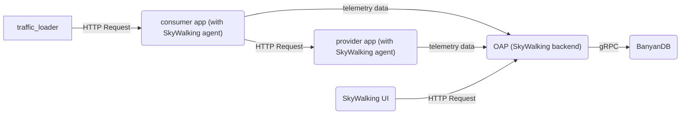

# Quick Start Tutorial
The following tutorial will guide you through setting up a SkyWalking OAP with BanyanDB as the storage backend using Docker Compose.
It is a quick way to get started with BanyanDB if you are a SkyWalking user and want to try out BanyanDB.

## Set up quickstart cluster

- run the following command to start the cluster with OAP and BanyanDB. The docker-compose file is [here](docker-compose.yaml).
```shell
docker compose -f ./docker-compose.yaml --project-name=banyandb-quickstart up -d
```

- run the following command to stop the cluster
```shell
docker compose --project-name=banyandb-quickstart down
```

## How the cluster works
The above docker-compose file starts a `standalone` BanyanDB with SkyWalking OAP and a traffic loader. The traffic loader sends HTTP requests to the Consumer app, which in turn sends HTTP requests to the Provider app. Both the Consumer and Provider apps have the SkyWalking agent installed. 
The telemetry data is sent to the OAP, which stores the data in BanyanDB. The OAP UI can be accessed to view the data stored in BanyanDB.
The following graph shows how the cluster works.



## Data presentation
### Get into the SkyWalking UI
The UI can be accessed at `http://localhost:8080`.
We can view the final presentation of the metrics/traces/logs/topology for the demo system on the UI dashboards.
The following image shows the `General-Service` service list in the SkyWalking UI:


note: There is a service `localhost:-1` in the `Virtual-Database` dashboard service list, which belongs to `VIRTUAL_DATABASE` layer.

### Query the data in BanyanDB
If you interested in the raw data stored in BanyanDB, you can use the BanyanDB embedded UI or BanyanDB CLI(bydbctl) to query the data.

- BanyanDB embedded UI can be accessed at `http://localhost:17913`.
The following image shows how to query all the services from the BanyanDB:


- BanyanDB CLI(bydbctl) can be used to query the data from the command line.
```shell
bydbctl measure query -f - <<EOF
name: "service_traffic_minute"
groups: ["measure-default"]
tagProjection:
  tagFamilies:
    - name: "default"
      tags: ["service_id", "short_name","layer"]
EOF
```

We can see the following output:

```shell
dataPoints:
- fields: []
  sid: "1372594403119019694"
  tagFamilies:
  - name: default
    tags:
    - key: service_id
      value:
        str:
          value: c2VydmljZS1jb25zdW1lcg==.1
    - key: short_name
      value:
        str:
          value: service-consumer
    - key: layer
      value:
        int:
          value: "2"
  timestamp: "2024-07-23T08:10:00Z"
  version: "15395932411795"
- fields: []
  sid: "1927510178256660176"
  tagFamilies:
  - name: default
    tags:
    - key: service_id
      value:
        str:
          value: c2VydmljZS1wcm92aWRlcg==.1
    - key: short_name
      value:
        str:
          value: service-provider
    - key: layer
      value:
        int:
          value: "2"
  timestamp: "2024-07-23T08:10:00Z"
  version: "15380822193095"
- fields: []
  sid: "5033399348250958164"
  tagFamilies:
  - name: default
    tags:
    - key: service_id
      value:
        str:
          value: bG9jYWxob3N0Oi0x.0
    - key: short_name
      value:
        str:
          value: localhost:-1
    - key: layer
      value:
        int:
          value: "14"
  timestamp: "2024-07-23T08:10:00Z"
  version: "15380811642295"
trace: null
```

