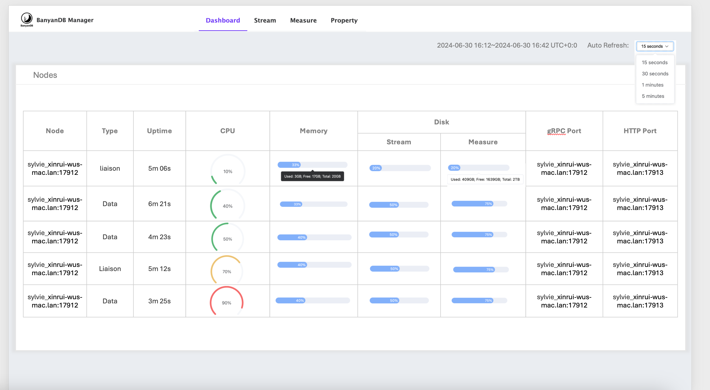
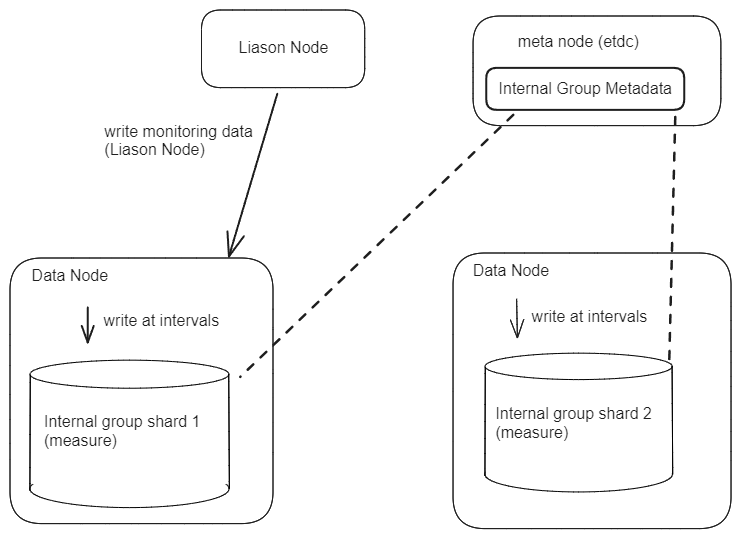

# Observability

This document outlines the observability features of BanyanDB, which include metrics, profiling, and tracing. These features help monitor and understand the performance, behavior, and overall health of BanyanDB.

## Metrics

BanyanDB has built-in support for metrics collection. Currently, there are two supported metrics provider: `prometheus` and `native`. These can be enabled through `observability-modes` flag. 

### Prometheus

Prometheus is auto enabled at run time, if no flag is passed or if `promethus` is set in `observability-modes` flag.

When the Prometheus metrics provider is enabled, the metrics server listens on port `2121`. This allows Prometheus to scrape metrics data from BanyanDB for monitoring and analysis.

The Docker image is tagged as "prometheus" to facilitate cloud-native operations and simplify deployment on Kubernetes. This allows users to directly deploy the Docker image onto their Kubernetes cluster without having to rebuild it with the "prometheus" tag.

### Self-observability 

If the `observability-modes` flag is set to `native`, the self-observability metrics provider will be enabled. The metrics will be displayed in the dashboard of [skywalking-banyandb-webapp](http://localhost:17913/) 

#### Metrics storage 

In self-observability, the metrics data is stored in BanyanDB within the ` _monitoring` internal group. Each metric will be created as a new `measure` within this group.

#### Write Flow

#### Read Flow
The read flow is the same as reading data from `measure`, with each metric being a new measure.

## Profiling

Banyand, the server of BanyanDB, supports profiling automatically. The profiling data is collected by the `pprof` package and can be accessed through the `/debug/pprof` endpoint. The port of the profiling server is `2122` by default.

## Tracing
