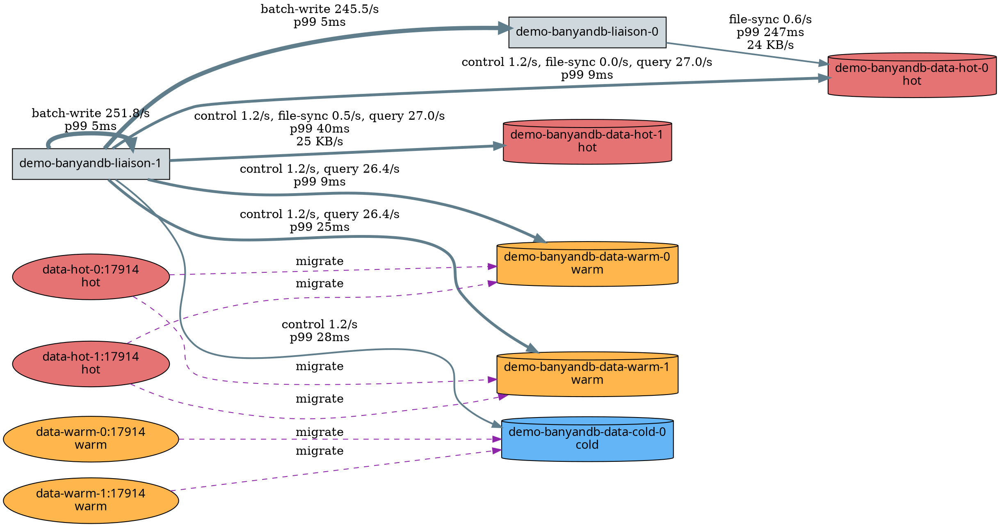
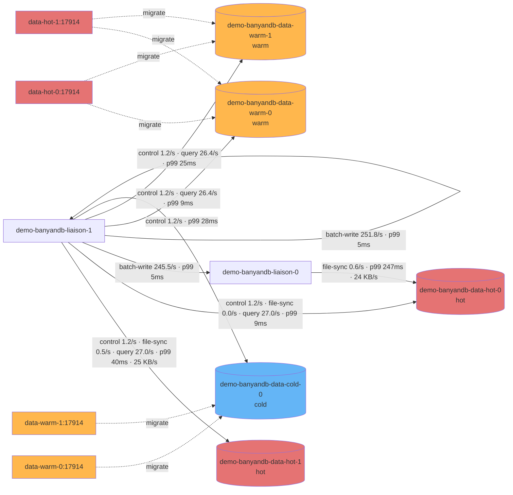

# Cluster Topology Rendering

BanyanDB gives you two partial views of a running cluster, and neither is a usable topology on its own:

- The **FODC proxy `/cluster/topology`** endpoint knows the **nodes** — names, roles, storage tier, health — and a `calls` graph that carries the **lifecycle tier-migration** edges (hot→warm→cold) mixed with a noisy data↔data property-repair gossip mesh.
- The **queue metrics** (`banyandb_queue_pub_*` / `banyandb_queue_sub_*`) know the **request pipeline edges** — which node sends what to which, for what operation/group, at what throughput, latency, and error rate — but carry only the peer's node name and the local scrape target's identity, with no node inventory or health.

This page shows how to **join them on node name** into one directed topology with **two edge layers**:

- **Request pipeline** (solid, weighted) — liaison→data, from the queue metrics: `batch-write`, `file-sync`, `query`, and `control`, with throughput, p99 latency, errors, and file-sync bytes. The publisher metrics (`queue_pub`) are the primary source; the subscriber metrics (`queue_sub`) fill any edge the publisher does not record — chiefly the liaison→warm/cold `query` fan-out on servers whose publish path is not yet instrumented for it.
- **Lifecycle migration** (dashed, structural) — hot→warm→cold tier movement, from the **lifecycle** service's entries in `/cluster/topology` `calls`.

Nodes (and their health) come from `/cluster/topology`. The result answers "who sends what to whom, how fast, and is it healthy?" — useful for dashboards and incident triage.

See [Proxy APIs and CLI Flags](./apis.md) for the full `/cluster/topology` schema and [Metrics](../observability/metrics.md#internal-queue-metrics-reference-queue_sub--queue_pub) for the full queue-metric model.

## Inputs

### Nodes — `GET {proxy}/cluster/topology`

Returns `{ "nodes": [...], "calls": [...] }`. Each node carries the identity and attributes we need:

```json
{
  "metadata": { "name": "demo-banyandb-data-hot-0.demo-banyandb-data-hot-headless.skywalking-showcase:17912" },
  "roles": ["ROLE_META", "ROLE_DATA"],
  "labels": { "type": "hot", "pod_name": "demo-banyandb-data-hot-0", "container_name": "data" },
  "status": "online",
  "last_heartbeat": "2026-06-07T12:34:56Z"
}
```

- `metadata.name` is the BanyanDB node name — a full DNS address `pod.headless.namespace:port` (liaison uses its internal port, e.g. `:18912`; data nodes `:17912`). **This is the universal join key.**
- `labels.type` is the storage tier (`hot` / `warm` / `cold`; empty for liaison).
- `labels.container_name` is the k8s container the node runs as (`liaison` / `data` / `lifecycle`), stamped by the agent from its `--container-names` config — so even the role-less lifecycle sidecar is classified correctly.
- `labels.pod_name`, `status`, and `last_heartbeat` are enrichment the proxy/agent fill in for every node matched to a live agent — see [Caveats](#caveats).
- `calls` mixes two things: the **lifecycle service's** tier-migration targets (hot→warm→cold — we render these, see [Lifecycle migration layer](#lifecycle-migration-layer)) and a data↔data property-repair gossip mesh (we drop these as noise).

### Edges — queue metrics on the FODC proxy scrape

Every `banyandb_queue_pub_*` series carries **both endpoints** of one directed flow:

| Role | Labels | Meaning |
| --- | --- | --- |
| **Local** (the scrape target / publisher) | `pod_name`, `container_name` (`liaison`/`data`), `node_role`, `node_type` | The node emitting the metric |
| **Remote** (the peer) | `remote_node`, `remote_role`, `remote_tier` | The downstream target it publishes to |
| Facet | `operation` (`batch-write`/`file-sync`/`query`/`control`), `group`, `error_type` | What kind of traffic |

`remote_node` is exactly a topology `metadata.name`, so a publisher series is a ready-made directed edge **`pod_name` → `remote_node`**.

`banyandb_queue_sub_*` on the receiver carries the **same five labels**, but recorded from the other end: `pod_name` is the **receiver** and `remote_node` is the **sender** (the publisher stamps its identity onto the first frame of each stream, and the receiver reads it back). So a subscriber series is the directed edge **`remote_node` → `pod_name`** — the inverse mapping. We use the publisher as the primary source and the subscriber **only to fill edges the publisher does not record**, per edge — never both for the same edge, or you double-count. This matters because `batch-write` and `file-sync` are recorded on the publisher, but `query` and `control` are recorded on the **receiver** unless the publisher's publish path is instrumented for them — so the liaison→warm/cold `query` fan-out reaches the graph through the subscriber fallback.

## The join

1. **Remote endpoint** — `remote_node` **==** topology `metadata.name`. Direct, exact.
2. **Local endpoint** — resolve the metric's `pod_name` to a topology node via `labels.pod_name` when present; otherwise keep the `pod_name` as the node id and take its role/tier from the metric's own `node_role` / `node_type`. Both liaisons (publishers) and data nodes (subscribers) carry `labels.pod_name`, so both ends resolve cleanly. **Lifecycle sidecars share a pod — and thus a `pod_name` — with their co-located data node**, so they are excluded from the `pod_name` → node map; otherwise a subscriber edge received by the data node would be misattributed to the `:17914` sidecar.
3. **Direction follows the recording side.** A publisher series (`queue_pub`) is `local → remote_node` (the scrape target is the sender). A subscriber series (`queue_sub`) is the **inverse** — `remote_node → local` (the scrape target is the receiver; `remote_node` is the sender). After flipping the subscriber edges they share the same node-name keyspace as the publisher edges.
4. **Publisher first, subscriber as fallback — per edge.** Build the edge set from `queue_pub`; then add an edge from `queue_sub` **only if the publisher did not already record it**. Never sum both sides for one edge. On servers that don't yet record `query`/`control` on the publish path, this is what surfaces the liaison→warm/cold `query` edges; once the publisher records them too, those edges come from `queue_pub` and the subscriber contributes nothing for them (so there is still no double-counting).
5. **Node attributes come from `/cluster/topology`** (authoritative, consistent), falling back to the metric's `node_*` / `remote_*` labels for endpoints the topology did not enrich.

The node set is the **union** of topology nodes and the endpoints seen in the metrics, so idle nodes (no current traffic) still appear, and a live edge to a node missing from topology still renders.

**Worked example.** This publisher series:

```
banyandb_queue_pub_total_finished{
  pod_name="demo-banyandb-liaison-0", container_name="liaison", node_role="ROLE_LIAISON",
  operation="file-sync", group="sw_metricsMinute",
  remote_node="demo-banyandb-data-hot-0.demo-banyandb-data-hot-headless.skywalking-showcase:17912",
  remote_role="data", remote_tier="hot"
}
```

becomes the directed edge **`demo-banyandb-liaison-0` → `demo-banyandb-data-hot-0`** (operation `file-sync`), with the data-hot-0 node's attributes (`tier=hot`, status) supplied by `/cluster/topology`.

## Per-edge metrics (PromQL)

Group by the local `pod_name` and the peer `remote_node`. Keep the endpoint identity labels in the throughput query so endpoints absent from topology are still attributed.

```promql
# Throughput (messages/s), per edge and operation
sum by (pod_name, node_role, node_type, remote_node, remote_role, remote_tier, operation)
  (rate(banyandb_queue_pub_total_finished{job=~"$job"}[$__rate_interval]))

# p99 latency (seconds), per edge
histogram_quantile(0.99,
  sum by (le, pod_name, remote_node)
    (rate(banyandb_queue_pub_total_latency_bucket{job=~"$job"}[$__rate_interval])))

# Error rate (errors/s), per edge
sum by (pod_name, remote_node)
  (rate(banyandb_queue_pub_total_err{job=~"$job"}[$__rate_interval]))

# File-sync bytes/s, per edge
sum by (pod_name, remote_node)
  (rate(banyandb_queue_pub_sent_bytes{job=~"$job"}[$__rate_interval]))
```

Add `, group` to any `by (...)` clause to break an edge down by business group.

Run the **same four queries** against `banyandb_queue_sub_*` to get the subscriber view (e.g. `rate(banyandb_queue_sub_total_finished{...}[$__rate_interval])`). Remember the subscriber edge is inverted — `remote_node` is the **source** and `pod_name` is the **target** — and that `banyandb_queue_sub_*` records `received_bytes`, not `sent_bytes`. Merge the two sets per edge, preferring the publisher, so the liaison→warm/cold `query` edges fill in from the subscriber while every publisher edge keeps its authoritative throughput.

## Lifecycle migration layer

The tiered-storage **lifecycle** service migrates data hot→warm→cold. It is a first-class participant in the cluster's data flow, but it surfaces differently from the request pipeline:

- **Source = the lifecycle service's route table**, recomputed continuously from each group's lifecycle **stage node-selectors** — not only while the scheduled (e.g. `@daily`) migration runs. Each lifecycle instance runs on a data pod and publishes the **next-tier data nodes it migrates to**; the proxy exposes these as `calls` whose `source` is the lifecycle node — a hot-tier instance to warm nodes, a warm-tier instance to cold nodes, i.e. the hot→warm→cold path.
- **Identify lifecycle nodes by their port.** Lifecycle nodes advertise the lifecycle gRPC port (default **`17914`**) and carry no role. The script treats any `calls` edge whose `source` ends in `:17914` as a migration edge and drops the rest of the `calls` mesh (property-repair gossip).
- **Structural only — no metrics.** The migration publisher is built without a metadata service (`pub.NewWithoutMetadata()`), so it emits **no `queue_pub` metrics**. Migration edges have no throughput/latency/bytes — they show *that* a tier path exists, not how busy it is. (The request pipeline is the weighted layer.)
- **Distinct identity, all-interfaces bind.** Each lifecycle instance advertises `<pod-host>:17914` as its node name (resolved from the node host when `--lifecycle-grpc-host` is empty), so the per-tier instances stay distinct instead of collapsing into a single `:17914` node under the proxy's dedup-by-name. The gRPC server still **binds** to `:17914` (all interfaces) so the co-located FODC agent reaches it on `127.0.0.1`; only the advertised identity carries the host.

## Rendering recipe (offline join script)

The script [`render_topology.py`](./render_topology.py) does the whole join with only the Python standard library:

- GETs `{proxy}/cluster/topology` and builds the node inventory (`metadata.name` → role / tier / pod / status, plus a `pod_name` → name map that excludes lifecycle sidecars so they don't shadow their co-located data node).
- Runs the four per-edge queries against Prometheus for **both** `banyandb_queue_pub_*` and `banyandb_queue_sub_*`.
- Joins them — `remote_node` maps to a topology node directly, the local `pod_name` maps to a node via `labels.pod_name` (falling back to the metric's own `node_*` labels). Publisher edges are `pod_name → remote_node`; subscriber edges are flipped to `remote_node → pod_name`. It accumulates per-edge throughput, p99, errors, and bytes from the publisher, then adds any edge the publisher lacks from the subscriber (so liaison→warm/cold `query` edges appear without double-counting).
- Adds the **lifecycle migration layer**: `calls` edges whose `source` is a lifecycle node (`--lifecycle-port`, default `17914`) become dashed `migrate` edges (hot→warm→cold); the rest of the `calls` gossip mesh is dropped.
- Prints **Graphviz DOT** and/or **Mermaid**: nodes shaped by role (liaison = box, data = cylinder, lifecycle = ellipse), colored by tier, dashed-red when unhealthy. Write edges are labeled with operation / throughput / p99 / bytes and turn red on errors or when p99 exceeds `--p99-warn`; migration edges are dashed.

If Prometheus sits behind Grafana's datasource proxy with basic auth, set `PROM_USER` / `PROM_PASS` in the environment.

Run it:

```bash
# Prometheus reachable directly:
python3 render_topology.py --proxy http://PROXY_HOST:17913 --prom http://PROM_HOST:9090

# Prometheus behind Grafana's datasource proxy (basic auth):
export PROM_USER=admin PROM_PASS=...
python3 render_topology.py \
  --proxy http://PROXY_HOST:17913 \
  --prom  http://GRAFANA_HOST/api/datasources/proxy/uid/<PROM_DS_UID> \
  --format both

# Render the DOT:
python3 render_topology.py --proxy ... --prom ... --format dot | dot -Tsvg -o topology.svg
```

### Sample: input → join → output (live showcase)

A complete walkthrough on the live 2-liaison / 5-data showcase cluster. `/cluster/topology` reports **11 nodes** (2 liaison + 5 data + 4 lifecycle sidecars) and **38 `calls`** of three kinds: **6** lifecycle-migration, **12** liaison-route (liaison→data / liaison→liaison, from the liaison's tier-1/tier-2 route tables), and **20** data↔data property-gossip. The script keeps only the **6** lifecycle-migration edges; the liaison→data request layer is rendered from the **weighted queue metrics** instead, and the gossip mesh is dropped. The publisher records `query`/`control` for every tier, so the liaison→warm/cold `query` edges come straight from `queue_pub` — see Input B below. (On a cluster whose publisher predates that instrumentation, those edges would instead be filled from the **subscriber** side; see [the join](#the-join) and [Caveats](#caveats).)

**Input A — `GET {proxy}/cluster/topology`** (captured `2026-06-08T00:28:49Z` from `http://34.96.253.115:17913/cluster/topology`; all 11 nodes + all 38 calls) — see [`topology-input-a.json`](./topology-input-a.json).

Two things to notice, both of which drive the design:

- **Every node is enriched** with `pod_name`, `status: online`, `container_name` (`liaison` / `data` / `lifecycle`), and — for data/lifecycle — `type`. A data node's `metadata.name` ends in `:17912`, its lifecycle sidecar in `:17914` (same pod, distinct identity), and liaisons in `:18912`. **`container_name` comes from the agent's `--container-names` config** (the container behind each polled endpoint), so the **role-less lifecycle node** (`roles: []`) is still labeled `lifecycle` — it cannot be inferred from roles. (The proxy keeps a role-derived value only as a fallback.)
- **`calls` carries three kinds of edge.** Lifecycle-source (`…:17914`) → the tier-migration path (hot→warm→cold), which we render as dashed `migrate` edges (6). Liaison-source (`…:18912`) → the liaison's tier-1/tier-2 route tables (liaison→data and liaison→liaison, 12); these *do* describe the request flow, but we render that layer from the **weighted queue metrics** (throughput/p99/bytes) instead, so we drop the unweighted `calls` copies. Data-source (`…:17912`) → the property-repair **gossip** mesh (20), dropped as noise.

**Input B — queue metrics** (captured over a 5m `rate` window from Prometheus) — see [`topology-input-b.txt`](./topology-input-b.txt). All from the **publisher** (`banyandb_queue_pub_total_finished`, grouped by `pod_name`+`operation`+`group`+`remote_node`, plus `p99`/`sent_bytes` aggregates): `batch-write`, `file-sync`, and — with the publish path instrumented — `query`/`control` on every tier.

**The join — the complete edge set.** Publisher edges (`queue_pub`, weighted): local `pod_name`→node (via `labels.pod_name`/hostname), `remote_node`→node directly. `query`/`control` carry `remote_tier`, so the warm/cold edges resolve their tier without any inversion.

| source | → target | operation | rate | p99 | bytes |
| --- | --- | --- | --- | --- | --- |
| liaison-0 | data-hot-0 | file-sync | 0.6/s | 247 ms | 24 KB/s |
| liaison-1 | data-hot-1 | file-sync | 0.5/s | 247 ms | 25 KB/s |
| liaison-1 | data-hot-0 | file-sync | 0.0/s | — | — |
| liaison-1 | data-hot-0 | query | 27.0/s | 9 ms | — |
| liaison-1 | data-hot-1 | query | 27.0/s | 40 ms | — |
| liaison-1 | data-warm-0 | query | 26.4/s | 9 ms | — |
| liaison-1 | data-warm-1 | query | 26.4/s | 25 ms | — |
| liaison-1 | data-hot-0/1, warm-0/1, cold-0 | control | 1.2/s | 9–36 ms | — |
| liaison-1 | liaison-0 | batch-write | 245.5/s | 5 ms | — |
| liaison-1 | liaison-1 | batch-write | 251.8/s | 5 ms | — |

The liaison→warm/cold `query` edges are now plain publisher series. The **subscriber** side (`queue_sub`) mirrors them but contributes nothing here — per-edge priority keeps every edge publisher-sourced, so there is no double-counting. On a cluster whose publisher predates the `query`/`control` instrumentation, the script would instead fill these edges from `queue_sub`, **inverted** (`remote_node`→`pod_name`).

Lifecycle migration (from `calls`, structural — no metrics):

| lifecycle source (`…:17914`) | → targets (next tier) |
| --- | --- |
| data-hot-0, data-hot-1 | data-warm-0, data-warm-1 |
| data-warm-0, data-warm-1 | data-cold-0 |

**Output** — the complete Graphviz DOT (names abbreviated to `pod:port`; real names are full DNS `pod.headless.namespace:port`). Solid = request pipeline (weighted); dashed = lifecycle migration. The liaison-1→warm/cold edges carry the publisher's `query`/`control` traffic:



The same as Mermaid:



**Two layers.** Solid edges are the **request pipeline** — `batch-write`, `file-sync`, and `query`/`control` (including the liaison→warm/cold query fan-out), all from the publisher metrics, weighted by operation, throughput, p99, and file-sync bytes; red on errors or when p99 exceeds `--p99-warn`. Dashed `migrate` edges are the **lifecycle tier migration** (hot→warm→cold, from `calls`; structural, no metrics). Liaisons are boxes, data nodes cylinders colored by tier, lifecycle sidecars ellipses. (The `liaison-1 → data-hot-0` file-sync path shows at `0.0/s` because it is currently idle; the `query`/`control` traffic on the same edge keeps it active. On a cluster whose publisher predates the query instrumentation, the warm/cold query edges would come from the `queue_sub` fallback instead — see [Caveats](#caveats).)

## Caveats

- **Publisher first, subscriber fallback — per edge.** `queue_pub` is the primary source. `queue_sub` mirrors each edge from the receiver (inverted: `remote_node` is the sender); add it **only** for edges the publisher does not record, and never sum both sides for one edge, or you double-count throughput. The fallback exists because `query`/`control` are recorded on the receiver until the publish path is instrumented for them.
- **Subscriber edges are inverted.** On a `queue_sub` series the scrape target (`pod_name`) is the **receiver** and `remote_node` is the **sender**, so the edge is `remote_node → pod_name` — the opposite of the publisher mapping. Flip it before joining.
- **Lifecycle sidecars share a `pod_name`** with their co-located data node; exclude them from the `pod_name` → node map, or subscriber edges to the data node get misattributed to the `:17914` sidecar.
- **Node name is a full DNS address** (`pod.headless.namespace:port`), and liaison/data use different ports — match on the whole string, not a prefix.
- **Topology enrichment.** `labels.pod_name`, `status`, and `last_heartbeat` are populated by the proxy for every node it can match to a live agent — on the showcase all 11 nodes are enriched (`status: online`). Should the proxy ever leave a node's `pod_name` empty, the script still resolves a metric's `pod_name` to the full node name by also matching the node's bare hostname (the first DNS label), in addition to `labels.pod_name`.
- **`remote_tier` is empty for liaison targets** (liaisons have no storage tier); on a subscriber series `remote_tier` is the **sender's** tier, also empty for a liaison.
- **`*_total_err` is lazily registered** — absent means "no errors yet", not zero; treat a missing series as healthy.
- **Use `rate(...[window])`, never raw counters.** After a restart, old counter series linger in Prometheus until they age out; a rate window ignores them.
- **`control` / `query` edges carry little or no bytes** (`sent_bytes` is file-sync only; `queue_sub` records `received_bytes`), so those edges show throughput/latency without a byte figure.
- **`calls` carries two edge kinds.** Lifecycle-source edges (`…:17914`) are the tier migration we render (dashed); data-source edges (`…:17912`) are the property-repair gossip mesh we drop. The liaison→data request pipeline is **not** in `calls` — that comes from the queue metrics. Each lifecycle instance advertises a distinct `<pod-host>:17914`, so the per-tier migration path renders without collapsing; see [Lifecycle migration layer](#lifecycle-migration-layer).

## Related

- [FODC Overview — Topology & Status API](./overview.md#topology--status-api)
- [Proxy APIs and CLI Flags](./apis.md)
- [Metrics — internal queue reference](../observability/metrics.md#internal-queue-metrics-reference-queue_sub--queue_pub)
- [Metrics Providers](../observability/providers.md)
