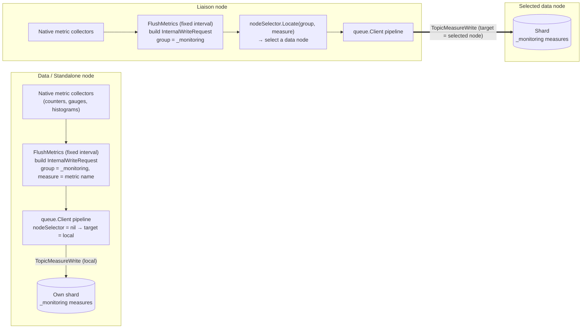

# Observability

This document outlines the observability features of BanyanDB, which include metrics, profiling, and tracing. These features help monitor and understand the performance, behavior, and overall health of BanyanDB.

## Key Signals to Watch

If you watch nothing else, watch these. They are organized with the two canonical monitoring methods: **RED** (Rate, Errors, Duration) for the request paths — BanyanDB's write and query paths — and **USE** (Utilization, Saturation, Errors) for resources [1][2][3]. The detailed metric definitions are in the [Metrics](#metrics) section below; the thresholds here are **industry reference values to tune per cluster**, except where a BanyanDB default is named.

| # | Signal (method) | BanyanDB metric(s) | Watch for | Failure it predicts |
| --- | --- | --- | --- | --- |
| 1 | **Query latency, p99** (RED · Duration) | Query Latency (`banyandb_liaison_grpc_total_latency` ÷ `_total_started`) | p99 over a short (~1 min) window trending up | The **earliest** warning of saturation — latency degrades before requests start failing [1]. Track success vs. error latency separately (a slow error is worse than a fast one) [1]. |
| 2 | **Write & query rate** (RED · Rate) | Write Rate (`banyandb_*_total_written`), Query Rate (`banyandb_liaison_grpc_total_started{method="query"}`) | a sudden drop (ingestion stall) or spike (overload) vs. baseline | ingestion stall upstream, or a load surge that will drive saturation |
| 3 | **Error rate** (RED · Errors) | Write/Query Errors Rate (`banyandb_liaison_grpc_total_err`, `_stream_msg_*_err`, `banyandb_queue_*` errors) | any sustained non-zero rate | failing writes/queries; correlate with the saturation signals below |
| 4 | **Disk utilization** (USE · Saturation) | Disk Usage % (`banyandb_system_disk` used ÷ total, per `pod_name`) | alert at **~80–85%** [4]; BanyanDB **rejects writes with `STATUS_DISK_FULL`** once usage crosses `{measure,stream,trace}-max-disk-usage-percent` (**default 95%**) | a write outage — affected components go read-only [4] |
| 5 | **Memory / GC pressure** (USE · Saturation) | System Memory % (`banyandb_system_memory_state{kind="used_percent"}`), `process_resident_memory_bytes`, `go_gc_duration_seconds`, `go_memstats_*` | memory near the protector limit; rising GC pause | BanyanDB's **memory protector** (`--allowed-percent`, **default 75**, or `--allowed-bytes`) **stops query execution** to avoid OOM, so high memory shows up as query slowdown first [2] |
| 6 | **CPU utilization** (USE · Utilization) | CPU Usage (`rate(process_cpu_seconds_total)` ÷ `banyandb_system_cpu_num`) | sustained high utilization | rising query/merge latency |
| 7 | **Cross-node queue backpressure** (USE · Saturation) | `banyandb_queue_pub_inflight_requests`/`_inflight_streams`, `banyandb_queue_pub_send_retry_exhausted_total`; **wqueue** `banyandb_*_pending_data_count` / `*_total_file_parts` (liaison) | rising **depth _and_ duration** | a slow/unavailable data node. The liaison wqueue is **on disk**, so it accumulates (it does not drop data after a fixed window) and can eventually fill liaison disk → `STATUS_DISK_FULL` [5] |
| 8 | **Merge / compaction health** (LSM) | Merge File Rate/Latency/Partitions (`banyandb_*_total_merge_loop_started`, `_merge_latency`, `_merged_parts`), part counts (`*_total_file_parts`) | merge-latency spikes correlated with write-latency spikes; steadily growing part/partition counts | a compaction storm or backlog → write-latency spikes, query slowdown, oversized/broken parts [6] |
| 9 | **Cardinality / series growth** | Total Series (`banyandb_*_inverted_index_total_doc_count`), `_total_updates` (churn), `_total_term_searchers_started` | rapid `doc_count` growth, high churn, or high term-search rate | a cardinality explosion → memory pressure, inverted-index bloat, and slow queries |
| 10 | **Node liveness / membership** | Active Instances (`count(banyandb_system_up_time)` by `container_name`), per-node `banyandb_system_up_time` | reporting-node count below expected; a node's uptime dropping to ~0 (restart) or its series disappearing (gone) | lost capacity, under-replication, and query gaps |

**Priority order:** 1–3 (RED) tell you whether users are affected *right now*; 4–7 (USE/backpressure) are the **leading indicators** that catch trouble before it becomes user-visible; 8–10 catch the classic slow-burn database failures (compaction backlog, cardinality blow-up, node loss). A practical first alert set: query p99 latency, error rate, disk > 85%, memory near `--allowed-percent`, and sustained wqueue/`queue_pub` backlog.

> Sources: [1] Google SRE — *Monitoring Distributed Systems* (Four Golden Signals) <https://sre.google/sre-book/monitoring-distributed-systems/> · [2] B. Gregg — *The USE Method* <https://www.brendangregg.com/usemethod.html> · [3] *The RED Method* (Grafana / T. Wilkie) <https://grafana.com/blog/the-red-method-how-to-instrument-your-services/> · [4] Elasticsearch disk watermarks 85/90/95% <https://www.elastic.co/docs/troubleshoot/elasticsearch/fix-watermark-errors> · [5] Prometheus remote-write backpressure <https://prometheus.io/docs/practices/remote_write/> · [6] Grafana Mimir — scaling to 1B active series (compaction/flush latency) <https://grafana.com/blog/2022/04/08/how-we-scaled-our-new-prometheus-tsdb-grafana-mimir-to-1-billion-active-series/>

## Logging

BanyanDB uses the [zerolog](https://github.com/rs/zerolog) library for logging. The log level can be set using the `log-level` flag. The supported log levels are `debug`, `info`, `warn`, `error`, and `fatal`. The default log level is `info`.

`logging-env` is used to set the logging environment. The default value is `prod`. The logging environment can be set to `dev` for development or `prod` for production. The logging environment affects the log format and output. In the `dev` environment, logs are output in a human-readable format, while in the `prod` environment, logs are output in JSON format.

`logging-modules` and `logging-levels` are used to set the log level for specific modules. The `logging-modules` flag is a comma-separated list of module names, and the `logging-levels` flag is a comma-separated list of log levels corresponding to the module names. The log level for a specific module can be set using these flags. Available modules are `storage`, `distributed-query`, `liaison-grpc`, `liaison-http`, `measure`, `stream`, `trace`, `metadata`, `property-schema-registry`, `metrics`, `pprof-service`, `query`, `server-queue-sub`, `server-queue-pub`. For example, to set the log level for the `storage` module to `debug`, you can use the following flags:

```sh
--logging-modules=storage --logging-levels=debug
```

### Slow Query Logging

BanyanDB supports slow query logging. The `slow-query` flag is used to set the slow query threshold. If a query takes longer than the threshold, it will be logged as a slow query. The default value is `0`, which means no slow query logging. This flag is only used for the data and standalone servers.

The `dst-slow-query` flag is used to set the distributed slow query threshold. This flag is only used for the liaison server. The default value is `5s`; set it to `0` to disable distributed slow query logging.

When query tracing is enabled, the slow query log won't be generated.

## Metrics

BanyanDB exposes metrics for monitoring and analysis.

> **Scrape source — the FODC proxy.** In a cluster deployment, metrics are collected by scraping the **FODC proxy** `/metrics` endpoint (see [FODC overview](fodc/overview.md)), which is the **single Prometheus scrape target**. The proxy aggregates every BanyanDB node's metrics and adds per-node identity labels, so all the PromQL below is written for that scheme:
>
> - `$job` — the Prometheus scrape job for the FODC proxy.
> - `$pod` — a BanyanDB node, matched via the **`pod_name`** label (the full node identity, e.g. `banyandb-data-hot-0`).
> - `$role` — the node role, matched via the **`container_name`** label (`liaison` or `data`).
>
> Because the proxy is the only target, the Prometheus-synthesized `instance`, `job`, and `up` labels describe the **proxy**, not individual BanyanDB nodes — use `$pod` / `$role` to scope a query to a node. Original BanyanDB labels (`group`, `kind`, `method`, `service`, `topic`, `node`, …) are preserved on every sample. `$__rate_interval` is the Grafana rate-interval variable.
>
> (If you are *not* running the FODC proxy, BanyanDB also exposes its own metrics on port `2121`; scrape each pod directly and substitute the Kubernetes `pod`/`instance` target labels for `$pod` below.)

### Stats

`Stats` metrics are used to monitor the overall status of BanyanDB. The following metrics are available:

#### Write Rate

The write rate is the number of write operations per second. It is calculated by summing the total number of written operations for measures, streams and traces.

**Expression**: `sum(rate(banyandb_measure_total_written{job=~"$job", pod_name=~"$pod"}[$__rate_interval])) + sum(rate(banyandb_stream_tst_total_written{job=~"$job", pod_name=~"$pod"}[$__rate_interval])) + sum(rate(banyandb_trace_tst_total_written{job=~"$job", pod_name=~"$pod"}[$__rate_interval]))`

#### Total Memory

The total memory is the total physical memory available on the system, which means total amount of RAM on the system.

**Expression**: `sum(banyandb_system_memory_state{job=~"$job", pod_name=~"$pod", kind="total"})`

#### Disk Usage

The total disk space used across the selected nodes, in bytes (summed over all storage paths). See **Resource Usage → Disk Usage** below for the used/total percentage.

**Expression**: `sum(banyandb_system_disk{job=~"$job", pod_name=~"$pod", kind="used"})`

#### Query Rate

The query rate is the number of query operations per second. It is the query rate on the liaison server.

**Expression**: `sum(rate(banyandb_liaison_grpc_total_started{job=~"$job", pod_name=~"$pod", method="query"}[$__rate_interval]))`

#### Total CPU

The total CPU is the total number of CPUs available on the system.

**Expression**: `sum(banyandb_system_cpu_num{job=~"$job", pod_name=~"$pod"})`

#### Write and Query Errors Rate

The write and query errors rate is the number of write and query errors per minute. It is calculated by summing the total number of write and query errors from liaison and data servers.

Each term is wrapped in `or vector(0)` so the panel reports `0` rather than "No Data" when an error counter has not been registered yet (several error counters are lazily registered on first occurrence).

**Expression**: `(sum(rate(banyandb_liaison_grpc_total_err{job=~"$job", pod_name=~"$pod", method="query"}[$__rate_interval])*60) or vector(0)) + (sum(rate(banyandb_liaison_grpc_total_stream_msg_sent_err{job=~"$job", pod_name=~"$pod"}[$__rate_interval])*60) or vector(0)) + (sum(rate(banyandb_liaison_grpc_total_stream_msg_received_err{job=~"$job", pod_name=~"$pod"}[$__rate_interval])*60) or vector(0)) + (sum(rate(banyandb_queue_sub_total_msg_sent_err{job=~"$job", pod_name=~"$pod"}[$__rate_interval])*60) or vector(0))`

#### Registry Operation Rate

The registry operation rate is the number of registry operations per second. It is calculated by summing the total number of registry operations.

**Expression**: `(sum(rate(banyandb_liaison_grpc_total_registry_started{job=~"$job", pod_name=~"$pod"}[$__rate_interval])) or vector(0)) + (sum(rate(banyandb_liaison_grpc_total_started{job=~"$job", pod_name=~"$pod", method!="query"}[$__rate_interval])) or vector(0))`

#### Active Instances

The number of BanyanDB nodes currently reporting through the FODC proxy. (The Prometheus `up` metric reflects the proxy target, not individual nodes, so node liveness is derived from the per-node `banyandb_system_up_time` gauge instead.)

**Expression**: `count(banyandb_system_up_time{job=~"$job", pod_name=~"$pod"})`

### Resource Usage

`Resource Usage` metrics are used to monitor the resource usage of BanyanDB on the node. The following metrics are available:

#### CPU Usage

The CPU usage is the fraction of CPU used per node. If it is over 80%, it may indicate that the CPU is overloaded.

**Expression**: `max(rate(process_cpu_seconds_total{job=~"$job", pod_name=~"$pod"}[$__rate_interval]) / banyandb_system_cpu_num{job=~"$job", pod_name=~"$pod"}) by (pod_name)`

#### RSS memory usage

The RSS memory usage is the fraction of system memory held as resident memory per node. If it is over 80%, it may indicate that the memory is almost full.

**Expression**: `max_over_time(process_resident_memory_bytes{job=~"$job", pod_name=~"$pod"}[$__rate_interval]) / on(pod_name) group_left() sum(banyandb_system_memory_state{job=~"$job", pod_name=~"$pod", kind="total"}) by (pod_name)`

#### Disk Usage

The disk usage is the percentage of disk space used per node. If the disk usage is over 80%, it may indicate that the disk is almost full.

**Expression**: `sum(banyandb_system_disk{job=~"$job", pod_name=~"$pod", kind="used"}) by (pod_name) / sum(banyandb_system_disk{job=~"$job", pod_name=~"$pod", kind="total"}) by (pod_name)`

#### Network Usage

The network usage is the number of bytes sent and received per second.

**Expression1**: `sum(rate(banyandb_system_net_state{job=~"$job", pod_name=~"$pod", kind="bytes_recv"}[$__rate_interval])) by (pod_name, name)`

**Expression2**: `sum(rate(banyandb_system_net_state{job=~"$job", pod_name=~"$pod", kind="bytes_sent"}[$__rate_interval])) by (pod_name, name)`

### Storage

`Storage` metrics are used to monitor the storage status of BanyanDB. The following metrics are available:

#### Write Rate

The write rate is the number of write operations per second for measures, streams and traces, grouped by the `group` tag. The three data types use different `group` values, so they are charted as separate series rather than added together.

You can view the write rate of different nodes (`pod_name`) to find out the hot node.

**Expression1**: `sum(rate(banyandb_measure_total_written{job=~"$job", pod_name=~"$pod"}[$__rate_interval])) by (group)`
**Expression2**: `sum(rate(banyandb_stream_tst_total_written{job=~"$job", pod_name=~"$pod"}[$__rate_interval])) by (group)`
**Expression3**: `sum(rate(banyandb_trace_tst_total_written{job=~"$job", pod_name=~"$pod"}[$__rate_interval])) by (group)`

#### Query Latency

The query latency is the average query latency in seconds. It is calculated by summing the total query latency and dividing by the total number of queries.

You can view the query latency of different nodes to find out the node with high query latency. Because BanyanDB will fetch all nodes to query, the node with high query latency will affect the overall query latency.

**Expression**: `sum(rate(banyandb_liaison_grpc_total_latency{job=~"$job", pod_name=~"$pod", method="query"}[$__rate_interval])) by (group) / sum(rate(banyandb_liaison_grpc_total_started{job=~"$job", pod_name=~"$pod", method="query"}[$__rate_interval])) by (group)`

#### Total Data

The total data is the total number of data points stored in BanyanDB. It's grouped by the `group` tag.

You can view the total data of different nodes to find out the node with high data points. If the difference between the total data of different nodes is too large, it may indicate that the data is not evenly distributed.

**Expression1**: `sum(banyandb_measure_total_file_elements{job=~"$job", pod_name=~"$pod"}) by (group)`
**Expression2**: `sum(banyandb_stream_tst_total_file_elements{job=~"$job", pod_name=~"$pod"}) by (group)`
**Expression3**: `sum(banyandb_trace_tst_total_file_elements{job=~"$job", pod_name=~"$pod"}) by (group)`

#### Merge File Rate

The merge file rate is the number of merge file operations per minute. It is calculated by summing the total number of merge file operations. It's grouped by the `group` tag.

If the value surges, it may indicate that too many small files are being merged. It may bring following problems:

- Increase the disk I/O
- Slow down the query performance
- Increase the CPU usage

**Expression1**: `sum(rate(banyandb_measure_total_merge_loop_started{job=~"$job", pod_name=~"$pod"}[$__rate_interval])) by (group) * 60`
**Expression2**: `sum(rate(banyandb_stream_tst_total_merge_loop_started{job=~"$job", pod_name=~"$pod"}[$__rate_interval])) by (group) * 60`
**Expression3**: `sum(rate(banyandb_trace_tst_total_merge_loop_started{job=~"$job", pod_name=~"$pod"}[$__rate_interval])) by (group) * 60`

#### Merge File Latency

The merge file latency is the average merge file latency in seconds. It is calculated by summing the total merge file latency and dividing by the total number of merge file operations. It's grouped by the `group` tag.

If the value surges, it may indicate that the merge file operation is slow. It may be caused by the high disk I/O and other resource usage. It may bring following problems:

- Slow down the query performance
- Increase the CPU usage
- Increase the memory usage

**Expression1**: `sum(rate(banyandb_measure_total_merge_latency{job=~"$job", pod_name=~"$pod", type="file"}[$__rate_interval])) by (group) / sum(rate(banyandb_measure_total_merge_loop_started{job=~"$job", pod_name=~"$pod"}[$__rate_interval])) by (group)`
**Expression2**: `sum(rate(banyandb_stream_tst_total_merge_latency{job=~"$job", pod_name=~"$pod", type="file"}[$__rate_interval])) by (group) / sum(rate(banyandb_stream_tst_total_merge_loop_started{job=~"$job", pod_name=~"$pod"}[$__rate_interval])) by (group)`
**Expression3**: `sum(rate(banyandb_trace_tst_total_merge_latency{job=~"$job", pod_name=~"$pod", type="file"}[$__rate_interval])) by (group) / sum(rate(banyandb_trace_tst_total_merge_loop_started{job=~"$job", pod_name=~"$pod"}[$__rate_interval])) by (group)`

#### Merge File Partitions

The merge file partitions is the average number of partitions merged per merge file operation. It is calculated by summing the total number of partitions merged and dividing by the total number of merge file operations. It's grouped by the `group` tag.

If the value surges, it may indicate that too many partitions are being merged. It may because the partition number is too large that indicates the server is under a high write load.

**Expression1**: `sum(rate(banyandb_measure_total_merged_parts{job=~"$job", pod_name=~"$pod", type="file"}[$__rate_interval])) by (group) / sum(rate(banyandb_measure_total_merge_loop_started{job=~"$job", pod_name=~"$pod"}[$__rate_interval])) by (group)`
**Expression2**: `sum(rate(banyandb_stream_tst_total_merged_parts{job=~"$job", pod_name=~"$pod", type="file"}[$__rate_interval])) by (group) / sum(rate(banyandb_stream_tst_total_merge_loop_started{job=~"$job", pod_name=~"$pod"}[$__rate_interval])) by (group)`
**Expression3**: `sum(rate(banyandb_trace_tst_total_merged_parts{job=~"$job", pod_name=~"$pod", type="file"}[$__rate_interval])) by (group) / sum(rate(banyandb_trace_tst_total_merge_loop_started{job=~"$job", pod_name=~"$pod"}[$__rate_interval])) by (group)`

#### Series Write Rate

The series write rate is the number of series write operations per second. It is calculated by summing the total number of series write operations for measures and streams. It's grouped by the `group` tag.

If the value surges, it may indicate that the old series are being updated frequently by the new series. It may be caused by the high cardinality of the series and bring following problems:

- Increase the series inverted index size
- Slow down the query performance

**Expression1**: `sum(rate(banyandb_measure_inverted_index_total_updates{job=~"$job", pod_name=~"$pod"}[$__rate_interval])) by (group)`
**Expression2**: `sum(rate(banyandb_stream_storage_inverted_index_total_updates{job=~"$job", pod_name=~"$pod"}[$__rate_interval])) by (group)`

##### Series Term Search Rate

The series term search rate is the number of series term search operations per second. It is calculated by summing the total number of series term search operations for measures and streams. It's grouped by the `group` tag.

If the value is too large, it may indicate that reading operation fetch too many series. It may be caused by the high cardinality of the series and bring following problems:

- Slow down the query performance
- Increase the CPU usage
- Increase the memory usage

**Expression1**: `sum(rate(banyandb_stream_storage_inverted_index_total_term_searchers_started{job=~"$job", pod_name=~"$pod"}[$__rate_interval])) by (group)`
**Expression2**: `sum(rate(banyandb_measure_inverted_index_total_term_searchers_started{job=~"$job", pod_name=~"$pod"}[$__rate_interval])) by (group)`

#### Total Series

The total series is the total number of series stored in BanyanDB. It's grouped by the `group` tag.

If the value is too large, it may indicate that the high cardinality of the series. It may bring following problems:

- Increase the series inverted index size
- Slow down the query performance

**Expression1**: `sum(banyandb_measure_inverted_index_total_doc_count{job=~"$job", pod_name=~"$pod"}) by (group)`
**Expression2**: `sum(banyandb_stream_storage_inverted_index_total_doc_count{job=~"$job", pod_name=~"$pod"}) by (group)`

### Stream Inverted Index

`Stream Inverted Index` metrics are used to monitor the stream inverted index status of BanyanDB. The following metrics are available:

#### Stream Inverted Index Write Rate

The write rate is the number of write operations per second. It is calculated by summing the total number of written operations for streams. It's grouped by the `group` tag.

If the value is too large, it may indicate that too many data points are being indexed and bring following problems:

- Increase the inverted index size
- Slow down the query performance
- Increase the CPU usage
- Increase the memory usage

**Expression**: `sum(rate(banyandb_stream_tst_inverted_index_total_updates{job=~"$job", pod_name=~"$pod"}[$__rate_interval])) by (group)`

#### Term Search Rate

The term search rate is the number of term search operations per second. It is calculated by summing the total number of term search operations for streams. It's grouped by the `group` tag.

If the value is too large, it may indicate that reading operation fetch too many data points. It may bring following problems:

- Slow down the query performance
- Increase the CPU usage
- Increase the memory usage

**Expression**: `sum(rate(banyandb_stream_tst_inverted_index_total_term_searchers_started{job=~"$job", pod_name=~"$pod"}[$__rate_interval])) by (group)`

#### Total Documents

The total documents is the total number of documents stored in the stream inverted index. It's grouped by the `group` tag.

If the value is too large, it may indicate that too many data points are being indexed and bring following problems:

- Increase the inverted index size
- Slow down the query performance
- Increase the CPU usage
- Increase the memory usage

**Expression**: `sum(banyandb_stream_tst_inverted_index_total_doc_count{job=~"$job", pod_name=~"$pod"}) by (group)`

### Liaison internal queue (`queue_sub` / `queue_pub`)

Liaison nodes run an internal gRPC **queue server** (`server-queue-sub`, wired via `sub.NewServerWithPorts` in `pkg/cmdsetup/liaison.go`) and **queue clients** (`server-queue-pub`) for tier-1/tier-2 pipelines. Prometheus metrics use the namespaces `banyandb_queue_sub_*` and `banyandb_queue_pub_*` (built from `observability.RootScope` + `queue_sub` / `queue_pub` sub-scopes). Data nodes may expose the same metric families where the corresponding services run.

#### `queue_sub` — inbound server (including chunked sync)

| Metric (suffix after `banyandb_queue_sub_`) | Type | Labels | Meaning |
| --- | --- | --- | --- |
| `total_started`, `total_finished`, `total_err`, `total_latency` | Counter | `topic` | Legacy per-topic stream handler lifecycle. |
| `total_msg_received`, `total_msg_received_err`, `total_msg_sent`, `total_msg_sent_err` | Counter | `topic` | Per-topic message I/O errors (included in high-level error rates below). |
| `out_of_order_chunks_received`, `chunks_buffered` | Counter | `topic` | Chunk reordering: out-of-order arrivals and buffer events (**`topic` only**, not per session). |
| `buffer_timeouts`, `large_gaps_rejected`, `buffer_capacity_exceeded`, `finish_sync_err` | Counter | `topic` | Reorder buffer pressure and sync completion issues. |
| `chunked_sync_active_sessions` | Gauge | `topic` | In-flight chunked sync sessions per topic. |
| `chunk_reorder_buffered_chunks` | Gauge | `topic` | Chunks waiting in the reorder buffer. |
| `chunked_sync_aborted_total` | Counter | `topic`, `reason` | Aborted sessions; `reason` is one of `switch`, `stream_error`, `ctx_done`, `eof`. |
| `chunked_sync_failed_parts_total` | Counter | `topic` | Parts incomplete when a sync completes. |
| `chunked_sync_total_bytes_received` | Counter | `topic` | Bytes received for completed syncs. |
| `chunked_sync_duration_seconds` | Histogram | `topic` | Wall-clock duration of completed syncs. |

**Troubleshooting:** rising `chunk_reorder_buffered_chunks` or `buffer_timeouts` suggests sustained out-of-order or slow consumers. Spikes in `chunked_sync_aborted_total` with `reason=switch` often correlate with topic/hand-off changes; `stream_error` / `ctx_done` / `eof` point to RPC lifecycle issues. Use `chunked_sync_failed_parts_total` and the duration histogram to separate partial completion from healthy throughput.

#### `queue_pub` — outbound batch client

| Metric (suffix after `banyandb_queue_pub_`) | Type | Labels | Meaning |
| --- | --- | --- | --- |
| `send_success_total` | Counter | `topic`, `node` | Successful `Send` on the client stream (local write, not end-to-end ack). |
| `send_bytes_total` | Counter | `topic`, `node` | Payload bytes on successful `Send`. |
| `send_duration_seconds` | Histogram | `topic`, `node`, `result` | Time spent in the send path including retries. `result` is one of `success`, `non_transient`, `canceled`, `stream_canceled`, `retry_exhausted`; filter to `result="success"` (and optionally `retry_exhausted`) when isolating end-to-end send latency. |
| `send_err_total` | Counter | `topic`, `node`, `reason` | Send/recv side errors; `reason` includes `non_transient`, `canceled`, `stream_canceled`, `retry_exhausted`, `recv_error`, `server_rejected`. |
| `send_retry_attempts_total`, `send_retry_exhausted_total`, `send_backoff_seconds_total` | Counter | `topic`, `node` | Retry/backoff behavior before giving up. |
| `inflight_streams` | Gauge | `node` | Open send streams per downstream node. |
| `inflight_requests` | Gauge | `topic`, `node` | In-flight batch send operations. |

**Troubleshooting:** correlate `send_retry_exhausted_total` and `send_err_total{reason="retry_exhausted"}` with upstream pressure. `recv_error` vs `server_rejected` separates transport failures from application-level `SendResponse` errors. Sustained high `inflight_requests` or `inflight_streams` may indicate slow or unavailable data nodes.

Metrics are only registered when `metadata` implements `metadata.Service` and `MetricsRegistry()` is non-nil (e.g. after `SetMetricsRegistry` in bootstrap). `NewWithoutMetadata()` leaves `queue_pub` metrics disabled and logs a warning (`queue_pub metrics disabled: ...`). Several error/abort counters above are registered lazily on first occurrence, so they are simply absent (not zero) on a healthy cluster.

#### Example PromQL snippets

Saturation (scope by node with the proxy labels):

- **Chunked sync sessions:** `sum(banyandb_queue_sub_chunked_sync_active_sessions{job=~"$job", pod_name=~"$pod"}) by (topic)`
- **Reorder buffer depth:** `sum(banyandb_queue_sub_chunk_reorder_buffered_chunks{job=~"$job", pod_name=~"$pod"}) by (topic)`
- **Chunked sync abort rate:** `sum(rate(banyandb_queue_sub_chunked_sync_aborted_total{job=~"$job", pod_name=~"$pod"}[$__rate_interval])) by (topic, reason)`
- **Publisher success rate:** `sum(rate(banyandb_queue_pub_send_success_total{job=~"$job", pod_name=~"$pod"}[$__rate_interval])) by (topic)`
- **Publisher errors by reason:** `sum(rate(banyandb_queue_pub_send_err_total{job=~"$job", pod_name=~"$pod"}[$__rate_interval])) by (reason)`

**Suggested alerts (tune thresholds per cluster):**

- Non-zero sustained `rate(banyandb_queue_pub_send_retry_exhausted_total[5m])` on liaison.
- `chunk_reorder_buffered_chunks` or `chunked_sync_active_sessions` above an environment-specific ceiling for a single `topic`.

#### Aggregate pipeline error rate (optional)

To combine legacy queue stream errors with publisher-side failures (per minute scaling as elsewhere in this doc; each term wrapped in `or vector(0)` so a missing counter doesn't blank the result):

**Expression**: `(sum(rate(banyandb_queue_sub_total_msg_sent_err{job=~"$job", pod_name=~"$pod"}[$__rate_interval])*60) or vector(0)) + (sum(rate(banyandb_queue_sub_total_msg_received_err{job=~"$job", pod_name=~"$pod"}[$__rate_interval])*60) or vector(0)) + (sum(rate(banyandb_queue_pub_send_err_total{job=~"$job", pod_name=~"$pod"}[$__rate_interval])*60) or vector(0))`

## Metrics Providers

BanyanDB has built-in support for metrics collection. Currently, there are two supported metrics provider: `prometheus` and `native`. These can be enabled through `observability-modes` flag, allowing you to activate one or both of them.

### Prometheus

Prometheus is auto enabled at run time, if no flag is passed or if `prometheus` is set in `observability-modes` flag.

When the Prometheus metrics provider is enabled, each BanyanDB process exposes its own metrics on port `2121`.

In a cluster, the recommended setup is to let the **FODC proxy** aggregate every node's metrics and scrape the proxy as the single target. Configure the following Prometheus job (replace `BANYANDB_NAMESPACE` with the namespace where BanyanDB is deployed, and adjust the keep-regex to match your FODC proxy pod label):

```yaml
scrape_configs:
  - job_name: "fodc-proxy"
    kubernetes_sd_configs:
      - role: pod
        namespaces:
          names: ["${BANYANDB_NAMESPACE}"]
    relabel_configs:
      - source_labels: [__meta_kubernetes_pod_label_app_kubernetes_io_component]
        action: keep
        regex: fodc-proxy
      - source_labels: [__address__]
        target_label: __address__
        regex: (.*):\d+
        replacement: $1:17913
    metrics_path: /metrics
    scheme: http
```

The proxy adds the `pod_name` and `container_name` labels used throughout this document. Without the FODC proxy, scrape each BanyanDB pod directly on port `2121` instead and use the Kubernetes `pod`/`instance` target labels in place of `pod_name`.

#### Grafana Dashboard

Check out the [BanyanDB Cluster (FODC Proxy) Dashboard](grafana-cluster-fodc.json) for monitoring BanyanDB metrics. It is built for the deployment where Prometheus scrapes the [FODC proxy](fodc/overview.md) `/metrics` endpoint — the single scrape target — rather than each BanyanDB pod: per-node identity is carried in the `pod_name` and `container_name` labels (so `job`/`pod`/`up` no longer distinguish nodes). The dashboard is organized by role (liaison / data) with fleet overview, a per-node health table, resources, disk-by-path, liaison ingestion/query/publish plus write-queue (wqueue) backlog, data storage/inverted-index/internal-queue, and Go runtime sections.

### Native

If the `observability-modes` flag is set to `native`, the self-observability metrics provider will be enabled. Some of the metrics will be displayed in the dashboard of [banyandb-ui](http://localhost:17913/)


#### Metrics storage

In self-observability, the metrics data is stored in BanyanDB within the ` _monitoring` internal group. Each metric will be created as a new `measure` within this group.

You can use BanyanDB-UI or bydbctl to retrieve the data.

#### Write Flow

When starting any node, the `_monitoring` internal group will be created, and the metrics will be created as measures within this group. All metric values will be collected and written together at a configurable fixed interval. For a data node, it will write metric values to its own shard using a local pipeline. For a liaison node, it will use nodeSelector to select a data node to write its metric data.



Node selection (the liaison's `nodeSelector`) resolves targets through the cluster node registry — the property-based schema registry with `dns` / `file` node discovery; **etcd is no longer used**.

#### Read Flow

The read flow is the same as reading data from `measure`, with each metric being a new measure.

## Profiling

Banyand, the server of BanyanDB, supports profiling automatically. The profiling data is collected by the `pprof` package and can be accessed through the `/debug/pprof` endpoint. The pprof server listen address is set by the `pprof-listener-addr` flag, defaulting to `:6060`.

Refer to the [pprof documentation](https://golang.org/pkg/net/http/pprof/) for more information on how to use the profiling data.

## Query Tracing

BanyanDB supports query tracing, which allows you to trace the execution of a query. The tracing data includes the query plan, execution time, and other useful information. You can enable query tracing by setting the `QueryRequest.trace` field to `true` when sending a query request.

The below command could query data in the last 30 minutes with `trace` enabled:

```shell
bydbctl measure query --start -30m -f - <<EOF
name: "service_cpm_minute"
groups: ["measure-minute"]
tagProjection:
  tagFamilies:
    - name: "storage-only"
      tags: ["entity_id"]
fieldProjection:
  names: ["total", "value"]
trace: true
EOF
```

The result will include the tracing data in the response. The duration time unit is in nano seconds.
