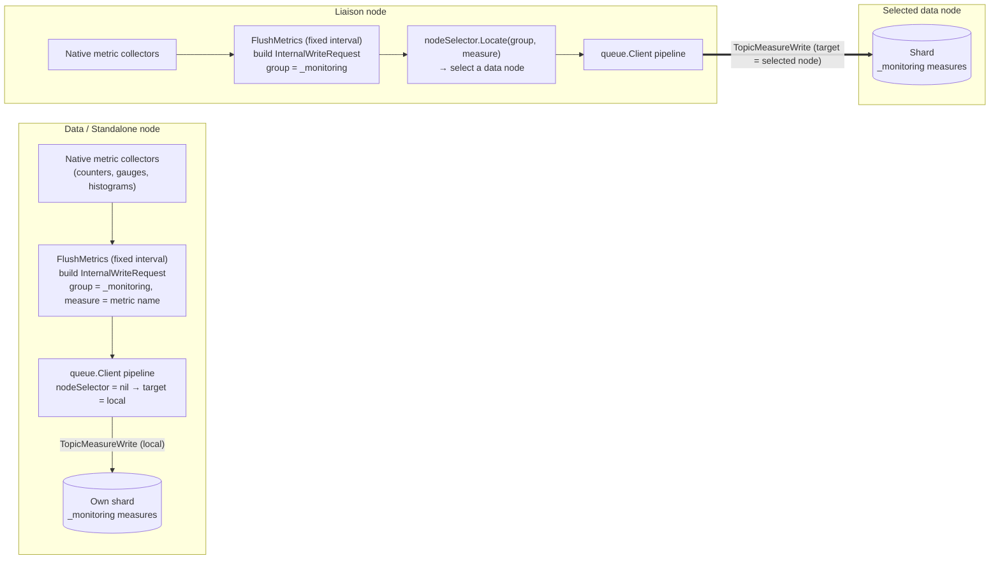

# Metrics Providers

BanyanDB has built-in support for metrics collection. Currently, there are two supported metrics provider: `prometheus` and `native`. These can be enabled through `observability-modes` flag, allowing you to activate one or both of them.

## Prometheus

Prometheus is auto enabled at run time, if no flag is passed or if `prometheus` is set in `observability-modes` flag.

When the Prometheus metrics provider is enabled, each BanyanDB process exposes its own metrics on port `2121`. (The lifecycle sidecar is the exception: it reuses its HTTP API port — `--lifecycle-http-port`, default `17915` — and serves the same Prometheus payload at `/metrics` there instead of opening `2121`.)

In a cluster, the recommended setup is to let the **FODC proxy** aggregate every node's metrics and scrape the proxy as the single target. Configure the following Prometheus job (replace `BANYANDB_NAMESPACE` with the namespace where BanyanDB is deployed, and adjust the keep-regex to match your FODC proxy pod label):

```yaml
scrape_configs:
  - job_name: "fodc-proxy"
    kubernetes_sd_configs:
      - role: pod
        namespaces:
          names: ["${BANYANDB_NAMESPACE}"]
    relabel_configs:
      - source_labels: [__meta_kubernetes_pod_label_app_kubernetes_io_component]
        action: keep
        regex: fodc-proxy
      - source_labels: [__address__]
        target_label: __address__
        regex: (.*):\d+
        replacement: $1:17913
    metrics_path: /metrics
    scheme: http
```

The proxy adds the `pod_name` and `container_name` labels used throughout this document. Without the FODC proxy, scrape each BanyanDB pod directly on port `2121` instead and use the Kubernetes `pod`/`instance` target labels in place of `pod_name`.

### Grafana Dashboard

Two complementary dashboards monitor BanyanDB metrics, both built for the deployment where Prometheus scrapes the [FODC proxy](../fodc/overview.md) `/metrics` endpoint — the single scrape target — rather than each BanyanDB pod (per-node identity is carried in the `pod_name` and `container_name` labels, so `job`/`pod`/`up` no longer distinguish nodes). They are split by aggregation dimension:

- [BanyanDB Cluster — Nodes (FODC Proxy)](../grafana-fodc-nodes.json) — node/pod-level health and resources, aggregated by `pod_name`: fleet overview (node counts, CPU/memory/disk capacity, uptime), a per-node health table, a pod-to-pod flows table that joins the publisher's and subscriber's views of each directed flow into one row, resources (CPU, RSS, system memory %, disk %, network), disk-by-path, and Go runtime.
- [BanyanDB Cluster — Workload (FODC Proxy)](../grafana-fodc-workload.json) — business/data-level throughput and latency, aggregated by `group`: cluster workload summary (write/query/error rate), liaison ingestion/query/publish plus write-queue (wqueue) backlog, data storage, inverted-index, and the internal queue (per-operation throughput & p99 by group).

## Native

If the `observability-modes` flag is set to `native`, the self-observability metrics provider will be enabled. Some of the metrics will be displayed in the dashboard of [banyandb-ui](http://localhost:17913/)


### Metrics storage

In self-observability, the metrics data is stored in BanyanDB within the ` _monitoring` internal group. Each metric will be created as a new `measure` within this group.

You can use BanyanDB-UI or bydbctl to retrieve the data.

### Write Flow

When starting any node, the `_monitoring` internal group will be created, and the metrics will be created as measures within this group. All metric values will be collected and written together at a configurable fixed interval. For a data node, it will write metric values to its own shard using a local pipeline. For a liaison node, it will use nodeSelector to select a data node to write its metric data.



Node selection (the liaison's `nodeSelector`) resolves targets through the cluster node registry — the property-based schema registry with `dns` / `file` node discovery; **etcd is no longer used**.

### Read Flow

The read flow is the same as reading data from `measure`, with each metric being a new measure.
