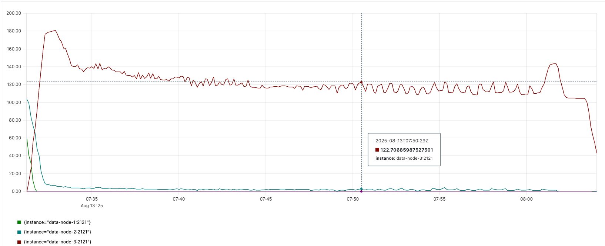
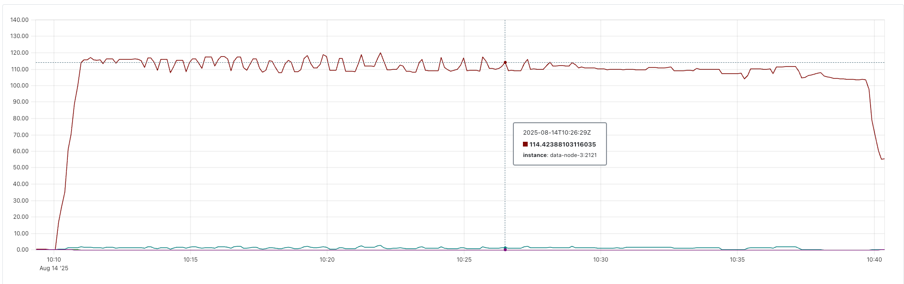

# Property Repair Benchmark Test

## Purpose

This performance evaluation is designed to test the execution efficiency of the backend’s automated Property repair feature. 
It primarily covers the following key features:
1. The cluster is configured with a maximum of three nodes, one group, one shard, and two replicas.
2. Each shard contains **100,000** records, with each record approximately **2KB** in size.

## Requirements

- Docker and Docker Compose
- Go 1.21+

### Building the BanyanDB Docker Image

Please make sure you have the latest version of the BanyanDB codebase, and building the Docker image is essential before running the tests.

```bash
export TARGET_OS=linux
export PLATFORMS=linux/arm64 # please replace to your platform
make clean && make generate && make release && make docker.build
```

## Monitoring

The performance evaluation is primarily conducted by observing logs and monitoring metrics in Prometheus. 

The logs provide clear markers for the start and end times of the backend repair process.
In Prometheus, by visiting `http://localhost:9090`, you can view system performance metrics for each machine in the cluster.

### CPU Usage Monitoring

Use this PromQL query to monitor CPU usage during property repair:

```promql
avg by (instance) (
  rate(process_cpu_seconds_total[1m]) * 100
)
```

## Case 1: Fully Data Property Repair

In the first test case, a brand-new, empty node will be started, 
and **100,000** records will be synchronized to it in a single batch. 
This test is designed to measure the node's CPU usage and the total time consumed during the process.

### Running the Integrated Test

The full data test case runs as an integrated test that handles all steps automatically:

```bash
cd test/property_repair/full_data
# Run the complete integrated test
go test . -v -timeout 3h -count=1
```

The test performs the following steps:
1. Starts a 3-node cluster using docker-compose
2. Creates a group with 1 replica and loads 100,000 properties
3. Updates the group to 2 replicas to trigger property repair
4. Monitors the repair process through Prometheus metrics
5. Verifies both propagation count and repair success count increase

Then, wait for the propagation to complete in the cluster.

### Result

After waiting for the Property Repair process to complete, the following information was recorded:
1. **Duration**: The total estimated time taken was approximately **36 minutes**.
2. **CPU Consumption**: The estimated CPU usage on the new node was about **1.4 CPU cores**.

The detailed CPU usage rate is shown in the figure below.



## Case 2: Half-Data Property Repair

In the second test case, three nodes are started, with the group’s number of copies initially set to two. 
First, **50,000** records are written to all three nodes.
Next, the group’s copies' setting is changed to one, and the remaining **50,000** records are written to only two fixed nodes. 
At this point, the third node’s dataset is missing half of the data compared to the other nodes.
Finally, the group’s copies' setting is changed back to two, allowing the backend Property Repair process to perform the data synchronization automatically.

### Running the Integrated Test

This test case runs as an integrated test that handles all steps automatically:

```bash
cd test/property_repair/half_data
# Run the complete integrated test
go test . -v -timeout 3h -count=1
```

The test performs the following steps:
1. Starts a 3-node cluster using docker-compose
2. Creates a group with 2 replicas and loads 50,000 properties
3. Reduces the group to 1 replica
4. Writes additional 50,000 properties (creating data inconsistency)
5. Increases the group back to 2 replicas to trigger property repair
6. Monitors the repair process through Prometheus metrics
7. Verifies both propagation count and repair success count increase

Then, wait for the propagation to complete in the cluster.

### Result

After waiting for the Property Repair process to complete, the following information was recorded:
1. **Duration**: The total estimated time taken was approximately **30 minutes**.
2. **CPU Consumption**: The estimated CPU usage on the new node was about **1.1 CPU cores**.

The detailed CPU usage rate is shown in the figure below.



## Case 3: All Nodes Data are the Same

In the third test case, which represents the most common scenario, all nodes contain identical data.

### Running the Integrated Test

This test case runs as an integrated test that handles all steps automatically:

```bash
cd test/property_repair/same_data
# Run the complete integrated test
go test . -v -timeout 3h -count=1
```

The test performs the following steps:
1. Starts a 3-node cluster using docker-compose
2. Creates a group with 2 replicas and loads 100,000 properties across all nodes
3. Monitors the repair process through Prometheus metrics
4. Verifies propagation count increases (repair count verification is skipped since data is consistent)

Then, wait for the propagation to complete in the cluster.

### Result

After waiting for the Property Repair process to complete, the following information was recorded:
1. **Duration**: Almost Less than **1 minute**.
2. **CPU Consumption**: The estimated CPU usage in almost has no impact.